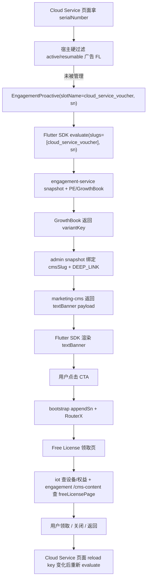

# 触点接入手册：以 `cloud_service_voucher` Flutter PROACTIVE 触点为样例

本文给宿主 App 同学和 AI agent 使用。目标是把 `cloud_service_voucher` 的 Flutter SDK 接入流程拆成可复用步骤，覆盖 Flutter 宿主接 SDK、CMS 素材、engagement-admin 变体、GrowthBook 实验、测试和线上观察。

相关代码仓库：

| 系统 | GitLab |
|---|---|
| engagement | `https://gitlab.addx.ai/services/value-added/engagement` |
| personalization-engine | `https://gitlab.addx.ai/services/personalization-engine` |
| marketing-cms | `https://gitlab.addx.ai/CLOUD/marketing-cms` |
| g0-flutter-module | `https://gitlab.addx.ai/SWCLIEN/g0-flutter-module` |
| g0-ios | `https://gitlab.addx.ai/SWCLIEN/g0-ios` |
| g0-android | `https://gitlab.addx.ai/SWCLIEN/g0-android` |

## 0. 结论

`cloud_service_voucher` 是一个设备级 `PROACTIVE` 触点：

- admin `slug` = SDK `slotName` = `cloud_service_voucher`。
- GrowthBook feature = `engagement_cloud_service_voucher_experience`。
- 宿主端是 Flutter，接入点在 g0-flutter-module 仓库 `lib/pages/vip/setting_cloud_service/view.dart`。
- 触点类型是 `PROACTIVE`，宿主没有 child fallback；命中时 SDK 渲染 CMS `textBanner`，未命中时自然收起。
- 设备级触点必须传 `EngagementContext(sn: sn)`，`sn` 来自 Cloud Service 页面入参 `serialNumber`。
- CTA 走 engagement-admin 变体的 `DEEP_LINK`，Flutter bootstrap 在跳转前追加 `sn` query，再进入 Free License 领取页。
- Free License 领取页不是 evaluate payload 直接渲染出来的；它会根据 deep link 里的 `cmsSlug` / `freeLicenseId` 再请求 iot 和 engagement `/cms-content` 组装页面。

## 1. 命名和职责

| 名称 | 归属 | 当前值 | 说明 |
|---|---|---|---|
| `slug` | engagement-admin | `cloud_service_voucher` | 触点主键；运行时就是 SDK `slotName` |
| SDK API | Flutter SDK | `EngagementProactive` | `PROACTIVE` 专用 widget，命中渲染内容，miss 收起 |
| GB feature | GrowthBook | `engagement_cloud_service_voucher_experience` | string feature，返回 admin 已注册的 `variantKey` |
| banner block | marketing-cms + SDK | `textBanner` | Cloud Service 页顶部窄条 banner |
| claim page block | marketing-cms + App | `freeLicensePage` | 领取页内容，由 Free License 页面通过 `/cms-content` 拉取 |
| CTA action | engagement-admin + Flutter | `DEEP_LINK` | 跳 `smart-camera://payment/free_license_page?...` |
| source | 路由 / 埋点 | `cloud_service_voucher` | deep link 必须带，领取页和数仓用它归因 |

多 App 命名原则和 `home_page_device_badge` 一致：即使 VicoHome、KiwiBit、VicoNature 复用同一套 Flutter 代码，也建议从触点 slug 级别拆分，例如 `cloud_service_voucher`、`kb_cloud_service_voucher`、`vn_cloud_service_voucher`。不要把多个 App 都塞进一个触点或一个 GB feature 后再靠 app 条件区分，否则 rule、variant、发布、回滚和数据看板都会混在一起。

## 2. Flutter 宿主 SDK 基础接入

g0-flutter-module 通过 pub 依赖 engagement 仓库的 Flutter SDK：

```yaml
dependencies:
  engagement_sdk:
    git:
      url: git@gitlab.addx.ai:services/value-added/engagement.git
      path: sdk-flutter
      ref: <pinned_commit>
```

App 启动时必须先完成一次性配置。入口在 g0-flutter-module 仓库：

- `lib/main.dart`：在 `initFromArgs(args)` 后调用 `EngagementBootstrap.configure()`。
- `lib/engagement/engagement_bootstrap.dart`：注入 network provider、tracker、CTA 路由回调。
- `lib/engagement/app_engagement_network_provider.dart`：把 SDK path 转成 APISIX 网关路径，保证 `/en` 前缀只加一次。
- `lib/engagement/snowplow_engagement_tracker.dart`：桥接 SDK 标准 5 事件到 Snowplow。

bootstrap 的关键行为：

```dart
EngagementSDK.configure(
  networkProvider: AppEngagementNetworkProvider(),
  tracker: SnowplowEngagementTracker(),
  onOpenAction: _onOpenAction,
  onOpenPaywall: _onOpenPaywall,
);
```

`DEEP_LINK` 点击时：

1. SDK 根据当前 slot / sn 读取 `EngagementTouchpoint.state(slotName: slotName, sn: sn)`。
2. 宿主用 `appendSn(actionLink, sn)` 给 admin 配置的 URL 追加 `sn`。
3. 通过 `RouterX.toNamed(...)` 跳转，并把 `slot_name`、`solution_id`、`experiment_key`、`variation_id`、`sn` 作为 arguments 透传。

`cloud_service_voucher` 依赖这条链路，admin deep link 不需要硬编码设备 sn，宿主会在运行时追加。

## 3. Cloud Service 页面接入

接入点在 g0-flutter-module 仓库 `lib/pages/vip/setting_cloud_service/view.dart` 的 `_freeContent()`。

核心代码形态：

```dart
Widget _freeContent() {
  final sn = widget.params?['serialNumber'] as String?;
  final localeKey = Localizations.localeOf(context).toLanguageTag();
  final managed = state.adflDevices?.activeBySn(sn) != null ||
      state.adflDevices?.resumableBySn(sn) != null;
  if (managed) return const SizedBox.shrink();

  return Padding(
    padding: const EdgeInsets.fromLTRB(16.0, 16.0, 16.0, 0.0),
    child: EngagementProactive(
      key: ValueKey(
          'cloud_service_voucher:${sn ?? ''}:$localeKey:$_cloudServiceVoucherReloadKey'),
      slotName: 'cloud_service_voucher',
      context: EngagementContext(sn: sn),
    ),
  );
}
```

这里有三个关键点：

| 点 | 规则 |
|---|---|
| `sn` | 从页面入参 `serialNumber` 取，必须传给 `EngagementContext` |
| 宿主硬过滤 | 广告 FL 已 active / resumable 的设备走 Manage 入口，不再展示领取 voucher banner |
| reload key | key 包含 `sn`、locale 和 `_cloudServiceVoucherReloadKey`，用于设备切换、语言切换、领取后返回时重新 evaluate |

`PROACTIVE` 不要传 child。Flutter SDK 的语义是命中渲染 CMS，未命中渲染 `SizedBox.shrink()`；如果要保留原生 fallback，应改产品 / 灰度策略，而不是把 fallback 塞进 `EngagementProactive`。

## 4. SDK 渲染模型

Flutter SDK 公开 API 在 engagement 仓库 `sdk-flutter/lib/src/public/engagement_widgets.dart`：

- `EngagementGate`：用于 `FEATURE_GATE`，有 child。
- `EngagementProactive`：用于 `PROACTIVE`，没有 child。
- `EngagementSlot`：统一执行 cache、evaluate、type 校验和渲染。

`EngagementProactive` 会构造：

```dart
EngagementSlot(
  slotName: slotName,
  expectedType: TouchpointType.proactive,
  context: context,
)
```

运行时行为：

1. 先按严格 `(slotName, sn)` 查 SDK cache，避免设备串内容。
2. 无论是否有 cache，都发起 fresh evaluate。
3. 返回 type 不是 `PROACTIVE` 时拒绝渲染并收起。
4. 没有命中触点时 invalidate 当前 `(slot, sn)` 并收起。
5. 命中后交给 `ProactiveRender`，只渲染服务端返回的 primary block。

`cloud_service_voucher` 使用的 blockType 是 `textBanner`。Flutter builder 在 engagement 仓库 `sdk-flutter/lib/src/internal/builders/text_banner_builder.dart`，payload 契约是：

```json
{
  "blockType": "textBanner",
  "payload": {
    "text": "...",
    "ctaLabel": "Redeem",
    "bgColor": "#E9EDF5",
    "textColor": "#3D3E3F",
    "ctaColor": "#5AC4A7"
  }
}
```

任一必要字段缺失或颜色解析失败时，builder 返回 `SizedBox.shrink()`，不会崩溃。CTA 的 semantics identifier 是 `textBanner.cta`，点击触发 SDK 的 `callbacks.onCtaClick`，再进入 bootstrap `onOpenAction`。

## 5. marketing-cms 素材与模板

engagement-admin 配置前必须先确认 CMS 内容存在。`cloud_service_voucher` 至少涉及两类 CMS 内容：

| 内容 | collection / blockType | 用途 | 绑定位置 |
|---|---|---|---|
| banner 素材 | Engagement 触点内容 / `textBanner` | Cloud Service 页顶部窄条 | admin variant 的 `cmsSlug` |
| 领取页内容 | Engagement 触点内容 / `freeLicensePage` | Free License 领取页 | deep link query `cmsSlug` |

接入新变体时的顺序：

1. 在 `https://marketing-cms-staging-us.addx.live/admin/collections/engagements` 创建或确认 banner `textBanner` entry。
2. 如果要跳 CMS 化领取页，确认对应 `freeLicensePage` entry 已存在，例如 `free-license-page-1007`、`free-license-page-1008`。
3. 确认 entry 已 Published，多语言翻译完成。
4. 确认 Flutter SDK 已支持目标 `blockType`。`textBanner` 和 `freeLicensePage` 当前分别由 banner SDK builder 和领取页 model/parser 消费。
5. 再进入 engagement-admin 绑定 banner `cmsSlug` 和 deep link。

注意：banner 的 CMS entry 只承载视觉内容，不承载 tier id。`freeLicenseId` 和领取页 `cmsSlug` 通过 engagement-admin 变体的 deep link query 携带。

## 6. engagement-admin 配置

触点配置入口：`https://engagement-admin.addx.live`。

`cloud_service_voucher` 的 admin 配置要点：

```yaml
slug: cloud_service_voucher
type: PROACTIVE
slotType: blocks
experienceFeature: engagement_cloud_service_voucher_experience
variants:
  - variantKey: <GrowthBook 返回值>
    cmsSlug: <banner textBanner cmsSlug>
    actionType: DEEP_LINK
    actionConfig:
      deepLink: smart-camera://payment/free_license_page?source=cloud_service_voucher&cmsSlug=<freeLicensePage cmsSlug>&freeLicenseId=<tier id>
```

当前常见变体分两类：

| 类别 | variantKey 示例 | banner CMS | deep link 目标 |
|---|---|---|---|
| R0 legacy FL | `legacy_fl_voucher_1001` / `legacy_fl_voucher_1002` / `legacy_fl_voucher_1003` | `cloud-voucher-7d-trial`、`cloud-voucher-1d-cloud`、`cloud-voucher-3d-cloud` | Free License 领取页，至少带 `source=cloud_service_voucher`；新配置建议统一带 `cmsSlug` / `freeLicenseId` |
| 广告 FL | `ad_fl_voucher_1007_us02` / `ad_fl_voucher_1008_us02` | 以 admin 当前配置为准，历史文档中出现过 `cloud-voucher-ad-fl-7d` / `cloud-voucher-ad-fl-30d` 和 `cloud-voucher-ad-fl-3d` / `cloud-voucher-ad-fl-7d` 两套命名 | `cmsSlug=free-license-page-1007&freeLicenseId=1007` 或 `cmsSlug=free-license-page-1008&freeLicenseId=1008` |

不要手敲历史文档里的 CMS slug 后直接上线。用 API 创建 / 修改后，必须回到 engagement-admin 页面做只读检查；禁止通过 UI 表单写入。逐个检查每个变体：

- `variantKey` 是否和 GrowthBook 返回值完全一致。
- `cmsSlug` 是否指向正确 banner entry。
- `actionType` 是否是 `DEEP_LINK`。
- deep link 是否包含 `source=cloud_service_voucher`。
- 广告 FL 是否包含正确的 `cmsSlug=free-license-page-1007/1008` 和 `freeLicenseId=1007/1008`。
- fatigue、发布单、staging/prod 状态是否符合预期。

发布流程和其他触点一致：先创建 release 发布到 staging，staging 验证通过且 prod 依赖全部解决后再发布 prod。prod 发布未来接入飞书审批后，应把审批状态纳入发布检查。

## 7. GrowthBook 配置

GrowthBook 入口：`https://us-ab-management.addx.live/features/engagement_cloud_service_voucher_experience`。

截至 2026-07-06 重新查询，feature 摘要如下：

```yaml
id: engagement_cloud_service_voucher_experience
valueType: string
defaultValue: ""
environments:
  staging:
    enabled: true
    rules: 10
  pre:
    enabled: true
    rules: 0
  production:
    enabled: true
    rules: 0
```

这说明当前线上 production 虽然 feature enabled，但没有配置 rules；不能因为 staging 命中就假设 prod 已经放量。每次修改前都要重新打开 GB 页面或用 API 查最新规则。

staging 规则的业务结构：

| 规则类型 | 典型返回值 | 说明 |
|---|---|---|
| QA 白名单 | `ad_fl_voucher_1007_us02` | 用固定 userId 快速验证链路 |
| 广告 FL 池实验 | `ad_fl_voucher_1007_us02` / `ad_fl_voucher_1008_us02` | 由上游池实验或 saved group 判定用户所在业务池 |
| R0 legacy force rule | `legacy_fl_voucher_1001` / `legacy_fl_voucher_1002` / `legacy_fl_voucher_1003` | 按设备属性 `eligibleTierId` 等条件命中 |

R0 设备属性通常包括：

```yaml
is4G: false
isSupportedFreeLicense: true
noPaidCloud: true
hasRedeemed: false
eligibleTierId: 1001 | 1002 | 1003
```

如果产品需求需要的条件在 GrowthBook attributes 里不存在，先去 personalization-engine 仓库补 attribute 赋值，合入 staging 后再回到 GB 配规则。`vipCovered`、`activeFlTierId` 这类属性的赋值过程可参考 personalization-engine 仓库中 attribute schema 和 evaluate 组装逻辑，不能在 GB 里臆造不存在的字段。

## 8. 端到端链路



关键不变量：

- evaluate 必须带同一个 `sn`。
- admin deep link 必须带 `source=cloud_service_voucher`。
- 广告 FL 领取页必须带 `cmsSlug` 和 `freeLicenseId`。
- 领取后返回 Cloud Service 页面要重新 evaluate，使 `hasRedeemed` / active 状态生效。

## 9. 测试

### 9.1 单元测试

已有测试可以作为新增触点的参考：

| 仓库 | 文件 | 覆盖点 |
|---|---|---|
| engagement | `sdk-flutter/test/builders/content_builders_test.dart` | `textBanner` 字段映射、缺字段 no-op、CTA callback、builder 注册 |
| engagement | `sdk-flutter/test/engagement_widgets_test.dart` | `EngagementProactive` type 校验、命中 / miss 行为 |
| g0-flutter-module | `test/engagement/engagement_adapters_test.dart` | `/en` 前缀、Snowplow payload、`appendSn` |
| g0-flutter-module | `test/free_license/free_license_page_content_test.dart` | `freeLicensePage` CMS 内容解析 |
| g0-flutter-module | `test/free_license/free_license_source_tracking_test.dart` | `source=cloud_service_voucher` 归因 |

### 9.2 Staging E2E

可以参考 engagement 仓库 `docs/testing/staging-evaluate-e2e-runbook.md`。

基础步骤：

1. 用 QA 工具或接口创建符合目标池条件的测试账号和设备。
2. 调 `account/login` 获取 bearer token。
3. 调 `listuserdevices/v4` 找到测试设备 sn。
4. 调 `/engagement/v1/touchpoints/evaluate` 验证 `cloud_service_voucher` 是否命中。
5. 在 Flutter 页面打开 Cloud Service，确认 banner 展示、点击跳转、领取页参数正确。
6. 用 `addx:tracking-lifecycle` 或埋点管理平台 `/check/dashboard/` 生成配置，App 扫码后真实触发曝光、点击、领取/转化路径，确认触点埋点已发布且字段正确。

evaluate 请求形态：

```bash
curl -X POST "$API_BASE/en/engagement/v1/touchpoints/evaluate" \
  -H "Authorization: Bearer $TOKEN" \
  -H "Content-Type: application/json" \
  -d '{
    "slugs": ["cloud_service_voucher"],
    "sn": "<device_sn>",
    "language": "en",
    "app": {"appType": "iOS", "version": 10000}
  }'
```

命中时重点看：

```json
{
  "slotName": "cloud_service_voucher",
  "slotType": "blocks",
  "experienceKey": "<variantKey>",
  "content": {
    "blocks": [
      {"blockType": "textBanner", "payload": {"text": "..."}}
    ]
  },
  "deepLink": "smart-camera://payment/free_license_page?source=cloud_service_voucher..."
}
```

未命中时常见返回：

```json
{
  "result": 0,
  "data": [],
  "evalResults": {
    "cloud_service_voucher": "hide_targeting"
  }
}
```

必要用例：

| 用例 | 期望 |
|---|---|
| R0 `eligibleTierId=1001/1002/1003` | 分别返回对应 legacy variant |
| 广告 FL 1007 / 1008 池 | 返回对应广告 FL variant，deep link 携带正确 `freeLicenseId` |
| `sn` 为空或设备不满足条件 | 不命中或被宿主硬过滤 |
| 设备已 active / resumable 广告 FL | Cloud Service 页面不展示 voucher banner，显示 Manage 入口 |
| 点击 CTA | 跳转 URL 包含 `source=cloud_service_voucher` 和运行时追加的 `sn` |
| 领取成功后返回 | banner 重新 evaluate 后消失或切换到 Manage 入口 |

## 10. 线上观察

SDK 基础排障看板：

- `https://superset-us.addx.live/superset/dashboard/527/`

这个看板适合排查 evaluate、impression、CTA、converted、slot、solution、variant 等 SDK 基础数据。AI agent 可以使用 superset skill 查询数据，不需要只停留在“验证页面能打开”。如果触点 action 是 `OPEN_PAYWALL`，完整漏斗应改用 `https://superset-us.addx.live/superset/dashboard/paywall-p0-touchpoint-to-paywall-health/` 并筛选 `slot_name + paywall_id`。

`cloud_service_voucher` 的 action 是 `DEEP_LINK`，领取结果不属于 Paywall 通用漏斗，因此使用已有的广告 FreeLicense SQL / 领域看板：

- engagement 仓库 SQL：`observability/superset/free-license/01_ad_fl_touchpoint_funnel.sql`
- engagement 仓库 SQL：`observability/superset/free-license/02_ad_fl_assignment_match.sql`

建议监控指标：

| 指标 | 用途 |
|---|---|
| evaluated / impressed / cta_clicked / converted | SDK 基础漏斗是否断链 |
| impression / evaluated | 命中后是否成功渲染 |
| cta_clicked / impressed | banner CTR |
| converted / cta_clicked | 领取页和兑换链路效率 |
| assignment vs evaluation match | GB 分桶和 engagement evaluate 是否一致 |
| business_pool coverage | 各广告 FL 池是否有流量 |
| `source=cloud_service_voucher` 的领取页 PV / conversion | 业务归因是否完整 |

Dashboard 527 只表示触点 SDK 基础数据。广告 FL 领取、停止、恢复等结果优先复用已有领域看板；只有现有看板缺少必要指标时，才记录缺口并经 owner 确认后申请新看板。

## 11. 常见问题

| 问题 | 现象 | 处理 |
|---|---|---|
| 没传 `sn` | staging API 手测命中，App 页面不展示 | 查 `EngagementContext(sn:)` 和页面 `serialNumber` 来源 |
| admin 配成 `FEATURE_GATE` | Flutter `EngagementProactive` 拒绝渲染 | admin type 必须是 `PROACTIVE` |
| CMS block 不是 `textBanner` | evaluate 有数据但 UI 空白 | 查 CMS entry 和 SDK builder 注册 |
| deep link 缺 `source` | 领取页能打开但归因断 | admin deep link 加 `source=cloud_service_voucher` |
| deep link 缺 `cmsSlug/freeLicenseId` | 广告 FL 领取页内容或兑换 tier 错 | 1007 / 1008 变体必须带对应参数 |
| 设备已 active/resumable 还展示 voucher | Cloud Service 出现两个免费云存入口 | 检查 host hard gate `state.adflDevices` |
| staging 命中但 prod 不命中 | prod 没有 GB rules 或 release 未发布 | 查 GB production rules、admin prod release 和依赖 |
| 点击后 `sn` 丢失 | 领取页不知道设备 | 查 `appendSn`、RouterX deep link handler、参数解析 |

## 12. 接入新 Flutter PROACTIVE 触点时的最小清单

```yaml
slug: <全小写下划线，必要时按 App 拆分>
type: PROACTIVE
host:
  repo: https://gitlab.addx.ai/SWCLIEN/g0-flutter-module
  widget: EngagementProactive
  location: <页面 repo-relative path>
  context:
    sn: <设备级必填>
  hardGates:
    - <必须在调 SDK 前过滤的业务条件>
cms:
  banner:
    blockType: textBanner | cardBanner | ...
    cmsSlug: <admin 绑定的素材>
    sdkBuilderExists: true
  targetPage:
    cmsSlug: <deep link 目标页内容，可选>
admin:
  slug: <same as slotName>
  variantKey: <GB 返回值>
  cmsSlug: <banner cmsSlug>
  actionType: DEEP_LINK
  deepLink: <必须带 source，设备级由宿主追加 sn>
growthbook:
  feature: engagement_<slug>_experience
  stagingRulesReady: true
  productionRulesReady: false
testing:
  evaluateApiHit: true
  appRenderHit: true
  ctaRouteHit: true
  conversionTracked: true
observability:
  sdkDiagnosticDashboard: https://superset-us.addx.live/superset/dashboard/527/
  domainOutcomeDashboard: <已有 Free License 领域看板；没有则先确认指标缺口>
```

## 13. 参考资料

- GrowthBook：`https://us-ab-management.addx.live/features/engagement_cloud_service_voucher_experience`
- engagement-admin：`https://engagement-admin.addx.live`
- marketing-cms staging：`https://marketing-cms-staging-us.addx.live/admin/collections/engagements`
- Superset SDK 排障看板：`https://superset-us.addx.live/superset/dashboard/527/`
- Superset 触点 + Paywall 通用 P0 看板（仅 `OPEN_PAYWALL`）：`https://superset-us.addx.live/superset/dashboard/paywall-p0-touchpoint-to-paywall-health/`
- engagement 仓库 `docs/testing/staging-evaluate-e2e-runbook.md`
- engagement 仓库 `docs/plans/2026-06-12-us02-cloud-service-voucher-app-integration-design.md`
- engagement 仓库 `docs/plans/2026-06-17-cloud-service-voucher-experiment-as-built.md`
- engagement 仓库 `docs/plans/2026-05-21-us02-ad-fl-claim-page-cms-design.md`
