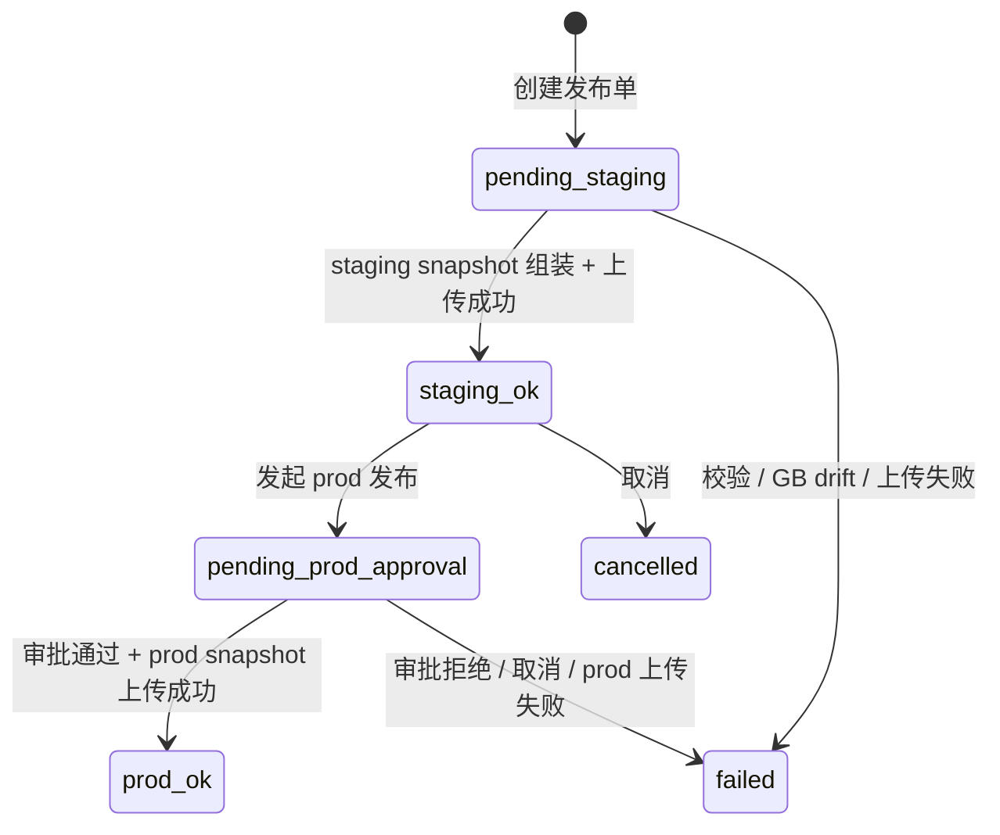
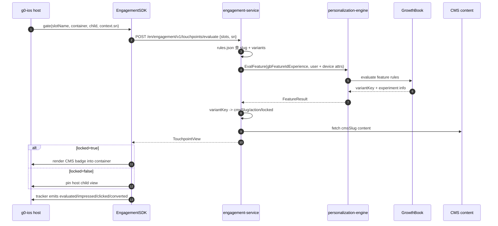

# 触点接入手册：以 `home_page_device_badge` 为样例

本文给宿主 App 同学和 AI agent 使用。目标不是只复盘一个角标，而是把 `home_page_device_badge` 的接入拆成可复制的端到端流程：宿主 App 接 SDK、marketing-cms 建素材、GrowthBook 配实验、engagement-admin 录触点与发布、Superset 看线上数据。

相关代码仓库：

| 系统 | GitLab |
|---|---|
| engagement | `https://gitlab.addx.ai/services/value-added/engagement` |
| personalization-engine | `https://gitlab.addx.ai/services/personalization-engine` |
| marketing-cms | `https://gitlab.addx.ai/CLOUD/marketing-cms` |
| g0-ios | `https://gitlab.addx.ai/SWCLIEN/g0-ios` |
| g0-android | `https://gitlab.addx.ai/SWCLIEN/g0-android` |
| g0-flutter-module | `https://gitlab.addx.ai/SWCLIEN/g0-flutter-module` |

## 0. 结论

`home_page_device_badge` 是一个设备级 `FEATURE_GATE` 触点：

- admin `slug` = SDK `slotName` = `home_page_device_badge`。
- GrowthBook feature = `engagement_home_page_device_badge_experience`。
- 非 VIP / 未覆盖设备命中 `locked=true`，SDK 渲染 CMS 下发的黄色 `Get` badge。
- VIP / 已覆盖设备命中 `locked=false`，SDK 透传宿主原生 child 视图，iOS 上是绿色盾牌 `VipDeviceBadgeView`。
- 设备级触点必须传 `EngagementContext(sn:)`，否则 PE / GrowthBook 读不到设备维度属性，容易全部落到默认 locked 分支。

## 1. 命名和职责

| 名称 | 归属 | 示例 | 说明 |
|---|---|---|---|
| `slug` | engagement-admin | `home_page_device_badge` | 触点主键；运行时就是 SDK `slotName` |
| `slotName` | SDK / 宿主 | `EngagementSlot.homeDeviceCardBadge` | 调 `EngagementTouchpoint.gate/proactive` 的入参 |
| GB feature | GrowthBook | `engagement_home_page_device_badge_experience` | 约定 `engagement_<slug>_experience` |
| `variantKey` | admin + GB | `default` / `locked_v1` / `unlocked_v1` | GB 返回的字符串；admin 用它查变体绑定 |
| `cmsSlug` / `solution_id` | marketing-cms + admin | `device_card_badge_awareness` | 决定渲染哪份内容；Snowplow `solution_id` 也用这个语义 |
| `blockType` | marketing-cms + SDK | `badge` | CMS 内容组件类型；SDK 必须有同名 builder |
| `paywallId` | marketing-cms + admin | Paywall CMS slug | OPEN_PAYWALL 点击目标 |
| `preludeEventKey` | admin + 数仓 | 父容器曝光事件 | 用于 Superset 漏斗分母；当前 host 不再传 `host_spm` |

常见命名坑：历史代码和测试里出现过 `home_device_card_badge`，但当前 iOS 常量实际值是 `home_page_device_badge`。新触点以 engagement-admin 的 `slug` 和 `BaseUI/Engagement/EngagementSlotIdentifiers.swift` 常量值为准，不能只看变量名或旧测试桩。

多 App 命名原则：

- 目前主要 App 包括 VicoHome、KiwiBit、VicoNature。它们的宿主代码很多地方是通用的，但触点配置建议从 slug 级别就拆开。
- VicoHome 上可以继续使用 `home_page_device_badge`；如果 KiwiBit 和 VicoNature 也接同类触点，建议分别定义为 `kb_home_page_device_badge`、`vn_home_page_device_badge`。
- 不推荐把三个 App 放进同一个触点或同一个 GrowthBook feature，再在 rule 里用 app 条件区分。这样短期看起来复用，长期会让 rule、variant、CMS、发布、数据分析和回滚都混在一起。
- `https://us-ab-management.addx.live/features/home_promo_banner` 是一个反例：一个实验承载多个 App 后，配置已经很难读懂。后续新触点优先按 App 拆成多个触点。
- 拆成 App 级触点后，每个 App 都能独立配置 admin variant、CMS 内容、GrowthBook rule、发布节奏和回滚方案；数据验收优先在通用看板里按各自的 `slot_name` / `paywall_id` 筛选，不默认新建看板。

## 2. 宿主 App 接 SDK

### 2.1 Pod / SDK 依赖

g0-ios 通过 Pod 接入 EngagementSDK：

- `Podfile` 引入 `EngagementSDK`。
- 本地开发可指向 engagement 仓库 checkout，仓库地址：`https://gitlab.addx.ai/services/value-added/engagement`。
- 发版时应 pin 到明确 commit，避免 SDK 行为被本地 worktree 漂移影响。

### 2.2 App 启动时初始化

入口：g0-ios 仓库 `AddxAi/A4xInitAppConfig+AppDelegate.swift`

关键配置：

```swift
EngagementSDK.configure(
    networkProvider: AppEngagementNetworkProvider(),
    onOpenAction: { actionLink, paywallId, slotName, sn in
        // DEEP_LINK 走 RouterX；OPEN_PAYWALL 走 A4xPayRouteModule.presentCmsPaywallPage
    },
    onOpenPaywall: { _, _, _, _, _, _, _, _, _ in
        // 当前无 paywall-type slot，暂空
    },
    tracker: SnowplowEngagementTracker()
)
```

网络适配在 g0-ios 仓库 `AddxAi/Classes/Engagement/AppEngagementNetworkProvider.swift`：

- SDK 发 `/engagement/v1/...`。
- 宿主加 APISIX `/en` 前缀，实际请求 `/en/engagement/v1/...`。
- 公共 `app/language/country/user` envelope 由 SmartDeviceCoreSDK 底层补，不要在 adapter 里重复覆盖。

CTA 适配规则：

- `DEEP_LINK`：admin 变体里配置完整链接，宿主原样交给 `RouterX.open`。
- `OPEN_PAYWALL`：admin 变体里配置 `paywallId`，宿主调用 `A4xPayRouteModule.presentCmsPaywallPage`，并透传 `referrerSlotName`、`referrerSolutionId`、`experimentKey`、`variationId`、`experienceKey`、`fatigueKey`、`sourceDeviceSn`。
- payment success 回调必须能回到 `EngagementTouchpoint.notifyConverted(...)`，否则 `touchpoint_converted` 漏斗断。

### 2.3 埋点 adapter

入口：g0-ios 仓库 `AddxAi/Classes/SmartLiveSDK/LiveVideoUIKit/LiveVideo/Engagement/SnowplowEngagementTracker.swift`

SDK 标准 5 事件：

- `touchpoint_evaluated`
- `touchpoint_impressed`
- `touchpoint_cta_clicked`
- `touchpoint_dismissed`
- `touchpoint_converted`

当前实现用 `TrackerManager.shared.trackNonSpmEvent` 上报，并通过 `VipTrackBaseParams.shared.getVipBaseParams()` 补增值业务 base schema 字段。`host_spm` 已按 2026-05-29 ADR 从 host 和 SDK payload 移除，slot 到父容器的映射由数仓 dim 表维护；新触点不要再新增 `EngagementHostSpm`。

## 3. 触点 UI 接入模式

### 3.1 注册 slot 常量

入口：g0-ios 仓库 `BaseUI/BaseUI/Engagement/EngagementSlotIdentifiers.swift`

新增触点先加常量，调用点不要写裸字符串：

```swift
public enum EngagementSlot {
    public static let homeDeviceCardBadge = "home_page_device_badge"
}
```

### 3.2 设备级硬过滤

入口：g0-ios 仓库 `AddxAi/Classes/SmartLiveSDK/LiveVideoUIKit/LiveVideo/Engagement/DeviceBean+EngagementEligibility.swift`

`home_page_device_badge` 在 host 侧先过滤硬业务约束：

- shared device：非 owner，不展示。
- 4G-only device：没有这个云存储套餐导购路径，不展示。
- feeder device：不走云存储感知 / 保护套餐，不展示。

这些是业务硬约束，不应该绕到 GrowthBook 做实验判断。新设备级触点也应先明确哪些条件是宿主硬过滤，哪些条件才交给 GB / PE。

### 3.3 安装 FEATURE_GATE

入口：g0-ios 仓库 `AddxAi/Classes/SmartLiveSDK/LiveVideoUIKit/LiveVideo/Engagement/DeviceCardBadgeIntegration.swift`

核心调用：

```swift
let nativeBadge = VipDeviceBadgeView()
nativeBadge.bind(device: device)

EngagementTouchpoint.gate(
    slotName: EngagementSlot.homeDeviceCardBadge,
    in: container,
    child: nativeBadge,
    context: EngagementContext(sn: device.serialNumber)
)
```

语义：

- `gate(...)` 用于 `FEATURE_GATE`。
- `child` 是 unlocked / 已有权益时的宿主原生视图。
- `locked=true` 时 SDK 忽略 child，渲染 CMS blocks。
- `locked=false` 时 SDK 固定 child，不渲染 CMS blocks。
- `context.sn` 是设备级 evaluate 的必要参数。

### 3.4 容器和布局

入口：g0-ios 仓库 `AddxAi/Classes/SmartLiveSDK/LiveVideoUIKit/LiveVideo/View/SubView/LiveTopBarView.swift`

当前接入点在 `updataData(shouldRefreshBadge:)`：

1. 用 `DeviceCardBadgeIntegration.isEligible(deviceModel)` 判断是否需要预留 badge 空间。
2. 对设备名加最大宽度约束，避免长名称把 badge 挤出屏幕。
3. 调 `DeviceCardBadgeIntegration.install(...)`。
4. 语言切换时传 `clearCacheFirst=true`，清 SDK touchpoint cache，避免旧语言 cached view 被复用。

新触点接入时要同时考虑：

- cell 复用：重复配置 cell 时不能产生 N+1 evaluate 风暴。
- cache key：设备级触点必须走 `(slot, sn)` 严格缓存。
- layout：先留空间再渲染，miss / ineligible 要清空容器和恢复约束。
- 语言：缓存 key 不含语言，App 内切语言要主动 invalidate。

## 4. marketing-cms 素材与模板

在 engagement-admin 配置 `cmsSlug` 之前，必须先在 marketing-cms 创建或确认对应的触点素材。admin 只保存 `cmsSlug` 绑定；真正的文案、图标、颜色、图片、多语言和内容组件都在 CMS。

入口：

- Staging：`https://marketing-cms-staging-us.addx.live/admin/collections/engagements`
- 搜索示例：`device_card_badge_awareness`

`home_page_device_badge` 当前绑定的 CMS 内容：

```yaml
cmsSlug: device_card_badge_awareness
collection: engagements
status: Published
blockType: badge
payload:
  text:
    en: Get
  icon: Protection@3x-1.png
  iconSize: 42x43
  bgColor: "#FFF8E3"
  textColor: "#6A3B07"
  borderColor: "#FFE69E"
```

截图里这个内容的组件是 `Badge`，运行时下发给 SDK 的语义是：

```json
{
  "blockType": "badge",
  "payload": {
    "text": "Get",
    "iconUrl": "<cms media url>",
    "bgColor": "#FFF8E3",
    "textColor": "#6A3B07",
    "borderColor": "#FFE69E"
  }
}
```

新触点接入时按这个顺序处理 CMS：

1. 先确认 marketing-cms 平台上是否已有目标模板，例如 `Badge`、`Text Banner`、`Card Banner`。
2. 如果 CMS 平台没有对应模板，先改 marketing-cms 仓库，仓库地址：`https://gitlab.addx.ai/CLOUD/marketing-cms`。新增 block / collection 字段 / preview / transformer，再部署 CMS。
3. 创建素材内容，填写文案、图片、颜色、跳转所需素材字段，并发布。
4. 触发或确认多语言翻译完成；有文字的素材不能只看英文。
5. 记录 `cmsSlug` 和 `blockType`，后续 engagement-admin 的 `cmsSlug` 必须引用这份内容。
6. 再检查目标端 engagement-sdk 是否支持该 `blockType`；不支持时先改 SDK builder。

当前 CMS UI 里已经能看到这些 Engagement 触点模板：

| 模板名 | 典型 blockType | 说明 |
|---|---|---|
| Image | `image` | 单图内容 |
| Badge | `badge` | 小胶囊 / 小黄条，`home_page_device_badge` 使用这个 |
| Icon Card | `iconCard` | 单 icon 卡片 |
| Chip Carousel | `chipCarousel` | 横向 chip 列表 |
| Text Banner | `textBanner` | 文案横幅 |
| Free License Page | 待按 CMS 代码确认 | 免付费许可页内容 |
| About Page | 待按 CMS 代码确认 | 说明页内容 |
| Hero Banner | `heroBanner` | 大卡片 banner |
| Inline Banner | `inlineBanner` | 内联横幅 |
| Card Banner | `cardBanner` | 卡片式 banner |

注意：CMS 有模板不代表宿主能渲染。SDK 也必须注册同名 builder，否则运行时会出现 `no builder registered for blockType=<x>`，触点会 miss 或空白。

当前本地 SDK checkout 里看到的 builder 注册情况：

| blockType | iOS | Android | Flutter |
|---|---|---|---|
| `image` | 支持 | 支持 | 支持 |
| `badge` | 支持 | 支持 | 支持 |
| `iconCard` | 支持 | 支持 | 支持 |
| `chipCarousel` | 支持 | 支持 | 支持 |
| `textBanner` | 支持 | 未在当前 checkout 看到 | 支持 |
| `heroBanner` | 支持 | 支持 | 未在当前 checkout 看到 |
| `inlineBanner` | 支持 | 支持 | 未在当前 checkout 看到 |
| `cardBanner` | 未在当前 checkout 看到 | 未在当前 checkout 看到 | 支持 |

这张表只代表当前代码快照；实际接入以目标 App 依赖的 SDK commit 为准。

## 5. engagement-admin 配置

入口：`https://engagement-admin.addx.live/releases/8` 是发布记录入口；触点编辑入口通常在 `/touchpoints/<slug>`。

### 5.1 API 写入与 UI 只读复核

engagement-admin 的触点、变体和发布单写操作必须走 Next.js API，禁止用 UI 表单创建或修改。日常操作连接 production Admin；首次 PublishOrder 从这里生成 staging rules package。UI 仅用于写后人工确认、查看发布记录和处理审批，不是 API 失败时的写入兜底。

常用 API：

| 操作 | 方法 | 路径 | 说明 |
|---|---|---|---|
| 查询触点 | `GET` | `/api/touchpoints?q=<slug>` | 用于创建前查重、创建后复核 |
| 创建触点 | `POST` | `/api/touchpoints` | 原子创建 touchpoint + 第一个 experience variant；`PROACTIVE` 还必须带第一个 fatigue variant |
| 更新触点元信息 | `PATCH` | `/api/touchpoints/<slug>` | 只能改 `description`、`entitlementKey`、`preludeEventKey` |
| 新增 experience variant | `POST` | `/api/touchpoints/<slug>/experience-variants` | 运营新增的变体固定是 `locked=true` |
| 更新 experience variant | `PATCH` | `/api/touchpoints/<slug>/experience-variants/<variantKey>` | 不能修改 `variantKey`，也不能修改系统变体 |
| 新增 fatigue variant | `POST` | `/api/touchpoints/<slug>/fatigue-variants` | 仅 `PROACTIVE` 可用 |
| 重跑 GB skeleton provisioning | `POST` | `/api/touchpoints/<slug>/gb-provision` | 幂等创建 / 修复 GrowthBook feature skeleton |
| 创建发布单 | `POST` | `/api/publish-orders` | 组装 snapshot，跑 snapshot validation、GB drift preflight、NO_CHANGES gate |

Admin CLI Bearer 仅覆盖触点配置和 staging PublishOrder，不覆盖
`approve-prod`、`refresh-approval`、`rollback`、审批 callback 或审计导出。
生产发布必须由用户在 production Admin 中单独确认并通过浏览器会话/飞书审批
推进，不能复用 helper 的触点管理授权。

API 创建或修改后的 UI 只读复核是必做步骤。API 负责写入，UI 复核不能替代发布前人工确认，也不能用于修改配置。

复核路径：`https://engagement-admin.addx.live/touchpoints/home_page_device_badge`

复核清单：

- 基础字段：`slug`、`type`、`preludeEventKey`、`gbFeatureIdExperience` 是否正确。
- CMS 绑定：`cmsSlug` 是否是 `device_card_badge_awareness`，对应 CMS 内容是否已发布。
- experience variants：逐个核对 `variantKey`、`cmsSlug`、`slotType`、`locked`、`isSystem`、`sortOrder`。
- action：`actionType` 与 `actionConfig` 是否匹配；`OPEN_PAYWALL` 必须有正确 `paywallId`，`DEEP_LINK` 必须有正确链接。
- FEATURE_GATE 系统分支：确认 `unlocked` 变体存在、`locked=false`、`isSystem=true`，且不能被当成运营变体修改。
- 运营分支：确认运营创建的变体是 `locked=true`，且能渲染对应 CMS 内容。
- 发布前：创建 Release 前再看 pending diff / snapshot 预检，避免配置错误进入 staging 后再返工。

`FEATURE_GATE` 的 `locked=false` 分支不是运营手填字段。创建 `FEATURE_GATE` touchpoint 时，admin 会自动插入系统变体：

```yaml
variantKey: unlocked
locked: false
isSystem: true
```

因此新接入时要这样理解：

- `unlocked` 是系统保留变体，代表宿主 native child 透传分支。
- 运营通过 API / UI 创建的 experience variant 都是 `locked=true`，需要 `cmsSlug` 和 action 配置。
- GrowthBook 可以返回 `unlocked`，但不能在 admin 里再创建第二个 `locked=false` 变体。

`POST /api/touchpoints` 的典型请求：

```json
{
  "slug": "home_page_device_badge",
  "type": "FEATURE_GATE",
  "preludeEventKey": "home_page_view",
  "gbFeatureIdExperience": "engagement_home_page_device_badge_experience",
  "description": "Home 页面设备卡片角标触点",
  "firstExperience": {
    "variantKey": "home_page_device_badge_locked_v1",
    "cmsSlug": "device_card_badge_awareness",
    "slotType": "blocks",
    "actionType": "OPEN_PAYWALL",
    "actionConfig": {
      "type": "OPEN_PAYWALL",
      "paywallId": "<paywall-id>"
    },
    "description": "非权益设备展示的黄色 badge",
    "sortOrder": 0
  }
}
```

如果 `slotType=paywall`，`cmsSlug` 指向 Paywalls collection，且不要传 `actionType` / `actionConfig`。如果 `slotType=blocks`，必须传 `actionType` 和同类型的 `actionConfig`。

### 5.2 当前鉴权边界

engagement-admin 网页仍使用 Cookie Session，但 helper 已支持专用 Bearer token API 模式。

- `ADMIN_SSO_ENABLED=true` 时，middleware 对网页校验 Feishu OAuth 登录后签发的 `admin_session` httpOnly cookie；对 `/api/...` 还可校验 Admin CLI Bearer Token，并给后端注入 `x-user-info`。
- `ADMIN_SSO_ENABLED` 未开启时，admin 主要依赖办公网络 / Ingress 边界；审计字段仍从 `x-engagement-admin-operator` 请求头读取。
- 目前 route handler 的审计归因还在读 `x-engagement-admin-operator`，所以自动化脚本调用 API 时应显式带这个 header，例如 `x-engagement-admin-operator: <name or email>`。

AI agent 通过 `scripts/admin_api.mjs` 获取 Admin 自己签发的 CLI Token 后即可 API 化操作。不要把 troubleshooting 的 `TROUBLESHOOTING_TOKEN` 或普通 Feishu token 直接拿来调用 engagement-admin；这些 token 的 issuer/purpose 不同。

### 5.3 未来接入 Feishu 登录后的自动化建议

如果以后 engagement-admin 完整接入 Feishu 登录，可以做成类似 troubleshooting skill 的自动化，但实现方式要选一种：

| 方案 | 做法 | 适用性 |
|---|---|---|
| Cookie session 自动化 | 导出或缓存 `admin_session` cookie | 已弃用：暴露浏览器 Session，且需要独立自动化浏览器 |
| Bearer token API | 默认浏览器授权 → localhost PKCE 回调 → Admin CLI Token | 已实现：适合 agent，且不导出 Cookie |

推荐使用 engagement-admin skill helper：它调用默认浏览器完成授权、缓存短期 CLI Token、设置 `x-engagement-admin-operator`，再直接请求 `/api/touchpoints` 和 `/api/publish-orders`。不要读取浏览器 Cookie，也不要使用 UI 表单作为 fallback。

创建或复核一个触点时，确认这些字段：

```yaml
slug: home_page_device_badge
type: FEATURE_GATE
preludeEventKey: <父容器曝光事件>
gbFeatureIdExperience: engagement_home_page_device_badge_experience
cms:
  slug: device_card_badge_awareness
  blockType: badge
experienceVariants:
  - variantKey: unlocked
    locked: false
    isSystem: true
    owner: admin 自动创建，GB 可返回，不能人工编辑
  - variantKey: <GB 返回值>
    cmsSlug: device_card_badge_awareness
    locked: true
    actionType: OPEN_PAYWALL | DEEP_LINK
    actionConfig:
      paywallId: <OPEN_PAYWALL 时必填>
      deepLink: <DEEP_LINK 时必填>
```

`FEATURE_GATE` 不需要 fatigue variant；`PROACTIVE` 必须配置 fatigue。

### 5.4 Release 发布单与环境流转

保存 touchpoint / variant 只是把配置留在 admin DB，不代表 staging 或 prod 已经生效。触点内容必须通过 Releases 创建发布单，发布单会把当前 active 配置组装成 `rules_package` snapshot，并发布到对应环境。

发布单状态流转：



状态口径：

| 状态 | 含义 |
|---|---|
| `pending_staging` | 发布单正在组装 / 上传 staging snapshot |
| `staging_ok` | staging rules package 已生成，staging 可测试 |
| `pending_prod_approval` | prod 发布等待审批；未来接入飞书审批后应停在这里 |
| `prod_ok` | prod rules package 已生成，prod 生效 |
| `failed` | 校验、GB drift、审批、S3 上传等任一环节失败 |
| `cancelled` | 未进入 prod 的发布单被取消 |

staging 发布流程：

1. 在触点详情页保存触点和变体。
2. 创建 PublishOrder。
3. 通过 snapshot 校验、GB 漂移预检、NO_CHANGES gate。
4. 创建成功后发布单进入 `staging_ok`；这意味着 staging rules package 已经生成。
5. 等 engagement-service poll 新 rules.json 后，在 staging 实机验证。

prod 发布原则：

1. staging 实机测试完全通过后，才允许发起 prod。
2. 所有 prod 依赖必须先解决：CMS 内容已同步到 prod 可读环境、Paywall / deeplink 目标在 prod 可用、GrowthBook prod rule 已配置、宿主端版本已覆盖目标用户、回滚方案明确。
3. 当前不要假设 prod 已经有真实飞书审批闭环；如果 deployment 还未接真实飞书审批，prod 发布必须按人工审批 / owner 确认执行。
4. 未来 prod 发布一定要接入飞书审批；接入后 `approve-prod` 应进入 `pending_prod_approval`，审批通过才进入 `prod_ok`，审批拒绝或取消应进入 `failed`。
5. prod 发布后继续看 Superset 和错误告警；发现严重问题时用回滚流程，而不是直接改 DB。

发布前必须看预检：

- GB feature 是否存在。
- GB rule 返回的每个 value 是否都存在于 admin experience variant。
- admin 的运营变体是否至少被 GB default 或 rule 覆盖。
- `locked=false` 变体是否是预期的 unlocked 分支，不要误配成面向全量用户。
- `cmsSlug` / `paywallId` 是否能在 CMS 查到。

## 6. GrowthBook 配置

入口：`https://us-ab-management.addx.live/features/engagement_home_page_device_badge_experience`

约定：

- feature id = `engagement_<slug>_experience`。
- value type = string。
- default value 建议为空串或明确 default 变体，取决于是否希望默认展示。
- force rule / experiment variation 的 value 必须等于 admin `variantKey`。
- 新增触点或修改触点实验配置时，先改 GrowthBook `staging` 环境；staging 全链路验证通过后，再推进 `production`。
- 使用 API 修改 GB rules 时，先读取现有 staging rules，再写回完整 rules 数组，避免覆盖掉别人已有规则。

`home_page_device_badge` 这类设备级规则通常会用 PE 提供的设备权益属性，例如：

- `vipCovered`
- `activeFlTierId`
- 其他 `device_entitlements` group 中以 `(userId, sn)` 解析的字段

因此宿主不传 `sn` 时，GB condition 看到的是 missing attribute，常见结果是落到默认 locked 变体。

### 6.1 attribute 不存在时的新增流程

如果产品需求要求的条件在 GrowthBook attributes 里找不到，不要直接在 rule 里写一个不存在的字段。正确流程是先让 personalization-engine 把这个字段暴露给 GrowthBook：

1. 到 personalization-engine 仓库的 `schema.yaml` 新增或修改字段，仓库地址：`https://gitlab.addx.ai/services/personalization-engine`。
2. 明确字段归属：用户级还是设备级，属于哪个 group，是否需要 `context.userId`，设备级字段是否依赖 `sn`。
3. 需要在 GB rule 里使用的字段必须标记 `ab_eligible: true`，并写清 `ab_description`。
4. 如果已有 source 能提供数据，只改 schema；如果数据来自新系统或需要特殊逻辑，要补 PE loader / client / tests。
5. 合入 personalization-engine 的 staging 分支并部署 staging。
6. PE 的 GrowthBook attribute sync 会把 scalar 且 `ab_eligible: true` 的字段注册到 GrowthBook attributes；合入 staging 后再去 GB 页面确认 attribute 已出现。
7. 用新增 attribute 配 staging rule，然后做黑盒 evaluate 验证。

`vipCovered` 和 `activeFlTierId` 的赋值过程可以作为新增设备 attribute 的参考：

| attribute | group | 类型 | 赋值链路 |
|---|---|---|---|
| `vipCovered` | `device_entitlements` | bool | PE 用 `userId + sn` 直查 camera DB，`user_tier_device` join `user_vip`，只认当前有效的付费 VIP：`tier_id % 10 != 0`、`order_id > 0`、`effective_time <= now`、`end_time > now` |
| `activeFlTierId` | `device_fl` | int | PE 调 iot-service `/cluster-api/free-license/device-info`，iot 按 `user_device_free_tier` 当前 active 记录返回 tier id；常见值有 `1001/1002/1003/1005/1006/1007/1008`，无有效 FL 时为 `0` |

注意：`activeFlTierId` 的业务选择逻辑在 iot-service，PE 不重新实现，只把 iot 结果作为 GB attribute 透传。测试这类规则时，必须准备有对应 free tier 状态的设备。

### 6.2 staging 配置校验

1. GB 页面确认 feature id 与 admin `gbFeatureIdExperience` 一致。
2. 每条 force rule 的返回值能在 admin 变体列表找到。
3. 如果用 experiment，确认 variation key / value 与 admin 变体一致，流量比例符合预期。
4. 如果 rule 用到 `vipCovered`、`activeFlTierId` 等设备属性，确认 evaluate 请求一定带同一个设备 `sn`。
5. 修改 GB 后重新跑 admin 发布预检；不要只改 GB 不发布 snapshot。
6. API 创建或修改触点后，仍然要去 engagement-admin UI 看一遍变体、action、release diff 和 snapshot 预检，避免配错后再返工。

### 6.3 staging 黑盒验证

AI agent 可以按这个顺序验证 staging 是否命中预期实验。更完整的 PE 调试示例见：`https://gitlab.addx.ai/services/personalization-engine/-/issues/58#note_336668`。

1. 用 qa-tools 创建测试账号，或使用现有 staging 测试账号。
2. 用 qa-tools 绑定 mock 设备；如果规则依赖 FL，绑定时设置 `deviceFreeTierId`，或调用 qa-tools `/api/device/free-tier` 精确设置 `tierId/startTime/endTime`。
3. 调 staging `/account/login` 获取 bearer token。
4. 调 `/device/listuserdevices/v4` 查看账号下设备，确认目标 `sn`。如果具体环境路由有差异，以当前 iot route 为准。
5. 调 `/en/engagement/v1/touchpoints/evaluate`，body 带 `slugs=["home_page_device_badge"]` 和同一个 `sn`。
6. 对比返回的 `experienceKey` / variant 与 GrowthBook staging rule 和 admin variant 是否一致。
7. 如果出现 `-1024 ACCOUNT_GET_KICKED`，重新 login 获取 token 后重试。

示例 curl 模板默认用 `jq` 解析 JSON；没有 `jq` 时可用注释里的 `python3` 管道；`jq` 和 `python3` 都不可用时，先单独执行 login curl，从响应里的 `data.token.token` 手工复制到 `TOKEN`，evaluate 去掉 `| jq .` 直接看原始 JSON。

```bash
API_BASE="https://api-staging-us.vicoo.tech"
EMAIL="<test-email>"
PASSWORD="<test-password>"
SN="<test-device-sn>"
SLOT="home_page_device_badge"

TOKEN="$(
  curl -s -X POST "$API_BASE/account/login" \
    -H 'Content-Type: application/json' \
    -d "{
      \"account\":\"$EMAIL\",
      \"password\":\"$PASSWORD\",
      \"app\":{\"appType\":\"iOS\",\"version\":10000}
    }" | jq -r '.data.token.token'
    # 无 jq、有 python3 版本：
    # }" | python3 -c 'import json,sys; print(json.load(sys.stdin)["data"]["token"]["token"])'
)"

curl -s -X POST "$API_BASE/device/listuserdevices/v4" \
  -H "Authorization: $TOKEN" \
  -H 'Content-Type: application/json' \
  -d '{}'

curl -s -X POST "$API_BASE/en/engagement/v1/touchpoints/evaluate" \
  -H "Authorization: $TOKEN" \
  -H 'Content-Type: application/json' \
  -d "{
    \"slugs\":[\"$SLOT\"],
    \"sn\":\"$SN\",
    \"language\":\"en\",
    \"app\":{\"appType\":\"iOS\",\"version\":10000}
  }" | jq .
  # 无 jq、有 python3 版本：替换为 `| python3 -m json.tool`；无 jq/python3：去掉 `| jq .`
```

qa-tools 可用能力：

| 目标 | qa-tools 能力 |
|---|---|
| 快速创建账号 | `/api/test-user/register` 或 `/api/quick-setup` |
| 绑定 mock 设备 | `/api/device/bind-mock`，可带 `userId`、`tenantId`、`deviceType`、`deviceFreeTierId` |
| 让设备在线 | `/api/device/mark-online` 或 `/api/device/keep-online` |
| 设置 FL tier | `/api/device/free-tier`，body 包含 `userId`、`serialNumber`、`tierId`、`startTime`、`endTime`、`replaceExisting` |

命中异常时按这个顺序排查：

| 现象 | 优先排查 |
|---|---|
| 所有测试账号都落默认分支 | GB staging rule 顺序、default value、attribute 是否已同步到 GB |
| VIP / FL 条件不生效 | 请求是否带 `sn`，PE 是否拿到 `userId`，设备是否真的有 active VIP / FL |
| evaluate 返回 value 但 data 为空 | GB value 与 admin `variantKey` drift，或 admin release snapshot 还没发布 |
| staging 可命中，App 不展示 | 宿主硬过滤、slotName、SDK cache、CMS blockType builder、容器布局 |

## 7. 运行时 evaluate 链路

一次展示的路径：



## 8. 运维、验收和交接

线上观察、接入检查清单、给 AI agent 的最小任务输入和参考入口已拆到子文档，避免单个 reference 文件过长：

- `home-page-device-badge-ops.md`

阅读顺序建议：先读本文 0-7 理解主链路，再读子文档完成发布验收和交接。
