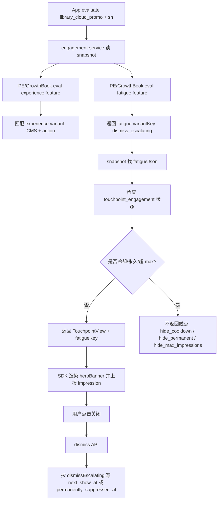

# 触点接入手册：以 `library_cloud_promo` 和疲劳度变体为样例

本文给宿主 App 同学和 AI agent 使用。目标是把相册首页 `library_cloud_promo` 的接入流程讲清楚，尤其说明 PROACTIVE 触点的疲劳度变体如何在 engagement-admin 配置，以及 GrowthBook `engagement_library_cloud_promo_fatigue` 如何关联到这些变体。

相关代码仓库：

| 系统 | GitLab |
|---|---|
| engagement | `https://gitlab.addx.ai/services/value-added/engagement` |
| personalization-engine | `https://gitlab.addx.ai/services/personalization-engine` |
| marketing-cms | `https://gitlab.addx.ai/CLOUD/marketing-cms` |
| g0-ios | `https://gitlab.addx.ai/SWCLIEN/g0-ios` |
| g0-android | `https://gitlab.addx.ai/SWCLIEN/g0-android` |
| g0-flutter-module | `https://gitlab.addx.ai/SWCLIEN/g0-flutter-module` |

## 0. 结论

`library_cloud_promo` 是相册首页的设备级 `PROACTIVE` 触点：

- admin `slug` = SDK `slotName` = `library_cloud_promo`。
- 体验 feature = `engagement_library_cloud_promo_experience`，决定展示哪个 banner / CTA。
- 疲劳度 feature = `engagement_library_cloud_promo_fatigue`，决定用户关闭后按哪个节奏冷却。
- CMS blockType = `heroBanner`，用于相册首页大 banner。
- R0 legacy 变体走 `OPEN_PAYWALL`，跳 Gen3 cloud paywall。
- R1 广告 FreeLicense 变体走 `DEEP_LINK`，跳 Flutter Free License 领取页。
- 疲劳度当前只有一个 admin 变体 `dismiss_escalating`，GrowthBook fatigue feature 的 default value 也是 `dismiss_escalating`，因此所有用户默认用这套关闭逐级冷却策略。

`library_cloud_promo` 和 `cloud_service_voucher` 都属于广告 FreeLicense 触点族，但不要混淆：

| 触点 | Surface | 宿主 | CMS block | 疲劳度 |
|---|---|---|---|---|
| `cloud_service_voucher` | Cloud Service 页 | Flutter | `textBanner` | 当前无冷却 / no cooldown |
| `library_cloud_promo` | 相册首页 | 原生 iOS / Android | `heroBanner` | `dismissEscalating`：7 / 15 / 30 天，第 4 次永久 |
| `playback_cloud_promo` | 回看页 / 相册详情 cell | 原生 iOS / Android | `inlineBanner` | cell 级 contextual，通常无 cooldown |

## 1. 标识符和职责

截至 2026-07-06 从 engagement-admin / GrowthBook 查询到的配置：

```yaml
slug: library_cloud_promo
type: PROACTIVE
preludeEventKey: library_page
gbFeatureIdExperience: engagement_library_cloud_promo_experience
gbFeatureIdFatigue: engagement_library_cloud_promo_fatigue
cmsBlockType: heroBanner
hostSurface: Library tab table header
deviceScope: true
```

admin 触点基础信息：

| 字段 | 值 |
|---|---|
| `slug` | `library_cloud_promo` |
| `type` | `PROACTIVE` |
| `status` | `active` |
| `preludeEventKey` | `library_page` |
| `gbFeatureIdExperience` | `engagement_library_cloud_promo_experience` |
| `gbFeatureIdFatigue` | `engagement_library_cloud_promo_fatigue` |
| `description` | 相册首页 Library banner，R0 视频快过期 legacy 迁移 + R1 广告 FL |

## 2. 宿主 App 接入

### 2.1 iOS slot 常量

g0-ios 仓库 `BaseUI/BaseUI/Engagement/EngagementSlotIdentifiers.swift`：

```swift
public enum EngagementSlot {
    public static let libraryCloudPromo = "library_cloud_promo"
}
```

注释里的关键语义：

- 这是 Library tab 顶部 banner。
- 类型是 `PROACTIVE`。
- 内容是 `heroBanner`。
- R0 替代 iot `/freeuser/banner` 的视频快过期导购。
- R1 叠加广告 FreeLicense voucher。
- 虽然 UI 是页面级 banner，但 R1 池和 `hasRedeemedAdFL` gate 都是设备级，所以 evaluate 要传一台代表设备的 sn。
- CTA deep link 不带 sn；领取页会聚合用户所有可领取设备。

### 2.2 iOS 相册页接入

g0-ios 仓库 `AddxAi/Classes/A4xLibraryUIKit/Manager/A4xLibraryBannerManager.swift`：

```swift
EngagementTouchpoint.proactive(
    slotName: EngagementSlot.libraryCloudPromo,
    in: bannerContainer,
    context: EngagementContext(sn: evaluationSn()),
    onContentSizeChange: { [weak self] size in
        self?.applyBannerHeight(size.height)
    }
)
```

宿主封装要点：

| 点 | 说明 |
|---|---|
| `evaluationSn()` | 取第一台非 hub camera 的 serialNumber，兜底第一台设备；没有设备时传 nil，banner 应隐藏 |
| 容器挂载 | 先把 `bannerContainer` 以 0 高度挂到 `tableView.tableHeaderView`，让 SDK 渲染的 `heroBanner` 有宽度可测量 |
| 高度回调 | SDK 通过 `onContentSizeChange` 返回高度，宿主再更新 table header；高度 ≤ 0 时移除 header |
| 语言切换 | SDK cache key 是 `(slot, sn)`，不含语言；语言变化时先 `invalidateAllTouchpointCache()` |
| 临时隐藏 | SD-card mode 等场景调用 `hideBannerTemporarily()`，避免异步 SDK render 把 header 又挂回去 |
| 恢复 | 退出临时隐藏后重新 evaluate，拿最新 eligibility、fatigue 和 CMS 内容 |

`PROACTIVE` 不要传 child。miss、GB 不命中、fatigue 冷却命中、CMS 渲染失败都会表现为高度 0，宿主收起 header。

### 2.3 Android / Flutter 边界

广告 FreeLicense 触点族里，`library_cloud_promo` banner 本身是原生相册 surface。领取页是 Flutter：

- banner 点击 R1 变体的 deep link。
- 原生路由打开 `free_license_page`。
- g0-flutter-module 的 Free License 页面根据 `source=library_cloud_promo`、`cmsSlug`、`freeLicenseId` 渲染领取页和归因。

如果后续 Android 也接 `library_cloud_promo`，应和 iOS 保持相同语义：相册首页容器、`EngagementProactive` / 对应原生 proactive API、`heroBanner` builder、高度回调、miss 收起、点击走全局 `onOpenAction`。

## 3. CMS 内容

`library_cloud_promo` 使用 marketing-cms 的 `heroBanner` block。它和 Cloud Service 的 `textBanner` 不同，不能互换。

`heroBanner` 典型 payload：

```json
{
  "blockType": "heroBanner",
  "payload": {
    "title": "...",
    "subtitle": "...",
    "iconUrl": "...",
    "ctaLabel": "...",
    "bgColor": "#58DBD2",
    "bgColorEnd": "#5FD7DB",
    "titleColor": "#FFFFFF",
    "subtitleColor": "#FFFFFF",
    "ctaBgColor": "#FFFFFF",
    "ctaTextColor": "#5AC4A7"
  }
}
```

当前 admin 绑定的 CMS slug：

| variantKey | cmsSlug | 说明 |
|---|---|---|
| `legacy_library_banner_expire` | `library-banner-expire-r0` | R0 视频快过期 legacy banner |
| `ad_fl_voucher_1007_us02` | `library-ad-fl-3d` | 广告 FL 1007，3 天滚动 |
| `ad_fl_voucher_1008_us02` | `library-ad-fl-7d` | 广告 FL 1008，7 天滚动 |

接入新相册触点或新增变体前必须先确认：

1. marketing-cms 已有 `heroBanner` 模板。
2. 目标 CMS entry 已 Published，多语言完成。
3. iOS / Android SDK 已注册 `heroBanner` builder。
4. admin 绑定的是 Library 专用 `heroBanner` entry，不要误绑 Cloud Service 的 `textBanner` entry。

## 4. engagement-admin 体验变体

admin 里的 experience variant 决定“展示什么内容”和“点击去哪里”。当前真实配置：

| variantKey | cmsSlug | actionType | actionConfig |
|---|---|---|---|
| `legacy_library_banner_expire` | `library-banner-expire-r0` | `OPEN_PAYWALL` | `paywallId=vip_purchase_product_page_0319_v1` |
| `ad_fl_voucher_1007_us02` | `library-ad-fl-3d` | `DEEP_LINK` | `smart-camera://payment/free_license_page?source=library_cloud_promo&cmsSlug=free-license-page-1007&freeLicenseId=1007` |
| `ad_fl_voucher_1008_us02` | `library-ad-fl-7d` | `DEEP_LINK` | `smart-camera://payment/free_license_page?source=library_cloud_promo&cmsSlug=free-license-page-1008&freeLicenseId=1008` |

配置规则：

- `variantKey` 必须和 GrowthBook experience feature 返回值完全一致。
- `cmsSlug` 是 banner 内容，不是领取页内容。
- `OPEN_PAYWALL` 只配置 `paywallId`，不要配置 deep link。
- `DEEP_LINK` 必须带 `source=library_cloud_promo`，否则领取页和数仓无法归因。
- 广告 FL deep link 必须带 `cmsSlug=free-license-page-1007/1008` 和 `freeLicenseId=1007/1008`。
- 1007 / 1008 的 deep link 目标和 Cloud Service / Playback 一致，差异只在 `source` 和 banner `cmsSlug`。

API 修改后，必须回到 engagement-admin 页面只读复核每个 variant。禁止用 UI 表单写入；`variantKey` drift 是高风险问题：GB 返回了一个 snapshot 没有登记的 variantKey 时，SDK 可能渲染内容但 action 为空，用户点击后到不了 paywall / 领取页。

## 5. GrowthBook 体验 feature

GrowthBook 入口：

- `https://us-ab-management.addx.live/features/engagement_library_cloud_promo_experience`

截至 2026-07-06 重新查询：

```yaml
id: engagement_library_cloud_promo_experience
valueType: string
defaultValue: ""
environments:
  staging:
    enabled: true
    rules: 8
  pre:
    enabled: true
    rules: 0
  production:
    enabled: true
    rules: 0
```

staging 当前规则：

| 顺序 | 类型 | 说明 | 返回值 |
|---|---|---|---|
| 0 | force | QA 白名单 userId | `legacy_library_banner_expire` |
| 1 | experiment-ref | R1 池1未领取存量池，共享 cloud_service_voucher 实验 | 当前两臂都返回 `ad_fl_voucher_1008_us02` |
| 2 | experiment-ref | R1 池3 1003 迁移，共享实验 | 当前两臂都返回 `ad_fl_voucher_1008_us02` |
| 3 | experiment-ref | R1 池2 1001 过期 N=0 | `ad_fl_voucher_1007_us02` / `ad_fl_voucher_1008_us02` |
| 4 | experiment-ref | R1 池2 1001 过期 N=7 | `ad_fl_voucher_1007_us02` / `ad_fl_voucher_1008_us02` |
| 5 | experiment-ref | R1 池2 1001 过期 N=14 | `ad_fl_voucher_1007_us02` / `ad_fl_voucher_1008_us02` |
| 6 | experiment-ref | R1 池4 老账号 2 年 3 天兜底 | 当前两臂都返回 `ad_fl_voucher_1008_us02` |
| 7 | force | R0 视频快过期 legacy banner | `legacy_library_banner_expire` |

R0 force 条件：

```json
{
  "isUserVip": false,
  "hasRedeemedAdFL": false,
  "videosExpiringIn24h": true
}
```

注意：

- 当前 production 没有 rules，不要假设 prod 已放量。
- Library 的 R1 池实验复用 Cloud Service 的共享实验 / saved group，但 Library 有自己的 experience feature 和自己的 admin variant / CMS slug。
- `defaultValue=""` 表示不展示；如果所有规则都不命中，触点 miss，宿主 header 收起。

## 6. 疲劳度变体是什么

PROACTIVE 触点有两个正交维度：

| 维度 | 决定什么 | Admin 表 | GrowthBook feature | SDK / 数仓字段 |
|---|---|---|---|---|
| Experience | 展示什么内容、点击去哪里 | `experience_variant` | `engagement_<slug>_experience` | `experience_key` |
| Fatigue | 多久再展示、关闭后如何冷却 | `fatigue_variant` | `engagement_<slug>_fatigue` | `fatigue_key` |

这两个维度不要耦合。`library_cloud_promo` 可以改 banner 文案 / deep link，而不改疲劳策略；也可以只改疲劳策略，而不动 CMS 内容。

当前 `library_cloud_promo` 的 fatigue variant：

```yaml
variantKey: dismiss_escalating
description: 关闭逐级冷却 7/15/30 天，第 4 次永久不再现；对齐线上 FREE_USER_NOTIFY
sortOrder: 0
fatigueJson:
  maxImpressions: null
  fatigue:
    strategy: dismissEscalating
    phases:
      - cooldownDays: 7
      - cooldownDays: 15
      - cooldownDays: 30
    permanentAfter: 4
```

完整 JSON：

```json
{
  "maxImpressions": null,
  "fatigue": {
    "strategy": "dismissEscalating",
    "phases": [
      {"cooldownDays": 7},
      {"cooldownDays": 15},
      {"cooldownDays": 30}
    ],
    "permanentAfter": 4
  }
}
```

语义：

| 累计关闭次数 | 行为 |
|---|---|
| 第 1 次关闭 | 冷却 7 天，冷却期内 evaluate 返回隐藏 |
| 第 2 次关闭 | 冷却 15 天 |
| 第 3 次关闭 | 冷却 30 天 |
| 第 4 次及以后 | 永久抑制，不再展示 |

这套策略复刻 iot legacy `FREE_USER_NOTIFY`：

```text
1: 604800 秒 = 7 天
2: 1296000 秒 = 15 天
3: 2592000 秒 = 30 天
第 4 次起永久
```

## 7. 疲劳度变体怎么配置

在 engagement-admin 配置 `library_cloud_promo` 的疲劳度时：

1. 打开触点详情页 `/touchpoints/library_cloud_promo`。
2. 确认触点类型是 `PROACTIVE`。`FEATURE_GATE` 不允许配置 fatigue variant。
3. 进入 Fatigue variants 区域。
4. 新建或编辑变体：
   - `variantKey`: `dismiss_escalating`
   - `fatigueJson.maxImpressions`: `null`
   - `fatigue.strategy`: `dismissEscalating`
   - `fatigue.phases`: `[{cooldownDays:7},{cooldownDays:15},{cooldownDays:30}]`
   - `fatigue.permanentAfter`: `4`
5. 保存后确认 admin 的 `gbFeatureIdFatigue` 是 `engagement_library_cloud_promo_fatigue`。
6. 创建 release 发布到 staging。
7. staging 验证 dismiss 后冷却，再考虑 prod 发布。

如果通过 API 创建，形态如下：

```bash
curl -X POST "$ENGAGEMENT_ADMIN/api/touchpoints/library_cloud_promo/fatigue-variants" \
  -H "Content-Type: application/json" \
  -H "x-engagement-admin-operator: <operator>" \
  -d '{
    "variantKey": "dismiss_escalating",
    "description": "关闭逐级冷却 7/15/30 天，第 4 次永久不再现 — 对齐线上 FREE_USER_NOTIFY",
    "sortOrder": 0,
    "fatigueJson": {
      "maxImpressions": null,
      "fatigue": {
        "strategy": "dismissEscalating",
        "phases": [
          {"cooldownDays": 7},
          {"cooldownDays": 15},
          {"cooldownDays": 30}
        ],
        "permanentAfter": 4
      }
    }
  }'
```

API 创建或修改后，必须去 admin UI 检查：

- fatigue variant 是否出现在触点详情页。
- `variantKey` 是否是 `dismiss_escalating`。
- JSON 是否是 `fatigue.strategy=dismissEscalating`，不是 `fixed` 或 `phased`。
- `permanentAfter=4` 是否存在。
- 发布单 snapshot 里是否包含 `fatigues[]`。

## 8. GrowthBook fatigue feature 如何关联 fatigue variant

GrowthBook fatigue feature 入口：

- `https://us-ab-management.addx.live/features/engagement_library_cloud_promo_fatigue`

截至 2026-07-06 重新查询：

```yaml
id: engagement_library_cloud_promo_fatigue
valueType: string
defaultValue: dismiss_escalating
environments:
  staging:
    enabled: true
    defaultValue: dismiss_escalating
    rules: 0
  pre:
    enabled: true
    defaultValue: dismiss_escalating
    rules: 0
  production:
    enabled: true
    defaultValue: dismiss_escalating
    rules: 0
```

关联机制：

1. engagement-admin 触点上保存 `gbFeatureIdFatigue=engagement_library_cloud_promo_fatigue`。
2. 发布单生成 snapshot，snapshot 里有：
   - `gbFeatureIdFatigue`
   - `fatigues[]`
   - 每个 fatigue variant 的 `variantKey` 和 `fatigueJson`
3. runtime evaluate `library_cloud_promo` 时，engagement-service 会额外调用 PE / GrowthBook 评估 fatigue feature。
4. GrowthBook 返回 string value，例如 `dismiss_escalating`。
5. engagement-service 用这个 value 在 snapshot `fatigues[]` 里找同名 `variantKey`。
6. 找到后：
   - `TouchpointView.fatigueKey = "dismiss_escalating"`，进入 SDK 和 Snowplow。
   - 对应 `fatigueJson` 参与 max impressions / cooldown / dismiss 策略。

当前没有 rules，靠 defaultValue 关联：

```text
GrowthBook defaultValue = dismiss_escalating
        ↓
snapshot.fatigues[].variantKey = dismiss_escalating
        ↓
runtime 使用该 fatigueJson
```

如果以后要 A/B 疲劳度，例如一半用户 7/15/30/永久，另一半用户 3/7/15/永久，流程是：

1. 在 admin 新增第二个 fatigue variant，例如 `dismiss_escalating_fast`。
2. 配不同的 `fatigueJson`。
3. 发布 release 到 staging，使 snapshot 带两个 fatigue variants。
4. 到 GrowthBook `engagement_library_cloud_promo_fatigue` 的 staging 环境新增 experiment rule。
5. variation value 分别填写 `dismiss_escalating`、`dismiss_escalating_fast`。
6. 确认每个 GrowthBook value 都能在 admin fatigue variants 找到同名 `variantKey`。
7. staging 用不同用户验证 `fatigue_key` 分布和冷却行为。
8. 再推 production。

常见误配：

| 误配 | 结果 |
|---|---|
| GB 返回 `dismissEscalating`，admin variantKey 是 `dismiss_escalating` | 找不到 fatigue variant，可能退回默认或 fail-safe |
| admin 有 fatigue variant，但 `gbFeatureIdFatigue` 空 | runtime 不会调用 fatigue feature，`fatigue_key` 为空 |
| GB defaultValue 为空 | 没有 rules 时 fatigue 无法分桶 |
| PROACTIVE 没有 fatigue variants | 发布预检应阻断；即使绕过，也会失去关闭冷却 |
| JSON 写成 `phased` | 不是按关闭次数冷却，无法复刻 FREE_USER_NOTIFY |
| `permanentAfter` 漏配 | 超过 phases 后仍可能永久，但语义不直观，UI 复核困难 |

## 9. Runtime 疲劳链路



evaluate 和 dismiss 都会用到 fatigue 策略：

- evaluate：看当前用户是否处于冷却 / 永久抑制 / maxImpressions 上限。
- dismiss：累计 `dismiss_count`，按策略写入 `next_show_at` 或 `permanently_suppressed_at`。

数据列：

| 字段 | 作用 |
|---|---|
| `dismiss_count` | 累计关闭次数，驱动第几档冷却 |
| `next_show_at` | 冷却到期时间，当前时间早于它则不展示 |
| `permanently_suppressed_at` | 非空表示永久不再展示 |

解析失败时的 fail-safe：如果触点有 fatigue 配置但 JSON 解析失败，后端退回固定 7 天冷却，避免用户关闭后立刻又看到 banner。

## 10. 测试、观察和交接

测试、线上观察、FAQ、给 AI agent 的最小输入卡和参考资料已拆到子文档，避免单个 reference 文件过长：

- `library-cloud-promo-fatigue-ops.md`

阅读顺序建议：先读本文 0-9 理解体验变体、疲劳度变体和 runtime 链路，再读子文档完成验证和交接。
