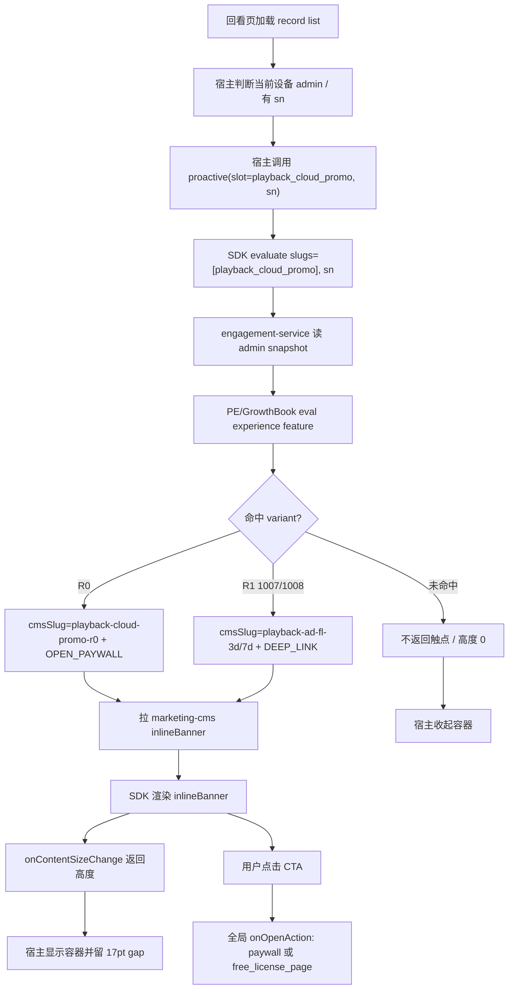

# 触点接入手册：以 `playback_cloud_promo` 回看页导购条为样例

本文给宿主 App 同学和 AI agent 使用。目标是把 `playback_cloud_promo` 的接入流程讲清楚，覆盖原生 iOS / Android 宿主接入、`inlineBanner` CMS 模板、engagement-admin 变体、GrowthBook 规则、无冷却策略、测试和线上观察。

相关代码仓库：

| 系统 | GitLab |
|---|---|
| engagement | `https://gitlab.addx.ai/services/value-added/engagement` |
| personalization-engine | `https://gitlab.addx.ai/services/personalization-engine` |
| marketing-cms | `https://gitlab.addx.ai/CLOUD/marketing-cms` |
| g0-ios | `https://gitlab.addx.ai/SWCLIEN/g0-ios` |
| g0-android | `https://gitlab.addx.ai/SWCLIEN/g0-android` |
| g0-flutter-module | `https://gitlab.addx.ai/SWCLIEN/g0-flutter-module` |

## 0. 结论

`playback_cloud_promo` 是回看页 / 相册详情页的设备级 `PROACTIVE` 触点：

- admin `slug` = SDK `slotName` = `playback_cloud_promo`。
- 体验 feature = `engagement_playback_cloud_promo_experience`。
- CMS blockType = `inlineBanner`，是回看 timeline 上方的横向窄条。
- 宿主是原生 iOS / Android；Free License 领取页仍由 Flutter 页面承接。
- R0 变体 `legacy_image_only_subscribe` 走 `OPEN_PAYWALL`，跳 Gen3 cloud paywall。
- R1 广告 FreeLicense 变体走 `DEEP_LINK`，跳 `free_license_page`。
- 当前 admin 有 `no_cooldown` fatigue variant，但 `gbFeatureIdFatigue=null`；GrowthBook 上存在 `engagement_playback_cloud_promo_fatigue` 但未关联到触点。运行时语义是 cell 级 contextual CTA，不做关闭冷却。

三类广告 FreeLicense surface 的差异：

| 触点 | Surface | 宿主 | CMS block | 疲劳度 |
|---|---|---|---|---|
| `cloud_service_voucher` | Cloud Service 页 | Flutter | `textBanner` | 无冷却 |
| `library_cloud_promo` | 相册首页 | 原生 iOS / Android | `heroBanner` | `dismissEscalating`：7 / 15 / 30 天，第 4 次永久 |
| `playback_cloud_promo` | 回看页 / 相册详情 | 原生 iOS / Android | `inlineBanner` | cell 级 contextual CTA，当前无冷却 |

## 1. 标识符和职责

截至 2026-07-06 从 engagement-admin / GrowthBook 查询到的配置：

```yaml
slug: playback_cloud_promo
type: PROACTIVE
preludeEventKey: library_page
gbFeatureIdExperience: engagement_playback_cloud_promo_experience
gbFeatureIdFatigue: null
cmsBlockType: inlineBanner
hostSurface: Library detail / playback timeline
deviceScope: true
```

admin 触点基础信息：

| 字段 | 值 |
|---|---|
| `slug` | `playback_cloud_promo` |
| `type` | `PROACTIVE` |
| `status` | `active` |
| `preludeEventKey` | `library_page` |
| `gbFeatureIdExperience` | `engagement_playback_cloud_promo_experience` |
| `gbFeatureIdFatigue` | `null` |
| `description` | 回看页 / 相册详情 image-only event 订阅导购条；R0 迁移自客户端 `subscribe_to_view_video`，R1 叠加广告 FL |

命名注意：历史文档里出现过 `engagement_playback_cloud_promo`，当前真实配置以 admin 为准，是 `engagement_playback_cloud_promo_experience`。

## 2. 宿主 App 接入

### 2.1 iOS slot 常量

g0-ios 仓库 `BaseUI/BaseUI/Engagement/EngagementSlotIdentifiers.swift`：

```swift
public enum EngagementSlot {
    public static let playbackCloudPromo = "playback_cloud_promo"
}
```

注释里的关键语义：

- 回看页 / 相册详情订阅导购条。
- 类型是 `PROACTIVE`。
- 内容是 `inlineBanner`。
- R0 是导购：`OPEN_PAYWALL → Gen3`。
- R1 是广告 FL：`DEEP_LINK → Free License 领取页`。
- 设备级 slot，必须传当前 cell / 当前回看记录对应的 sn。

### 2.2 iOS 回看 cell 接入

g0-ios 仓库 `AddxAi/Classes/A4xLibraryUIKit/LibraryDetail/View/A4xMediaPlayScrollCell.swift`。

数据源更新后触发 evaluate：

```swift
var dataSourceArray: [RecordBean]? {
    set {
        _dataSourceArray = newValue
        self.updateMediaData()
        self.fetchVideoEventDetail()
        self.setupEngagementBannerIfNeeded()
    }
}
```

核心接入：

```swift
private func setupEngagementBannerIfNeeded() {
    guard !engagementBannerRequested, isAdmin() else { return }
    let sn = dataSourceArray?.first?.cID ?? ""
    guard !sn.isEmpty else { return }
    engagementBannerRequested = true
    EngagementTouchpoint.proactive(
        slotName: EngagementSlot.playbackCloudPromo,
        in: engagementBannerContainer,
        context: EngagementContext(sn: sn),
        onContentSizeChange: { [weak self] size in
            guard let self = self else { return }
            guard self.engagementBannerHeight != size.height else { return }
            let wasHidden = self.engagementBannerHeight <= 0
            self.engagementBannerHeight = size.height
            if wasHidden || size.height <= 0 {
                self.tableView.reloadSections(IndexSet(integer: 0), with: .none)
            } else {
                self.tableView.beginUpdates()
                self.tableView.endUpdates()
            }
        }
    )
}
```

iOS 宿主侧硬过滤：

| 条件 | 处理 |
|---|---|
| 已请求过当前 cell 的 banner | `engagementBannerRequested` 防重复 evaluate |
| 当前用户不是设备 admin | 不调用 SDK |
| 当前记录没有 sn | 不调用 SDK |

布局要点：

- SDK 渲染到 `engagementBannerContainer`。
- SDK 通过 `onContentSizeChange` 回传 `inlineBanner` 实际高度。
- `heightForHeaderInSection` 返回 `engagementBannerHeight + 17pt`，17pt 是 banner 和下方 timeline 卡片之间的留白。
- `viewForHeaderInSection` 把 container 钉到 wrapper 顶部，底部留 17pt 间距。
- 高度从 0 到正数，或从正数到 0 时，必须 `reloadSections`，否则 table view 可能复用 0 高度时的空 header，出现“有高度但空白”。

`isShowImageMediaType()` 只用于媒体播放控制，导购条是否展示已经交给 engagement evaluate。不要再在客户端用 `vipTag` / `mediaType` 重新实现展示规则。

### 2.3 Android 回看页接入

g0-android 仓库 `a4xlibrary/a4xlibrarykit/src/main/java/com/a4x/a4xlibrary/ui/LibraryEventPlayActivity.kt`。

核心接入在 `freshLicenseLayout(serialNumber, position)`：

```kotlin
private fun freshLicenseLayout(serialNumber: String?, position: Int) {
    dismissLoadingDialog()
    val localDevice = DeviceManager.getInstance().get(serialNumber)
    if (localDevice == null || !localDevice.isAdmin) return
    val licenseLayout = this@LibraryEventPlayActivity.viewpageradapter
        ?.getViewByPos(position)
        ?.findViewById<ViewGroup?>(R.id.layout_license) ?: return

    EngagementTouchpoint.proactive(
        slotName = "playback_cloud_promo",
        container = licenseLayout,
        context = EngagementContext(sn = serialNumber),
        onContentSizeChange = { _, height ->
            licenseLayout.visibility = if (height > 0) View.VISIBLE else View.GONE
        },
    )
}
```

Android 布局容器在 `a4xlibrary/a4xlibrarykit/src/main/res/layout/item_library_play.xml`：

```xml
<FrameLayout
    android:id="@+id/layout_license"
    android:layout_width="match_parent"
    android:layout_height="wrap_content"
    android:layout_marginBottom="17dp"
    android:visibility="gone"
    tools:visibility="visible" />
```

Android 宿主侧硬过滤：

| 条件 | 处理 |
|---|---|
| 本地设备不存在 | 不调用 SDK |
| 当前用户不是设备 admin | 不调用 SDK |
| 找不到当前 position 的 `layout_license` | 不调用 SDK |
| SDK 回调高度 0 | `layout_license` 设为 `GONE` |

Android 注释里保留了一个边界：per-event `mediaType == image` 仍由调用点判定，不进 engagement。也就是说 engagement 负责“给定这个回看入口是否展示 / 展示哪个变体”，但宿主什么时候调用 `freshLicenseLayout` 仍由页面上下文决定。

## 3. CMS 内容

`playback_cloud_promo` 使用 marketing-cms 的 `inlineBanner` block。它不是 Library 首页的 `heroBanner`，也不是 Cloud Service 页的 `textBanner`。

`inlineBanner` payload 契约：

```json
{
  "blockType": "inlineBanner",
  "payload": {
    "text": "Subscribe to see new events in video.",
    "iconUrl": "",
    "ctaLabel": "Subscribe",
    "bgColor": "#58DBD2",
    "bgColorEnd": "#5BDFBB",
    "textColor": "#FFFFFF",
    "ctaBgColor": "#FFFFFF",
    "ctaTextColor": "#5AC4A7"
  }
}
```

字段规则：

- `text`、`ctaLabel`、`bgColor`、`textColor`、`ctaBgColor`、`ctaTextColor` 是必填。
- `bgColorEnd` 缺省时退化为纯色底。
- `iconUrl` 为空时隐藏 icon。
- 必填字段缺失时 SDK 返回零尺寸 view，宿主会收起容器。
- 整条 banner 点击触发 CTA。

当前 admin 绑定的 CMS slug：

| variantKey | cmsSlug | 说明 |
|---|---|---|
| `legacy_image_only_subscribe` | `playback-cloud-promo-r0` | R0 回看订阅导购条 |
| `ad_fl_voucher_1007_us02` | `playback-ad-fl-3d` | 广告 FL 1007，3 天滚动 |
| `ad_fl_voucher_1008_us02` | `playback-ad-fl-7d` | 广告 FL 1008，7 天滚动 |

历史文档里出现过 `playback-ad-fl-7d` / `playback-ad-fl-30d` 的旧命名；当前真实 admin 配置以 `playback-ad-fl-3d` / `playback-ad-fl-7d` 为准。接入新变体时不要直接照抄旧文档里的 slug，必须去 marketing-cms 和 admin 当前配置确认。

## 4. engagement-admin 配置

触点配置入口：`https://engagement-admin.addx.live`。

当前真实 experience variants：

| variantKey | cmsSlug | actionType | actionConfig |
|---|---|---|---|
| `legacy_image_only_subscribe` | `playback-cloud-promo-r0` | `OPEN_PAYWALL` | `paywallId=vip_purchase_product_page_0319_v1` |
| `ad_fl_voucher_1007_us02` | `playback-ad-fl-3d` | `DEEP_LINK` | `smart-camera://payment/free_license_page?source=playback_cloud_promo&cmsSlug=free-license-page-1007&freeLicenseId=1007` |
| `ad_fl_voucher_1008_us02` | `playback-ad-fl-7d` | `DEEP_LINK` | `smart-camera://payment/free_license_page?source=playback_cloud_promo&cmsSlug=free-license-page-1008&freeLicenseId=1008` |

当前 fatigue variants：

```yaml
variantKey: no_cooldown
fatigueJson:
  strategy: none
description: 无冷却；cell 级 contextual CTA，非 VIP 每次进详情页都出
```

注意：虽然 admin 有 `no_cooldown` fatigue variant，但触点基础信息里的 `gbFeatureIdFatigue` 是 `null`。这表示当前运行时不通过 GrowthBook fatigue feature 分桶，文档和排障时不要期待 evaluate 返回稳定的 `fatigueKey=no_cooldown`。

配置规则：

- `PROACTIVE` 的 experience variant 固定 `locked=true`，由 SDK 渲染 CMS 内容。
- R0 `OPEN_PAYWALL` 只配置 `paywallId`。
- R1 `DEEP_LINK` 必须带 `source=playback_cloud_promo`。
- R1 deep link 里的 `cmsSlug=free-license-page-1007/1008` 是领取页内容，不是 banner CMS slug。
- banner CMS slug 是 `playback-ad-fl-3d/7d`，只在 admin variant 的 `cmsSlug` 字段里。
- API 修改后，必须回到 admin 触点详情页只读检查每个 variant 的 `variantKey`、`cmsSlug`、`actionType`、`actionConfig`；禁止通过 UI 表单写入。

如果未来决定接入真正的 fatigue feature，需要额外确认：

1. admin touchpoint 的 `gbFeatureIdFatigue` 填 `engagement_playback_cloud_promo_fatigue`。
2. GrowthBook `engagement_playback_cloud_promo_fatigue` 的 default value 或 rule value 返回 `no_cooldown`。
3. admin fatigue variant 里存在同名 `variantKey=no_cooldown`。
4. 发布 release 后 staging evaluate 能看到 `fatigueKey`。

当前不建议为了“配置完整”强行挂 fatigue feature，因为此触点是 cell 级 contextual CTA，设计目标就是无冷却。

## 5. GrowthBook 配置

GrowthBook experience 入口：

- `https://us-ab-management.addx.live/features/engagement_playback_cloud_promo_experience`

截至 2026-07-06 重新查询：

```yaml
id: engagement_playback_cloud_promo_experience
valueType: string
defaultValue: ""
environments:
  staging:
    enabled: true
    defaultValue: ""
    rules: 7
  pre:
    enabled: true
    defaultValue: ""
    rules: 0
  production:
    enabled: true
    defaultValue: ""
    rules: 0
```

staging 当前规则：

| 顺序 | 类型 | 说明 | 返回值 |
|---|---|---|---|
| 0 | experiment-ref | 池1 未领取存量，共享 Cloud Service 实验 | 当前两臂都返回 `ad_fl_voucher_1008_us02` |
| 1 | experiment-ref | 池3 设备级 1003，共享实验 | 当前两臂都返回 `ad_fl_voucher_1008_us02` |
| 2 | experiment-ref | 池2 1001 过期 N=0 | `ad_fl_voucher_1007_us02` / `ad_fl_voucher_1008_us02` |
| 3 | experiment-ref | 池2 1001 过期 N=7 | `ad_fl_voucher_1007_us02` / `ad_fl_voucher_1008_us02` |
| 4 | experiment-ref | 池2 1001 过期 N=14 | `ad_fl_voucher_1007_us02` / `ad_fl_voucher_1008_us02` |
| 5 | experiment-ref | 池4 老账号 2 年 3 天兜底 | 当前两臂都返回 `ad_fl_voucher_1008_us02` |
| 6 | force | R0 录像回看引导条 | `legacy_image_only_subscribe` |

R0 force 条件：

```json
{
  "noPaidCloud": true,
  "is4G": false
}
```

GrowthBook fatigue 入口：

- `https://us-ab-management.addx.live/features/engagement_playback_cloud_promo_fatigue`

截至 2026-07-06 重新查询，该 feature 存在但没有实际关联：

```yaml
id: engagement_playback_cloud_promo_fatigue
valueType: string
defaultValue: ""
environments:
  staging:
    enabled: true
    rules: 0
  pre:
    enabled: true
    rules: 0
  production:
    enabled: true
    rules: 0
admin:
  gbFeatureIdFatigue: null
```

因此当前验收时主要看 experience feature，不把 `_fatigue` 当成必经链路。

## 6. 运行时时序



关键不变量：

- 每次 evaluate 必须带当前回看记录对应设备的 sn。
- 宿主只做 owner/admin、调用时机、容器布局，不再做权益判断。
- `inlineBanner` 高度由 SDK 测量，宿主不要写死固定高度。
- miss / 已付费 / 已领取 / GB 不命中时，SDK 回调高度 0，宿主必须收起容器。

## 7. 测试

### 7.1 单元和集成测试

已有测试可参考：

| 仓库 | 文件 | 覆盖点 |
|---|---|---|
| engagement | `sdk-ios/Tests/EngagementSDKTests/ContentViewBuilderTests.swift` | `inlineBanner` 字段、CTA locator、size callback |
| engagement | `sdk-ios/Tests/EngagementSDKTests/TouchpointRendererTests.swift` | `inlineBanner` builder 注册 |
| g0-android | `ThirdPartLib/engagement/sdk-android/src/test/kotlin/.../InlineBannerViewBuilderTest.kt` | Android `inlineBanner` 渲染和高度回调 |
| engagement | `observability/superset/free-license/*.sql` | FreeLicense 三个 surface 的数据口径 |

### 7.2 Staging E2E

基础 evaluate：

```bash
curl -X POST "$API_BASE/en/engagement/v1/touchpoints/evaluate" \
  -H "Authorization: Bearer $TOKEN" \
  -H "Content-Type: application/json" \
  -d '{
    "slugs": ["playback_cloud_promo"],
    "sn": "<device_sn>",
    "language": "en",
    "app": {"appType": "iOS", "version": 10000}
  }'
```

命中时重点检查：

```json
{
  "slotName": "playback_cloud_promo",
  "slotType": "blocks",
  "solutionId": "playback-ad-fl-7d",
  "experienceKey": "ad_fl_voucher_1008_us02",
  "content": {
    "blocks": [
      {"blockType": "inlineBanner", "payload": {"text": "..."}}
    ]
  },
  "deepLink": "smart-camera://payment/free_license_page?source=playback_cloud_promo&cmsSlug=free-license-page-1008&freeLicenseId=1008"
}
```

必要用例：

| 用例 | 期望 |
|---|---|
| 非 admin 设备 | 宿主不调用 SDK，容器保持隐藏 |
| sn 为空 | 宿主不调用 SDK |
| R0 条件 `noPaidCloud=true && is4G=false` | 返回 `legacy_image_only_subscribe`，actionType=`OPEN_PAYWALL` |
| R1 池命中 1007 | 返回 `ad_fl_voucher_1007_us02`，CMS=`playback-ad-fl-3d`，deep link `freeLicenseId=1007` |
| R1 池命中 1008 | 返回 `ad_fl_voucher_1008_us02`，CMS=`playback-ad-fl-7d`，deep link `freeLicenseId=1008` |
| 已付费 / 已领取 / GB 不命中 | evaluate 不返回触点，宿主容器收起 |
| `inlineBanner` 必填字段缺失 | SDK 回调高度 0，宿主容器收起 |
| 点击 R0 CTA | 打开 `vip_purchase_product_page_0319_v1` |
| 点击 R1 CTA | 打开 Free License 领取页，source=`playback_cloud_promo` |
| 埋点平台扫码验证 | 用 `addx:tracking-lifecycle` 或 `/check/dashboard/` 生成配置，扫码后真实触发展示、点击、转化路径，确认事件已发布且字段正确 |

## 8. 发布

发布顺序和其他触点一致：

1. marketing-cms staging 创建 / 发布 `inlineBanner` 内容。
2. engagement-admin 创建或更新 touchpoint / experience variants。
3. GrowthBook staging 配 rules，返回值必须能在 admin variants 找到。
4. engagement-admin 创建 release，生成 staging snapshot。
5. staging 用 API + 双端 App 实测。
6. 确认 prod 依赖：CMS prod 内容、GB prod rules、admin prod release、App 版本、deep link 目标、回滚方案。
7. 再发布 prod。

当前查询到 production 的 `engagement_playback_cloud_promo_experience` rules 为 0；上线前必须补 production rules，否则 prod 不会命中。

## 9. 线上观察

R0 `OPEN_PAYWALL` 完整漏斗看板：

- `https://superset-us.addx.live/superset/dashboard/paywall-p0-touchpoint-to-paywall-health/`
- 筛选 `slot_name=playback_cloud_promo` 和 R0 的 `paywall_id`。

SDK 基础排障看板：

- `https://superset-us.addx.live/superset/dashboard/527/`

R1 `DEEP_LINK` 的广告 FreeLicense 结果复用已有领域看板和 SQL：

- engagement 仓库 `observability/superset/free-license/01_ad_fl_touchpoint_funnel.sql`
- engagement 仓库 `observability/superset/free-license/02_ad_fl_assignment_match.sql`
- engagement 仓库 `observability/superset/free-license/03_ad_fl_pool_rollup.sql`

重点维度：

| 维度 | 说明 |
|---|---|
| `slot_name=playback_cloud_promo` | 回看页触点 |
| `solution_id` | CMS slug，例如 `playback-ad-fl-7d` |
| `experience_key` | 体验变体，例如 `legacy_image_only_subscribe` / `ad_fl_voucher_1008_us02` |
| `device_sn` | 设备级 sn，必须有 |
| `source=playback_cloud_promo` | 领取页归因 |
| `eval_result` | 是否被 targeting / 冷却 / 上限过滤 |

由于当前 `gbFeatureIdFatigue=null`，不要把 `fatigue_key` 作为此触点的核心验收维度。更重要的是看 evaluated、impressed、cta、converted 和领取页 source 归因。

## 10. 常见问题

| 问题 | 现象 | 处理 |
|---|---|---|
| 没传 sn | 设备级属性缺失，R0/R1 都可能 miss | 查 iOS `dataSourceArray.first.cID` / Android `serialNumber` |
| 非 admin 也展示 | 非 owner 用户看到导购 | 查宿主 `isAdmin` / `localDevice.isAdmin` 硬过滤 |
| CMS 误配为 `heroBanner` | 回看页横条视觉错位或高度异常 | 改成 Playback 专用 `inlineBanner` entry |
| 高度回调 0 但期望展示 | SDK builder 缺字段或颜色解析失败 | 查 CMS payload 必填字段 |
| iOS 有高度但空白 | table header 复用了旧空 view | 高度 0 ↔ 正数切换时必须 `reloadSections` |
| Android 容器占空白 | 高度 0 时没设 `GONE` | 查 `onContentSizeChange` 可见性逻辑 |
| 点击 R1 无归因 | deep link 缺 `source=playback_cloud_promo` | 修 admin actionConfig |
| 点击 R1 到错领取页 | deep link 里的 claim `cmsSlug/freeLicenseId` 错 | 1007 用 `free-license-page-1007`，1008 用 `free-license-page-1008` |
| prod 不展示 | production GB rules 为空或 admin prod release 未发 | 查 GB prod、admin Releases、CMS prod |
| 期待 `fatigue_key=no_cooldown` 但没有 | 当前 `gbFeatureIdFatigue=null` | 这是当前配置，不把 fatigue_key 当验收条件 |

## 11. 接入其他 cell 级 PROACTIVE 触点的最小输入卡

```yaml
slug: <全小写下划线>
type: PROACTIVE
surface: <页面 / cell / header>
deviceScope: true
snSource: <当前 cell 或 record 绑定的设备 SN>
hostHardGates:
  - 当前用户必须是设备 admin / owner
  - 当前调用点必须是目标 media/context
cms:
  blockType: inlineBanner
  cmsSlug: <banner 内容 slug>
admin:
  gbFeatureIdExperience: engagement_<slug>_experience
  gbFeatureIdFatigue: null | engagement_<slug>_fatigue
  variants:
    - variantKey: <GB value>
      cmsSlug: <banner cmsSlug>
      actionType: OPEN_PAYWALL | DEEP_LINK
growthbook:
  stagingRulesReady: true
  productionRulesReady: false
layout:
  onContentSizeChange: required
  zeroHeight: collapse container
  nonZeroHeight: show container
observability:
  touchpointPaywallDashboard: https://superset-us.addx.live/superset/dashboard/paywall-p0-touchpoint-to-paywall-health/
  sdkDiagnosticDashboard: https://superset-us.addx.live/superset/dashboard/527/
  domainOutcomeDashboard: <R1 已有 Free License 领域看板>
```

## 12. 参考资料

- GrowthBook experience：`https://us-ab-management.addx.live/features/engagement_playback_cloud_promo_experience`
- GrowthBook fatigue：`https://us-ab-management.addx.live/features/engagement_playback_cloud_promo_fatigue`
- engagement-admin：`https://engagement-admin.addx.live`
- marketing-cms staging：`https://marketing-cms-staging-us.addx.live/admin/collections/engagements`
- Superset 触点 + Paywall 通用 P0 看板：`https://superset-us.addx.live/superset/dashboard/paywall-p0-touchpoint-to-paywall-health/`
- Superset SDK 排障看板：`https://superset-us.addx.live/superset/dashboard/527/`
- engagement 仓库 `docs/architecture/sdk-ios/touchpoint-rendering-model.md`
- engagement 仓库 `docs/plans/2026-05-22-us02-library-detail-playback-prompt-r0-migration-design.md`
- engagement 仓库 `docs/plans/2026-05-21-us02-r1-ad-fl-experiment-design.md`
- engagement 仓库 `docs/plans/2026-05-21-us02-ad-fl-claim-page-cms-design.md`
