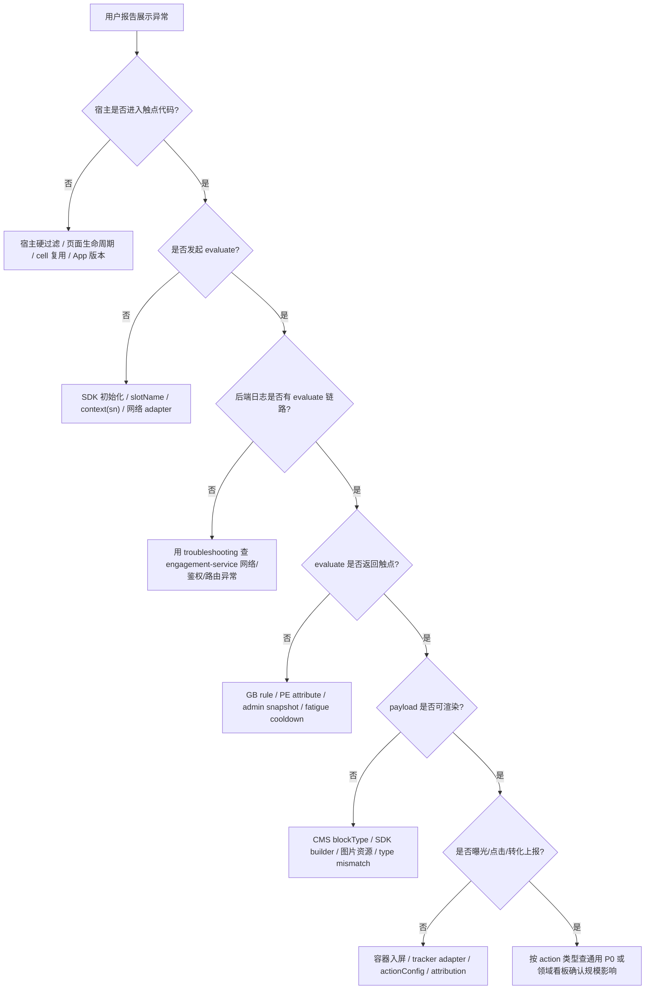

# Engagement 触点展示异常排障手册

本文给排查“触点不展示 / 展示错内容 / 点击无效 / Superset 没数据”的同学和 AI agent 使用。目标是把问题从“感觉是 GB 配错”拆成可验证的证据链。

## 0. 排障原则

先定位断层，再改配置或代码。不要跳过宿主和 evaluate 直接改 GrowthBook。

| 原则 | 说明 |
|---|---|
| 先复现 | 明确环境、App、账号、设备 sn、语言、版本、触点 slug、期望变体 |
| 先看请求和日志 | App 是否真的调用 SDK / evaluate，以及 engagement-service / personalization-engine 是否给出明确命中原因，比平台页面更重要 |
| 先查 staging | staging 没证据前不要动 prod |
| 每层留证据 | 截图、curl 响应、Superset 查询、日志关键字段都要记录 |
| 不混淆看板职责 | `OPEN_PAYWALL` 用通用 P0 看板验完整漏斗；Dashboard 527 只用于 SDK 基础链路排障 |

## 1. 最小问题输入卡

排障开始前，尽量补齐这些字段：

```yaml
slug: <触点 slug / SDK slotName>
environment: staging | prod
app: VicoHome | KiwiBit | VicoNature | <other>
platform: iOS | Android | Flutter
appVersion: <版本号>
user:
  id: <userId，可空>
  account: <测试账号，可空>
device:
  sn: <设备级触点必填>
  model: <可空>
expected:
  shouldShow: true | false
  expectedVariantKey: <可空>
  expectedCmsSlug: <可空>
symptom: <不展示 / 展示错内容 / 点击无效 / Superset 无数据 / 疲劳度异常>
links:
  growthbook: <feature url>
  admin: <touchpoint or release url>
  superset: <dashboard url>
```

## 2. 分层排障总览



## 3. 第一层：宿主是否进入触点代码

先确认宿主有没有走到触点所在页面和集成入口。

| 检查 | 证据 |
|---|---|
| 页面是否真的加载目标容器 | 页面日志、断点、UI 层级 |
| 宿主硬过滤是否提前 return | shared device、4G-only、feeder、非目标 App、非目标版本 |
| slotName 是否等于 admin slug | 代码常量值，不只看变量名 |
| 设备级触点是否拿到 sn | evaluate context、日志、curl 入参 |
| cell/header 是否因为复用残留被清空 | cell prepareForReuse、header 高度回调、reload key |

常见结论：

- 宿主硬过滤命中是“按预期不展示”，不要去改 GB。
- `slotName` 拼错时，admin / GB 配得再对也不会返回内容。
- 设备级触点不传 sn 时，PE 设备属性拿不到，很多规则会全部 miss。

## 4. 第二层：是否发起 evaluate

App 有日志时，优先看 SDK evaluate 请求。没有日志时，用 Charles / Proxyman / Xcode console / Android logcat / Flutter log 查。

必要字段：

| 字段 | 期望 |
|---|---|
| path | `/en/engagement/v1/touchpoints/evaluate` 或当前网关等价路径 |
| slugs | 包含目标 slug |
| sn | 设备级触点必须有，且是当前设备 |
| language | 和 App 当前语言一致 |
| appType/version | 能命中 GB 版本条件 |
| Authorization | 有效 token；`-1024 ACCOUNT_GET_KICKED` 需要重新登录 |

如果 App 没有发 evaluate，优先查：

- EngagementSDK 是否初始化。
- network provider / adapter 是否注入。
- slot 容器是否实际 mount。
- PROACTIVE 是否因为页面生命周期没触发 reload。
- FEATURE_GATE 是否因为 child 为空或容器未布局导致未调用。

## 5. 第三层：黑盒 evaluate 复现

用同一账号、同一设备 sn 手工调 evaluate，区分“后端不返回”和“App 渲染不出来”。

```bash
API_BASE="https://api-staging-us.vicoo.tech"
TOKEN="<login token>"
SN="<device sn>"
SLOT="<touchpoint slug>"

curl -s -X POST "$API_BASE/en/engagement/v1/touchpoints/evaluate" \
  -H "Authorization: $TOKEN" \
  -H 'Content-Type: application/json' \
  -d "{
    \"slugs\":[\"$SLOT\"],
    \"sn\":\"$SN\",
    \"language\":\"en\",
    \"app\":{\"appType\":\"iOS\",\"version\":10000}
  }"
```

结果判断：

| 响应 | 方向 |
|---|---|
| 无目标 slot | GB targeting、PE attribute、admin snapshot、fatigue、宿主入参 |
| 有 slot 但 `data/content` 空 | admin variantKey / cmsSlug / release snapshot / CMS 内容 |
| 有 content，App 不展示 | SDK renderer、blockType builder、容器布局、图片资源 |
| 有 `locked=false` 但展示 locked 内容 | GB value、admin variant、SDK cache、宿主 child 绑定 |

## 6. 第四层：用 troubleshooting 查后端日志

触点评估跨 `engagement-service -> personalization-engine -> GrowthBook`，最快的定位方式通常是用 `addx:troubleshooting` 查后端日志，而不是只靠平台 UI 猜。

先确认环境：

| 用户描述 | troubleshooting 环境 |
|---|---|
| staging-us | `https://troubleshooting-staging-us.addx.live` |
| staging-eu | `https://troubleshooting-staging-eu.addx.live` |
| prod-us | `https://troubleshooting-us.addx.live` |
| prod-eu | `https://troubleshooting-eu.addx.live` |

查询前按 troubleshooting skill 的要求做：

1. 如果没有 `TROUBLESHOOTING_TOKEN`，先用 troubleshooting skill 的 `references/get_token.mjs` 获取。
2. 获取 `$BASE_URL/api/openapi.json`，按 Swagger 确认日志查询接口参数。
3. 查询日志必须明确时间范围、环境、服务和关键词；不要盲查大范围。
4. 非 iot-service 服务优先走 `log-search/index-patterns` 找索引，再用 `log-search/query-index`。

建议优先查这些服务：

| 服务 | 目标 |
|---|---|
| engagement-service | 是否收到 evaluate、slot/sn/language/appVersion、admin snapshot、variant/cms/action/fatigue 解析结果、hide reason |
| personalization-engine | PE 是否调用 GrowthBook、传入 attributes、返回 feature value、experiment/variation 信息 |
| GrowthBook 相关日志 | 一般通过 PE 日志侧看返回值；平台 UI 负责配置确认 |
| host API 网关 / BFF | evaluate 请求是否被鉴权、路由、区域或 `/en` 前缀问题拦截 |

推荐关键词组合：

| 场景 | 关键词 |
|---|---|
| evaluate 是否进 engagement | `slug`、`touchpoints/evaluate`、`slotName`、`requestId`、`userId`、`sn` |
| GB value 不对 | `gbFeatureIdExperience`、`featureId`、`variantKey`、`experienceKey` |
| PE 属性缺失 | `attribute`、`vipCovered`、`activeFlTierId`、`device attrs` |
| admin snapshot 问题 | `snapshot`、`variantKey`、`cmsSlug`、`no_content_configured` |
| fatigue 问题 | `gbFeatureIdFatigue`、`fatigueKey`、`cooldown`、`next_show_at`、`permanent` |
| CMS 内容问题 | `cmsSlug`、`blockType`、`cms-content`、`content empty` |

日志结论要和黑盒 evaluate 对齐：

| 日志证据 | 结论 |
|---|---|
| engagement-service 没有 evaluate 日志 | App/网关/鉴权/路径层断了 |
| engagement 有请求，但 PE 没日志 | engagement 到 PE 调用或配置层断了 |
| PE 返回空 / default | GB rule 或 attribute 不命中 |
| PE 返回 variantKey，但 engagement 找不到 variant | GB value 和 admin variant drift |
| 找到 variant，但 cmsSlug 内容为空 | admin release snapshot 或 CMS 内容问题 |
| fatigue 返回 cooldown/permanent | 按预期不展示，查 dismiss 状态 |

## 7. 第五层：GrowthBook / PE

GrowthBook 只负责返回 feature value，不负责渲染。

| 检查 | 说明 |
|---|---|
| feature id | 默认 `engagement_<slug>_experience` |
| 环境 | staging 先改 staging，prod 另走发布依赖 |
| rule 顺序 | 上面的 rule 可能提前命中 |
| value | 必须等于 admin `variantKey`；空串通常表示不展示 |
| attributes | 产品要求的条件必须存在于 PE attribute schema 和赋值逻辑 |
| device attrs | 设备级规则必须带 sn 才能取到 |

如果 GB 条件依赖 `vipCovered`、`activeFlTierId` 等属性，去 personalization-engine 确认 attribute 是否已在 staging 分支合入，并用 evaluate 调试或 issue 里的步骤验证用户/设备属性。

## 8. 第六层：engagement-admin / release snapshot

admin 页面保存不等于运行时生效，运行时读的是发布后的 snapshot。

| 检查 | 说明 |
|---|---|
| touchpoint slug | 与 SDK slotName 完全一致 |
| type | `FEATURE_GATE` / `PROACTIVE` 是否和宿主 API 一致 |
| experience variant | `variantKey` 是否等于 GB value |
| cmsSlug | CMS 内容是否存在且已发布到对应环境 |
| actionConfig | CTA 类型和参数是否完整 |
| fatigue variant | PROACTIVE 是否有疲劳度配置 |
| release | staging release 是否通过；prod 依赖是否齐全 |

API 创建或修改触点后，仍要到 engagement-admin UI 检查每个变体、action、fatigue 和 release diff。

## 9. 第七层：CMS 和 SDK 渲染

evaluate 有内容但 App 空白，多数在 CMS blockType 和 SDK builder。

| 现象 | 排查 |
|---|---|
| `blockType` 不支持 | marketing-cms 模板已建，但 SDK 没注册 builder |
| 图片不显示 | 资源 URL、环境域名、尺寸、缓存 |
| 文案旧 | SDK cache key 是否包含 locale，语言切换是否 invalidate |
| 高度为 0 | header/cell 容器约束、`onContentSizeChange`、入屏判断 |
| FEATURE_GATE 展示错 child | `locked=false` variant 是否命中，宿主 child 是否被清空 |

新增模板时要同时确认：

- marketing-cms 已定义模板和字段。
- engagement-sdk 对应端支持 blockType。
- 宿主容器尺寸能容纳该模板。

## 10. 第八层：PROACTIVE 和疲劳度

PROACTIVE 触点展示异常，要额外查 fatigue。

| 现象 | 排查 |
|---|---|
| 第一次不展示 | experience feature miss、fatigue feature miss、admin snapshot 缺 fatigue |
| 关闭后马上又出现 | dismiss API 没写入状态，fatigue JSON 解析失败 |
| 关闭后一直不出现 | `next_show_at` 未过、`permanently_suppressed_at` 非空 |
| `fatigue_key` 空 | `gbFeatureIdFatigue` 未配置，或 GB value 找不到 admin fatigue variant |
| 期待 no cooldown 但没有 | 触点可能故意不挂 fatigue feature，如 `playback_cloud_promo` 当前配置 |

不要把所有 PROACTIVE 都强行接 fatigue。cell 级 contextual CTA 如果业务上不需要关闭冷却，可以明确记录 `gbFeatureIdFatigue=null`。

## 11. 第九层：CTA 和 converted

展示正常但点击或转化异常，查 action 和 attribution。

| 现象 | 排查 |
|---|---|
| 点击没反应 | `actionType`、`actionConfig`、host `onOpenAction` 分支 |
| deep link 打不开 | scheme、path、query 参数、Flutter/native 路由 |
| paywall 打开但归因缺失 | `OPEN_PAYWALL` 是否透传 touchpoint attribution |
| converted 缺失 | payment success 是否 echo `slotName/solutionId/experienceKey/variationId/sn` 并调用 `notifyConverted` |
| dismissed 缺失 | 关闭按钮是否走 SDK dismiss/action，而不是宿主直接隐藏 |

## 12. 第十层：Superset 和线上数据

优先使用 `addx:superset` skill 查询真实数据，不要只验证看板链接能打开。

`OPEN_PAYWALL` 完整漏斗默认看板：

- `https://superset-us.addx.live/superset/dashboard/paywall-p0-touchpoint-to-paywall-health/`
- 按 `slot_name` 和 `paywall_id` 筛选，不为每个新业务重复建看板。

SDK 基础排障看板：

- `https://superset-us.addx.live/superset/dashboard/527/`

Dashboard 527 适合确认：

- 是否有 `touchpoint_evaluated`。
- `eval_result` 是 show、hide_targeting、hide_no_content_configured、hide_cooldown 等哪类。
- `touchpoint_impressed / evaluated` 是否断层。
- `touchpoint_cta_clicked / impressed` 是否断层。
- `touchpoint_converted / cta_clicked` 是否断层。
- `slot_name`、`solution_id`、`experience_key`、`variation_id`、`fatigue_key`、`device_sn` 是否完整。

Paywall 打开和支付结果通过通用 P0 看板验收。`DEEP_LINK` 等非 Paywall 结果使用已有领域看板；只有通用或领域看板缺少必要指标时，才记录缺口并经 owner 确认后申请新看板。

## 13. 快速症状表

| 症状 | 优先断层 | 第一动作 |
|---|---|---|
| Superset 没有 evaluated | 宿主 / SDK / 网络 | 查 App 是否发 evaluate |
| App 发了 evaluate 但后端无日志 | 网关 / 鉴权 / 路由 | 用 troubleshooting 查 engagement-service 和网关日志 |
| PE 返回 GB default | GrowthBook / attributes | 用 troubleshooting 查 personalization-engine feature evaluate 日志 |
| evaluated 有但不展示 | SDK renderer / 容器 | 手工 evaluate 看 content，再查 blockType |
| evaluate 无目标 slot | GB / PE / admin snapshot / fatigue | 查 GB value、PE attrs、release |
| evaluate 有 slot 但 content 空 | admin / CMS | 查 variantKey、cmsSlug、CMS 发布 |
| 所有人都 locked | GB default / sn / PE attrs | 查请求 sn 和 GB 命中规则 |
| 应该 locked 但 unlocked | GB value / SDK cache | 查 `locked` 变体和 cache key |
| PROACTIVE 关闭后还出现 | fatigue dismiss | 查 dismiss API 和 `next_show_at` |
| 点击无效 | action / host route | 查 `actionType` 和 `onOpenAction` |
| converted 缺失 | attribution | 查 paywall success 是否回传 |
| Paywall 漏斗异常 | 通用 P0 看板 | 按 `slot_name + paywall_id` 定位断层，527 辅助排查 SDK 上报 |

## 14. 输出格式

排障结束时，按这个格式输出：

```markdown
### 触点展示异常排查结论
- 触点: <slug>
- 环境: <staging/prod>
- 账号 / 设备: <user/sn>
- 结论: <断在哪一层>
- 证据:
  - 宿主: <日志 / 代码 / 截图>
  - evaluate: <关键响应>
  - 后端日志: <troubleshooting 查询环境 / 服务 / 关键词 / 关键日志>
  - GB/admin/CMS: <配置或发布状态>
  - Superset: <查询口径和结果>
- 修复建议: <最小改动>
- 回归用例: <怎么确认已修复>
```
