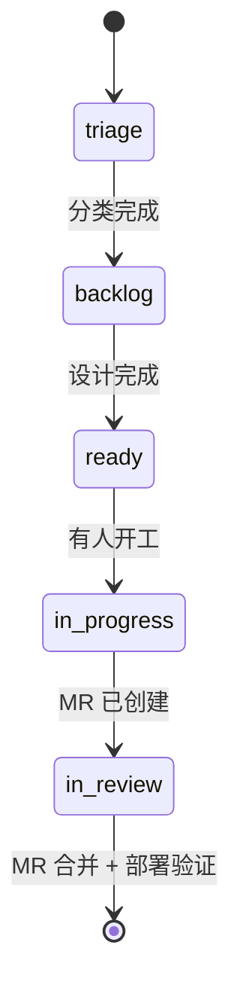

# gitlab-issue-sop

GitLab issue 管理的标准操作流程 (SOP)，覆盖**创建 / 状态 / 关联 / 进展 / 批量 / board** 全生命周期，并把 **issue 作为所有变更的统一入口**。

## Description

**为什么需要这个 SOP：** issue 是团队协作的 SSOT，如果 label 混乱、状态缺失、进展丢失在 Slack 里，跟踪就变成考古；本 skill 沉淀一套可批量执行、跨项目复用的 issue 管理方法。

**变更入口规则：** 所有变更必须先创建 issue，再开始工作。这里的变更包括需求、bug、SOP、文档、配置和方案设计，不允许先做再补 issue。

**适用场景：** GitLab CE（社区版）。Premium 的 `blocks` / `is_blocked_by` linked item type 本 skill 不依赖，阻塞关系通过 `flag/blocked` + issue 描述里的依赖段表达。

**Label 规则的唯一 SSOT：** [references/label-system.md](references/label-system.md)。Label
名称、语义、基数、放置层级、缺失处理和安全更新都由本 Skill 维护；其他 Skill 只能引用，
不得复制 taxonomy。

**不在范围：**
- 写代码或执行 issue 跟踪的业务逻辑（那是 issue 的内容而不是管理）
- MR 创建/合并（委派 `gitlab-mr`）
- CI/CD 配置（委派 `gitlab-ci`）

## 核心使用场景

issue 是团队协作的 SSOT，触发场景分五类（A–E）。

### 场景 A：开发过程中的"问题外移"（最常见）

AI 辅助开发或人工开发过程中，遇到当前不能/不想立即解决的问题：

| 场景 | 触发判断 | issue 性质 |
|------|---------|-----------|
| **遇到新问题但暂不解决** | 当前任务以外的副发现，强行解决会拖延主任务 | 跟踪外移，避免遗忘 |
| **需要他人帮助** | 缺权限/缺信息/缺专业知识，自己解决不了 | 求助，**必须指定 assignee** |
| **依赖他人/外部系统** | 等运维配置、等数据团队同步、等设计师产出 | 保留真实 status，另标 `flag/blocked` |
| **方案有分歧需要决策** | 多方案 trade-off，需要 stakeholder 拍板 | 决策类，**指定 owner**，等 reply |
| **审计发现的 gap** | `:audit` / `:design` 流程列出来的现状 vs 应有差距 | 跟踪 gap，按优先级排期 |

### 场景 B：非开发人员的需求/反馈

PM、运营、客服、设计、QA 等**任何角色**遇到需求或问题时都可以提 issue：

| 场景 | 提交者 | issue 性质 |
|------|--------|-----------|
| **新需求** | PM / 运营 | feature request，描述价值 + 验收，由 dev 评估排期 |
| **bug 反馈** | QA / 客服 / 用户 | 复现步骤 + 期望 vs 实际，**指定 dev assignee** |
| **运营操作请求** | 运营 | 需要研发支持的运营动作（如清数据、发活动），明确截止时间 |
| **流程改进建议** | 任何角色 | 跨团队协作问题，完成 triage 后按公共规范分类 |

> **关键**：issue 不是 dev 专属。低门槛、统一入口能减少 Slack/微信里的零散沟通和遗忘。

### 场景 C：Review 文档批量闭环（原 issue-tracker 合并至此）

从 `/code-review`、`/architect` 或其他 review 文档批量导入 issue，并在修复后自动读取文件验证问题是否真的消除：

| 场景 | 触发判断 | 对应命令 |
|------|---------|---------|
| **批量导入 review 问题** | review 文档产出 N 个问题需要 tracking | `import` |
| **验证某个修复** | 修完 #N 想知道问题真的消除了吗 | `verify` |
| **查看整体进度** | 想知道当前分支 open issue 分级分布 | `status` |
| **双向同步** | review 文档 `[x]` 和 GitLab closed 之间对齐 | `sync` |
| **打开某个 issue 开工** | 修复 issue 时想看完整上下文（问题描述 + 文件内容 + 修复建议） | `fix` |

批量创建的 issue 必须遵循 [Label 规则 SSOT](references/label-system.md) + assignee 原则（不允许漂浮）。详见 [references/review-doc-workflow.md](references/review-doc-workflow.md)。

### 场景 D：创建前跨仓查重

任何新 Issue 在写入前都先执行 [创建前查重 (Dedupe)](#创建前查重-dedupe)。高分 open 候选优先追加信息或建立关联；所有查询都失败时标记 `insufficient data`，不得把“查不到”冒充“没有重复项”。

### 场景 E：AI 对话中的需求变化

当开发、设计或 review 已经绑定 canonical Issue，而用户在与 AI 的对话中确认了新的 scope、验收标准、约束、交付物或 Skill gap 时，这不是只存在于 session 里的补充信息，必须按下方 [AI 对话中的需求变化](#ai-对话中的需求变化) 追加 requirement revision comment。

讨论中的候选想法、对既有 AC 的同义解释、未被确认的建议不构成需求变化，不应制造 revision 噪音。

### 指定 assignee 的原则

提 issue 时**主动指定人**而非让 issue 漂浮：

| 何时指定 | 谁该指定 |
|---------|---------|
| 求助 | 知道答案/有权限的人 |
| 决策类 | feature owner 或 tech lead |
| bug 报告 | 模块 owner（git blame / CODEOWNERS） |
| 运营请求 | 对应业务 dev |
| 不知道指给谁 | 先指给 tech lead 或 PM 让他们 triage |

API 用法：创建/更新 issue 时传 `assignee_id`（数字）或 `assignee_ids`（数组）。详见 [references/api-reference.md](references/api-reference.md)。

### 指派后的飞书通知（issue / Task）

本次会话的写操作**新产生或改变** assignee 后，通知新任 assignee：

- 触发边界：仅「首次指派」和「改派」两种变化通知；comment、label、milestone、
  状态流转、进度更新不通知。Task（work item）与 issue 同规则
- 通知内容：对象链接、一句话事由、指派人
- 渠道、身份、登录与收件人解析全部按 `feishu-channel-rules` 执行：本 SOP 只定义
  触发语义，不复制渠道规则；幂等键按（对象 × 收件人 × 指派变化，含前任）构造，
  改回同一人仍是新事件，重试复用原键不重复发送
- 批量创建（如 review 文档导入）对同一收件人聚合为一条通知，一条消息列出全部
  对象链接，不逐条私聊刷屏
- GitLab 操作与通知解耦：指派成功即有效；通知失败（渠道不可用、收件人无法唯一
  解析）不回滚指派，在交付报告里如实写「已指派、未通知 + 原因」

### 核心原则

- 所有变更先创建 issue，再开始工作；issue 是需求、方案、开发、review、merge 的统一入口
- 把"该做但现在不做"的事变成可追溯的 issue，而不是放在脑子里、TODO 注释里、或扔在 commit message 里
- 任何角色都可提 issue，不只是开发
- 提 issue 必带 assignee（漂浮 issue = 无主 issue = 没人管）
- AI session 结束后人类（或下一个 AI session）能接得住
- AI 对话中已确认的需求变化必须回写 canonical Issue，不能只留在 transcript、commit 或报告中

## Issue 类型

创建 issue 前，先识别 issue 类型。不要把所有 issue 都写成同一种风格。

### 1. 需求类 issue

适用场景：

- 新功能
- 新流程
- 面向用户或内部使用者的能力变更
- 需要清楚写明价值、角色、验收标准的事项

规则：

- 新建时先把用户原话、PRD 引用和已知事实保真写入 **raw-intake Issue**；不得为了看起来完整而补写意图
- 非 Buzz managed 的本地/manual 流程可让 `$requirements-analysis-agent` 消费该 canonical source，运行公司 Skill review 并产出 REQUIREMENTS/NEEDS_INPUT；其中 `$story-craftsman` 仅作为必选 review pass。Buzz managed 流程必须遵守后文专用入口边界
- accepted Requirements 可派生独立 US 文档，但本 Attempt 内不得重写 Issue description
- Why/What/Who/User Stories/AC 的完整性要求属于 accepted Requirements/派生 US，不是创建 raw-intake Issue 的前置条件

不要把需求类 issue 的主描述写成纯技术方案。

### 2. 技术优化类 issue

适用场景：

- 重构
- 工程化改进
- 稳定性优化
- 性能优化
- 文档/SOP/CI/CD 改造
- 无明显用户可见功能变化的技术工作

规则：

- 不要求完整用户故事格式
- 重点写清：
  - 当前问题
  - 改造目标
  - 范围
  - 风险
  - 验收方式

这类 issue 可以是技术说明，不强制走 `$story-craftsman`。

### 3. Bug 类 issue

适用场景：

- 缺陷
- 回归问题
- 线上异常
- 用户反馈的问题单

规则：

- 重点写清：
  - 复现步骤
  - 实际结果
  - 期望结果
  - 影响范围
  - 优先级
- 如有必要，再补临时 workaround

Bug 类 issue 不要求完整用户故事格式。

### 类型选择原则

- 如果 issue 的核心是在定义“要给谁提供什么能力”，按**需求类**处理，并默认使用 `$requirements-analysis-agent`；不得直接用 `$story-craftsman` 绕过 exact-hash PO Gate
- 如果 issue 的核心是在修系统、改工程、降风险，按**技术优化类**处理
- 如果 issue 的核心是在修错误行为，按**Bug 类**处理

## 标准执行顺序

所有需求或变更默认按以下顺序推进：

0. **创建 issue 前先查重**：跑 `scripts/issue_dedupe.py`，跨当前仓库、团队相关仓和集中 issue 项目池（默认覆盖 `SWCLIEN/g0-ios`、`SWCLIEN/g0-android`、`CLOUD/iot-service-old`、`CLOUD/iot-service-unified` 和 `issues/software` 下的软件 issue 项目）搜相似候选。详见下方 [创建前查重 (Dedupe)](#创建前查重-dedupe) 一节。若返回高分 open 候选，优先补充已有 issue 或建关联 issue；若返回 `insufficient data`（所有目标仓查询失败），先修复 CLI/权限再提，不要直接新建。
1. 根据草稿事实识别 issue 类型（需求 / 技术优化 / bug），但不把猜测写成结论
2. 创建 issue
   - 需求类：创建 raw-intake Issue，保真记录本次 Requirements Attempt 的 canonical description/source 输入
   - 技术优化 / bug：按对应轻量模板写清事实
3. 需求类进入 Requirements Analysis；非 Buzz managed 流程可显式调用 `$requirements-analysis-agent`，Buzz managed 流程只能由已验真的 adapter route 转交；PO 未接受精确 Artifact hash 前不得进入方案或实现
4. Coordinator 请求独立 PO 核验 exact Artifact ID/hash Gate evidence 后作 ACCEPT/REJECT；Gate 决策追加到不可变 ledger，不编辑原 comment 或 canonical description。GitLab 写入只在另行授权且对应运行契约允许时执行；Buzz managed 的 comment/readback 顺序见专用入口边界。任何业务来源变化必须创建新 Requirements Attempt 并重新 Gate
5. 在 issue 内通过追加 comment 收敛依赖、决策和后续产物；AI 对话产生已确认的需求变化时，立即追加 requirement revision，历史证据不可覆盖
6. 如需要，产出方案文档并提交 commit
7. 在 issue comment 中回链方案文档，请人 review
8. 人工完成方案批注和确认
9. 从该 issue 执行 `Create branch`
10. 在该分支上提交实现 commit，并创建/关联 MR
11. merge 与关闭动作回链到 issue

> 目标是让 issue 成为单一追溯入口：为什么做、方案在哪、谁 review、分支/MR/merge 是什么，都能回到同一个 issue。

### 反模式

- "顺手修一下"打断主线任务（应该开 issue 留给后续）
- "记一下"用 TODO 注释替代 issue（注释会被遗忘）
- "等我把这事做完再说"让阻塞悄无声息（应立即开 issue + `flag/blocked`）
- "我先在 Slack 问一下"（沟通过的事消失在历史记录里，应该在 issue 里讨论）
- 提 issue 不指定 assignee（让 issue 在 backlog 里腐烂）
- 提 issue 不查重（重复 issue 分散排查信息、状态不一致、triage 重复劳动）

## 创建前查重 (Dedupe)

提 issue 前先跑 `scripts/issue_dedupe.py` 跨当前仓、相关代码仓和集中 issue 项目池搜相似候选，避免在 g0-ios / g0-android / iot-service-old / iot-service-unified / issues/software 等来源之间重复提单。

```bash
mkdir -p .issue-dedupe
cat > .issue-dedupe/proposed.md <<'EOF'
<issue 正文草稿>
EOF
python3 <skill-dir>/scripts/issue_dedupe.py --title "<草稿标题>" --body-file .issue-dedupe/proposed.md --state all
```

脚本只读，按 0-1 相似度给候选 + 一条 `Recommendation`（`merge/update existing` / `reopen/comment` / `new issue` / **`insufficient data`** 等）。任何 GitLab 写操作（创建 / 评论 / reopen / close / label / assign）**必须先询问用户确认**。

完整参数、输出表、扩展默认仓、词典维护、性能特性见 [`references/dedupe.md`](references/dedupe.md)。

> **查重归属：谁建 issue 谁查重。** 不要把查重设计成「入口 agent 的职责」——主路径是人直接 @ 对应的领域 agent，**根本不经过入口**。把查重挂在入口上，等于主路径没有查重。
> 八成情况下正确答案是**补充已有 issue**，不是新建。

## Label 使用规则

Label 模型属于本 Skill。创建、更新或迁移任何 work item 前，完整读取
[references/label-system.md](references/label-system.md)，并按以下顺序执行：

1. 识别目标 namespace 使用原生 Work Item Type/Status 还是 Label 兼容模式；不得混用。
2. 查询项目和祖先 Group 的现有 labels，选择 SSOT 已批准的 canonical 值。
3. Deployment Task 按该 SSOT 的专用分类契约处理 Environment、Status、Milestone 和
   operational type；不要从 rollout phase 或集群名临时造 label。
4. Scoped label 只用增量 `remove_labels` + `add_labels` 更新，并回读证明同 scope 单值。
5. canonical label 缺失时停止 label 写入，按 SSOT 产出 Group-owner Ops Todo；不得用同义
   legacy label、Project 临时 label 或无前缀 label 绕过。

版本和时间窗口不在 label 模型里，见下一节 Milestone。

## Milestone 使用规则

Milestone 模型不属于本 skill。创建或更新 issue 前，先读组织级
[GitLab Milestone 治理规范](../../docs/standards/gitlab-milestone-governance.md)。执行时使用以下最小规则：

| 场景 | 规则 |
|---|---|
| 表达版本 / 时间窗口 | **一律用 Milestone**，不用 label（`kb-2.13.0` 这类版本 label 是反模式） |
| `status::ready` 及以后的 issue | **必须有 milestone**。没有 = 排期缺口，应在巡检/汇报里单列 |
| `status::triage` / `backlog` | 可以没有 milestone |
| 单条 issue 的 `due_date` | 只在该 issue 比所属版本更早需要完成时才设。**两处都设会产生哪个为准的歧义** |
| Milestone 名称 | **＝版本号本身**，并与冻结分支同名：`milestone KB2.25` ⇄ `release/KB2.25` ⇄ issue 挂 `KB2.25`。三者同名，自动化才能从任一端反查另两端 |
| `due_date` | **必填**。缺了它，「这条需求发没发」的证据链整条断——发布判定的四条证据之一就是「所属 milestone 的提审日已过」 |

**APP 版本的 `due_date` 是「提审日」，不是「上线日」，也不是「开发完成日」。**
开发真正的 deadline 是 `due_date − 2 个工作日`（提测截止，代码必须已合入 staging），
因为回归需要 2 个完整工作日。这个派生规则和配套的风险判据在上面那份 SSOT 里，
自动化（进展汇报、风险巡检）直接消费该规范，不要在各 skill 里重写一遍。

> ⚠️ 该发版日历**只适用于需要商店审核的 APP**。后端服务和嵌入式固件有各自的发布流程，不套用。

## 状态工作流



`flag/blocked` 是与 status 正交的标记，可叠加在任一 open 状态；阻塞解除后只移除该 flag。

退出条件：
- `triage → backlog`：类型、优先级和归属完成判断
- `backlog → ready`：设计定稿，验收清晰
- `ready → in-progress`：有 assignee，方案已 review，且开发分支已从该 issue 创建
- `in-progress → in-review`：MR 链接已附
- `in-review → close`：MR 合并且生产验证通过
- `* + flag/blocked`：等其他 issue / 决策 / 数据 / 运维，原 status 保留

[详见 references/status-workflow.md](references/status-workflow.md)

## Issue 模板

除需求类 raw-intake 外，每个 issue 描述按 5 段展开。raw-intake Issue 是此 5 段模板的入口例外：已有信息可按对应段落保真放置，未知项允许明确标记 unknown 或暂不出现，不得为满足模板而猜测；完整要求在 Requirements Analysis 与 PO Gate 中收敛。

```markdown
## 背景
为什么有这个 issue（链接上游决策 / 设计文档 / 用户故事）。

## 范围 (Scope)
具体要做什么。列表或表格。

## 依赖
- 阻塞于 #N（如有）
- 外部依赖（团队 / 数据 / 运维）

## 验收 (Definition of Done)
- [ ] 可勾选 checklist
- [ ] 每项可独立验证

## 相关文档
- 设计文档链接
- MR 链接
```

### `type::feature` 额外加一段「必备物」

**只对 `type::feature` 生效**，其它三类不要求：

```markdown
## 必备物
- **PRD / User Story**：<飞书链接 或 docs/prd/<iid>-<slug>.md，无则写（待补）>
- **功能看板（Superset）**：<链接，无则写（待补）>
- **AB 实验（GrowthBook）**：<链接，或写「本需求不做 AB 实验」>
```

三条边界，一条都别搞反：

1. **建 issue 时不卡。** 建的时候常常还没有 PRD、没有看板，这正常。**缺就留空位并写「（待补）」，不要因此不建 issue，更不要编一个链接填进去。**
2. **卡在提 MR 的时候。** 校验发生在 MR pipeline，不在 issue 侧——GitLab CE 没有服务端 issue 钩子，issue 侧拦不住任何东西，**能做的只有让缺失可见**。
3. **存量 issue 不用补。** 规则只对**新建**生效。去翻历史 issue 挨个要 PRD 只会制造噪音且没人理。

**AB 实验那栏是「二选一」不是「必填」**：不是每个需求都要做实验，但「做不做实验」是个产品决定，不该悄悄略过。所以必须二选一地表态——有实验给链接，不做就明写一句。**留空是最糟的状态**：后来人分不清是「决定不做」还是「忘了」。

**功能看板由谁建**：由**数据 agent（`-bi`）建看板并写明口径**，再由该 issue 的 **assignee 确认口径符合需求意图**，最后把链接回填到必备物栏。理由是「每个结论必须附口径」是数据 agent 的硬规则，开发建的看板口径经常对不上。

[详见 references/issue-template.md](references/issue-template.md)

### Buzz Thread origin（从频道开 Issue / Task / Milestone）

当本次任务来自已启用 GitLab→Buzz 同步的 Buzz 频道话题（你是在**当前话题**里被要求开这个 Issue、Task 或 Milestone），要**先做「origin 写入前检查」，通过了才**把 origin 块写在**描述末尾**（Channel UUID 与话题根取当前任务，禁止手填其它频道）。话题根是人类消息（最常见）也一样写：同步会把这个对象的通知**回复到讨论它的那个话题里**，不再另开一个门牌线程（ADR-0014，engineering/skills#125）：

```
buzz://message?channel=<channel-uuid>&id=<64-hex-root>&thread=<64-hex-root>
<!-- gitlab-buzz-origin:v1 {"channel_id":"<channel-uuid>","root_event_id":"<64-hex-root>"} -->
```

- 深链给人从 GitLab 点回 Buzz；HTML 注释给同步脚本自动识别。
- `<64-hex-root>` 写话题的**顶层根**（没有 `e` 标签的那条），不要写话题中间某条回帖的 id。
- 优先写进 description。同步也会认人类评论里的同一格式；多条有效 origin 都会回复对应 Thread。
- 同步在该对象还没有 binding 时把事实发进**第一条** origin Thread，不再另开门牌。已绑定的对象不搬家。
- 批量导入 / 非 Buzz 会话不要编 origin。
- Milestone 同样写在 milestone description。格式见 `buzz-agent-setup` 的 GitLab→Buzz 协议「origin 绑定」。

#### origin 写入前检查

- 根事件同时满足：kind 9、`h` 标签恰好一个且是本频道、没有 `e` 标签（顶层，不是回帖）、`buzz messages thread --channel <channel-uuid> --event <root>` 读得到（在返回里找 `id` 等于该根的事件逐条看）——**两行都写**，根是人类消息（人在频道里发一句话让你开 Issue）也行。根若是本频道 Desk 发的（`pubkey` 等于同步配置的 `publisher_pubkey`），内容必须是门牌（末行是 GitLab Issue / MR / 里程碑 URL）或 `[gitlab-notify:v1]` 事实；人、Feishu 镜像身份和别的 Agent 发的顶层消息不看内容。
- 读不到、是回帖、是别的 Agent 的无关发言、不是在当前话题里被要求开的，或任何一条核对不了：**两行都省略**，让同步自己给这个 Issue 建门牌。批量创建时对每个 Issue 各自检查，不要把同一个未核实的根复制到一批 Issue。
- **裸的 `buzz://message?…` 链接只是提示**：完整且指向本频道 Desk 门牌／事实的会被当作 origin（不需要 HTML 注释，放进反引号、括号里也一样），指向人类消息或占位符写法的会被忽略（不会绑定到那个话题，要绑定只有 HTML 注释可以）。仍不要在描述或评论里为了「引用一下」贴指向人类消息的链接；要引用就写频道名加一句话。
- 写错的后果：**格式**非法的 HTML 注释（JSON 坏了、键不对）会让**该对象停摆**（2026-09-19 事故是整个频道停摆，现在只停该对象），要人去改；格式合法但根不可用（读不到、是回帖、别的频道）的注释不会停摆，对象照常自开门牌，同步报告里记一条 `origin_fallbacks`。
- 完整规则与错误修复见 `buzz-agent-setup/references/gitlab-buzz-sync.md`「origin 写入前检查」。

### 需求类 issue 描述要求

若 issue 属于需求类，创建时使用 raw-intake Issue 保真记录用户原话、PRD/source 引用和已知事实；信息不全可以保持 `status::triage`，不得在创建前伪造完整用户故事。非 Buzz managed 的本地/manual 流程可随后调用 `$requirements-analysis-agent`，由它以 review-only 模式调用 `$story-craftsman`；该调用不构成 Buzz accepted route 或远程写权限。

Requirements Artifact 绑定 canonical source snapshot。本 Attempt 内不得重写 Issue description；Coordinator 使用当前流程可验证的独立身份和 exact Artifact ID/hash evidence 请求 PO Gate。PO 接受精确 `artifact_id + artifact_hash` 后，可从 accepted Artifact 派生独立 US 文档、方案或实现输入，但不得回写或覆盖 source description。GitLab comment 不是本地/manual Gate 的必选前置，远程写入必须另行授权。业务来源变化必须创建新 Requirements Attempt，使用 `supersedes` 保留历史并重新 Gate。

accepted Requirements/派生 US 的最低要求：

- 背景（Why）
- 目标（What）
- 角色（Who）
- 用户故事（User Stories）
- 可勾选验收标准（AC）

### Buzz managed intake 边界

Buzz live 路径不得由本地 session 直接调用 Requirements Analysis Agent 或自行声称路由成功。Issue 分类遵循 type-first：只有 live scoped label `type::feature`（或 adapter 明确支持的 legacy label）可成为 requirement；类型尚未确定时保持 `status::triage`，由 adapter 按 unclassified route 处理，不得猜测标签或手工激活 Agent。

只有 adapter 对同一 live opened revision 完成读回并持有 `issue-intake:v3` accepted claim，且完整 route tuple 为 `routing_contract_version=issue-routing:v1`、`issue_type=requirement`、`issue_type_source=scoped-label|legacy-label`、`analysis_route=requirements`、`target_agent=Requirements Analysis Agent`、`target_agent_status=available`、`routing_noop_reason=not-applicable`，同时 capability pin 全部通过，才允许 managed handoff。本地/manual Skill 调用不能替代这些证据。

失败原因必须精确分类：类型未识别时保持 `route=no-op` / `issue-type-unclassified`；多个冲突类型使用 `route=no-op` / `issue-type-conflict`；已确认为 requirement 但 capability pin 缺失或失效时才使用 `route=no-op` / `requirements-agent-unavailable`；accepted claim 缺失或 tuple malformed 必须 fail closed/reject、GitLab writes=0，不能记为 `requirements-agent-unavailable` 或伪造 capability-gap no-op。

- Artifact source baseline fields: `source_kind`、`source_ref`、`source_digest`、`retrieved_at`、`project_id`、`issue_iid`、`issue_updated_at`；`content.source_baseline.source_digest` 必须等于 claim 的 `issue_source_digest`。
- Dispatch context: canonical `idempotency_key`、`dispatch_claim_id` 和完整 route tuple 只绑定在 dispatch/receipt/Gate context，不得加入 Artifact `content.source_baseline`。

“exact Issue revision”指 Artifact source fields 与 dispatch context 共同绑定的 live-readback identity，而不是假设 GitLab Issue 本体不可变；writer 和 PO Gate 必须验证两层证据一致。

ready Artifact 必须先由受控 writer 写入含 `PO Gate=PENDING` 的需求分析 comment，并取得 GitLab exact readback receipt；独立 PO 只能在审查该 readback 后，对精确 `artifact_id + artifact_hash` 作 ACCEPT/REJECT。Gate 只追加不可变 decision，不自动写第二条 Issue comment。source、AC 或 accepted assumption 任一漂移，都创建新 Issue revision、Attempt 和 Artifact，并以 `supersedes` 指向上一 Artifact；禁止覆盖历史或复用旧 Gate。

### 技术优化类 issue 描述要求

最低要求：

- 背景 / 当前问题
- 改造目标
- 范围
- 风险或注意事项
- 验收标准

### Bug 类 issue 描述要求

最低要求：

- 背景 / 发现方式
- 复现步骤
- 实际结果
- 期望结果
- 影响范围
- 验收标准

## 方案评审与文档回链

如果该 issue 涉及方案设计、SOP 变更、实现前评审，必须满足以下规则：

- 先有 issue，再写方案文档
- 方案文档提交后，在 issue 新增 comment 回链文档或 commit；若产物是 HTML，必须先按下方规则发布 Page
- 人工 reviewer 在 issue 或方案文档中批注
- 方案 review 通过后，issue 才能进入 `status::ready`

### HTML 文档必须先发布 Page

当要回链到 Issue 或 Task 的方案、报告、原型是 `.html` 时，必须先调用 `$gitlab-pages-html` 完成分支级发布和服务端验收，再把**具体 HTML 文件的 Page URL**写入 comment；GitLab blob/commit 链接可以同时保留用于追溯，但不能替代可读 Page。

路径映射必须保留 HTML 在仓库中的完整相对路径：

```text
通用映射: public/<branch-slug>/<html-relative-path> → <CI_PAGES_URL>/<branch-slug>/<html-relative-path>
仓库文件: docs/architecture/example.html
发布产物: public/<branch-slug>/docs/architecture/example.html
Page URL: <CI_PAGES_URL>/<branch-slug>/docs/architecture/example.html
```

`public/` 是 Pages artifact 的发布根，不出现在浏览器 URL 中。`<CI_PAGES_URL>/<branch-slug>/` 只是分支索引，**不能**作为具体 HTML 文档的 review 链接。只有 publisher job 成功且 Pages API 的 deployment 时间已刷新后，才能把 Page URL 标成可 review；未完成时明确写“待发布”，不得把 branch 根 URL 冒充文档链接。

推荐 comment 模板：

```markdown
## 方案提交 (YYYY-MM-DD)

方案文档已提交，待 review。

**设计文档**:
- Page: <CI_PAGES_URL>/<branch-slug>/docs/plans/xxxx.html（HTML 产物必填；Markdown 可省略）
- Source: docs/plans/xxxx.html（或 docs/plans/xxxx.md）

**相关 commit**:
- abcdef1

**Follow-up**:
- 请 reviewer 批注方案
- review 通过后从本 issue Create branch 开始实现
```

这样 commit、评审意见、后续实现都能继续挂在同一个 issue 下。

## Issue Create Branch 规则

开发实现必须从 GitLab issue 的 `Create branch` 发起，不允许绕过 issue 手工建分支。

- 目的：让 branch、commit、MR、merge 与 issue 自动或稳定关联
- 适用：所有代码、配置、脚本、工程化实现类开发
- 要求：进入实现前，先确认 issue 已存在且 branch 从该 issue 创建

如果只是方案评审阶段且尚未开始实现，不创建开发 branch。

### 开发分支与 issue 的关联规则

- 默认一个 issue 对应一个主开发分支
- 如果确实需要多个开发分支，也必须都从同一个 issue 出发，而不是各自漂浮
- 分支名必须带 issue 编号，便于人工识别
- MR 必须回链到该 issue，保证 review、merge、关闭动作都能追溯

推荐规则：

1. **优先用 issue 页面 `Create branch`**
   - 这是 branch 与 issue 的首选关联方式
   - 能避免后续 branch、MR、issue 之间失联

2. **分支名显式带 issue 编号**
   - 推荐：`issue-123-short-topic`
   - 或：`123-short-topic`
   - 不要把 worktree 标识、临时后缀、个人后缀混进 issue 主分支名

3. **一个 issue 需要多个分支时**
   - 仅用于多仓库实现、并行子任务、或主分支已污染需要重开
   - 每个分支都应在 issue comment 中说明用途
   - 每个分支对应的 MR 也都要回链到同一个 issue

4. **MR 描述必须引用 issue**
   - 完成型 MR：`Closes #123`
   - 非完成型 MR：`Relates to #123`

5. **issue comment 要记录 branch / MR 进展**
   - 何时从 issue 创建了 branch
   - branch 名称是什么
   - 对应 MR 链接是什么

### 推荐命名规范

- 主开发分支：
  - `issue-<iid>-<short-topic>`
- 如果必须有额外分支：
  - `issue-<iid>-<short-topic>-<repo-or-slice>`
- worktree 目录可以带本地标识：
  - 例如 `.worktrees/issue-123-foo-wt`
- 但 **worktree 标识属于目录名，不属于 branch 名**

推荐示例：

- branch: `issue-5-cicd-developer-product-concierge`
- worktree: `.worktrees/issue-5-cicd-developer-product-concierge-wt`

不推荐示例：

- branch: `issue-5-cicd-developer-product-concierge-wt`
- branch: `issue-5-cicd-developer-product-concierge-jchen`

### 多分支使用边界

以下场景允许一个 issue 关联多个开发分支：

- 同一需求同时改多个仓库
- 同一 issue 下拆成前后端/配置并行实现
- 原分支因错误历史或污染需要重开

以下场景不建议多个分支：

- 只是临时试验，但不准备形成可 review 产出
- 同一仓库里无明确边界地反复开分支
- 用多个分支替代 issue 拆分

## Linked Items（GitLab CE 限制）

CE 版本 **只支持 `relates_to`**，不支持 `blocks/is_blocked_by`。

- 用 `relates_to` 串起所有相关 issue 形成关联图
- 阻塞关系通过 `flag/blocked` + issue 描述的 `## 依赖` 段表达
- 不要试图用 `link_type: blocks` 调 CE API（返回 400）

[详见 references/linked-items.md](references/linked-items.md)

## 父子层级：只用 Task，只有两层

`relates_to` 表达的是**平级关联**，不是层级。需求要拆开跟踪时用 **Task 子项**：

```
产品需求 Issue（type::feature）
  ├── Task（子项）
  └── Task（子项）
```

- **只有 feature Requirement Issue 拆 Task。** 具体环境和版本的部署执行若可独立验收，
  属于该需求的 Deployment Task；没有父需求的独立运维操作仍是平级 operation work item。
- **层级只有两层。** Epic 是 Premium 能力，本实例查不到，不要设计依赖它的流程。
- **优先创建原生 child Task。** 建 Task 走 GraphQL work item 接口
  （`workItemCreate` + `hierarchyWidget` 的 `parentId`）；REST 没有 parent Task 入口。具体参数以
  当前 API 为准，调用前先查。
- **平台或权限不支持原生父子层级时**，创建独立的 Task work item，用 `relates_to` 关联
  Requirement Issue，并在 Task 中记录 Requirement Issue URL 和降级原因。不得把 `relates_to`
  声称为父子层级，也不得因此退回把连续执行日志写进 Requirement Issue。
- Task 支持 **Development（原生关联分支与 MR）、Milestone、Labels、Assignees** 等能力，流程要用的它都有——它不是「弱化版 issue」。

**什么时候拆**：

1. **先看发布节奏。** 多产品同一波一起上 → **不拆**，一条 issue 挂主产品 milestone，`app/*` 标出覆盖范围；**各产品节奏不同 → 必须拆**，因为一个 issue 只能挂一个 milestone。
2. 节奏相同时再叠人的判断：**可独立验收才拆**，否则 Task 噪音比不拆更糟。

**拆开之后**：每个 Task 挂**自己那条产品线的 milestone**，`app/*` 在 Task 上**收敛为单值**，`status::` 各自独立流转。

**收益**：需求进展 ＝ 各 Task 的完成情况，GitLab 原生就能统计。
**绝不用 commit 数量或代码行数推算完成度百分比**——重构几千行不产生用户价值，一行配置可能就是整条需求。编出来的「完成 60%」会让整份汇报失去可信度。

## Eval / TDD 内外环 Review Task

当一个 feature Issue 用历史 session、golden cases 或其他冻结证据校准
TDD / evaluator 规则时，每个 inner-loop round 必须创建一个且仅一个 GitLab Task，
并交给用户做人类外环 review。普通开发中的一次测试重跑不算新 round；只有冻结的
`rule_version`、`evidence_snapshot` 或用户接受的 `rule_diff` 改变，才进入下一轮。

- 先生成不可变的 `round_id`（例如 `eval-review-v3-2026-09-15-r1`），再查父
  Issue 的直接子 Task。description 中的
  `<!-- eval-review-round:<round_id> -->` 是首选去重键；兼容旧 Task 时可匹配明确的
  `Round: <round_id>` 字段。
- 找到同一 `round_id` 就复用该 Task 并追加证据，绝不再建第二个；新的
  `round_id` 必须创建新 Task，不能覆盖或复用上一轮结论。
- Task 必须以 canonical feature Issue 为 parent，`assignee` 是请求 review 的用户；
  description 固定记录 parent、round/rule、evidence cutoff/snapshot、分支、报告路径、
  review checklist 和两个独立的人类决策：报告是否忠实遵守本轮规则，以及 proposal
  是否 promotion 为下一版规则。
- round 开始时报告、commit、MR 或 pipeline 尚未产生，可以在 description 明确写
  `pending`。内环完成后通过 **append-only comment** 补充 final head、固定 Git blob
  链接、测试与 evaluator 自检、pipeline 状态、证据能证明/不能证明的边界；不要回写
  description 来抹掉临时快照。
- 人类外环的误判、漏判或价值边界反馈只作为下一轮输入。被接受后形成
  `rule_diff + anonymized golden case`，更新父 Issue requirement revision，再用新的
  `round_id` 创建下一 Task；不得反向改写已冻结轮次。

若当前请求没有 GitLab 写授权，生成带完整字段的 Task draft 并标记未创建；不得把草案
称为已交付。Task 创建仍使用上文规定的 GraphQL work item 层级接口。

## 跨仓需求 issue 协议

一条需求需要改多个仓库时，按「单主 issue + 各仓 MR」组织，不在每个仓重复开 issue：

- **单主 issue**：放契约/规则的 **owner 仓**（谁定契约谁持有）；各仓**只开 MR 不开 issue**，MR description 必须回链主 issue（`Relates to #<主issue>`）。例外：某仓改造量大到需要独立指派/长期跟踪，才升级为该仓 **sub-issue** 并与主 issue 互链。
- **时间对齐用发布窗口**：主 issue 正文记录**目标发布窗口（时间）**，不挂业务仓 milestone；优先用 **group milestone** 对齐各仓迭代节奏。
- **版本对齐记三要素**：主 issue 的跨仓任务 checklist 每项记「仓 / MR / 该仓 milestone」三要素，从主 issue 可直接反查每个仓落在哪个版本。
- 查重照常：跨仓需求建主 issue 前仍先跑 [创建前查重 (Dedupe)](#创建前查重-dedupe)。（#61 X-1 / G-3，详见 docs/architecture/skill-artifact-delivery-implementation.html §10）

## Review SLA 与升级机制

review 请求（方案 MR / 方案文档回链）发出后按工作日计时升级，避免卡死：

| 超时 | 动作 | 执行方 |
|------|------|--------|
| > 3 个工作日无响应 | 在 issue/MR comment ping reviewer | AI 可自动执行 |
| > 5 个工作日 | 升级到周会/群内讨论 | 需人工确认后执行 |
| > 7 个工作日 | 建议更换 reviewer（回链证据给 issue owner） | 需人工确认后执行 |

- 升级动作一律**追加 comment 留痕**（时间点 + 已等待天数 + 下一步），不改原始描述。
- AI 只自动执行 ping 级；周会升级与换 reviewer 必须先征得人（issue owner / tech lead）确认。（#61 G-5，详见 docs/architecture/skill-artifact-delivery-implementation.html §10）

## 进展评论 SOP

**永远新增 comment，不要改原始描述。** 原始描述是 issue 的不可变事实（背景/范围/验收），进展走 comment 保留时间线。

```markdown
## 进展更新 (YYYY-MM-DD)

[状态变化或里程碑一句话]

**相关 MR**:
- 仓库/!iid

**Follow-up**:
- 下一步
```

[详见 references/progress-comments.md](references/progress-comments.md)

## AI 对话中的需求变化

Issue 是需求的 canonical source，AI session 不是。只要当前工作已经绑定 Issue，人与 AI 在对话中**确认**了需求变化，就必须在继续受影响的实现前向 canonical Issue 新增 comment。不得覆盖原始描述，也不得只改本地计划、报告、commit message 或 MR description。

### 什么算需求变化

满足任一项，并且用户已经确认，才写 requirement revision：

- 新增、删除或改变目标用户、业务结果、Scope、AC、约束或交付物；
- review 发现新的能力 / Skill gap，并决定把它纳入当前需求；
- 原先接受的假设、优先级、依赖或数据使用边界发生改变；
- 工作流新增需要独立追踪的 review 轮次、Task 或人工 Gate。

以下情况**不构成需求变化**：对既有 AC 的同义解释、未被接受的 brainstorm 候选、没有改变 Scope/AC 的表达偏好、AI 为执行既有要求自行拆出的临时步骤。它们可以留在对话或普通进展 comment 中，避免 revision 噪音。

### 写回顺序

1. 解析当前 canonical Issue；找不到时先按 Dedupe 流程定位或创建，不能猜一个 Issue。
2. 比较最新 Issue revision 与本轮已确认内容，写出真正的 delta；相同 revision 不重复发。
3. 在 GitLab 写权限已被当前请求授权时立即新增 comment；未授权时生成 GitLab-ready 草案并明确标记待写回，不能声称已同步。
4. 如果 source、AC 或 accepted assumption 改变，创建新的 Requirements Attempt，使用 `supersedes` 保留旧 Artifact / Gate 历史。
5. 后续方案、commit、MR 和 review Task 都回链同一 Issue；如果变更使已有产物失效，在影响范围中明确列出。

推荐 comment 模板：

```markdown
## 需求修订 <revision> (YYYY-MM-DD)

### 变更来源
- <用户确认的对话 / review / 业务来源；只记录必要摘要或可信链接>

### 需求变化
- <旧状态 → 新状态>

### Scope / AC delta
- [ ] <新增、删除或修改的可验证要求>

### 影响范围
- <文档 / 代码 / 测试 / Skill / 数据 / 排期 / 已有 MR>

### 待确认项
- <仍开放的问题；没有则写“无”>

### 回链
- Issue: <canonical Issue>
- Branch / Commit / MR / Review Task: <有则填写，无则明确待补>
```

### 正反例

- **好例子**：review 中确认“新发现的对话式研发方法也要进入 weekly report”，AI给原 Issue 新增“需求修订”comment，列出新的 method classification、AC 和对现有 evaluator 的影响，再继续实现。
- **坏例子**：AI只在聊天中答应“会支持”，随后改 Skill 和开 MR；Issue 仍保留旧 Scope，下一位 reviewer 无法知道为什么发生这些改动。
- **不是 revision**：用户把“保留证据”换一种说法解释，但没有改变证据字段、验收方式或边界；无需新增需求修订。

## Rules

### 批量操作的关键陷阱

| 陷阱 | 后果 | 解法 |
|------|------|------|
| `PUT /issues/:iid` 的 `labels` 是**覆盖语义** | 只传一个 label 会清空其他 label | 优先使用 `add_labels` / `remove_labels` 增量字段 |
| scoped label 在 **CE 不强制互斥** | 同时存在 `status::ready` 和 `status::in-progress` | 脚本里手动 strip 同前缀旧值 |
| `POST /labels` **重复名报 409** | 脚本中断 | 先 GET 检查或捕 409 继续 |
| Board list 只能按 **label_id** 不能按 name | 脚本硬编码 name 失败 | 先 GET `/labels` 拿 id 再 POST list |

完整 glab 命令脚本详见 [references/batch-operations.md](references/batch-operations.md)。

### 操作红线

1. **永远不改原始描述表达进展** — 用 comment；描述只存背景/范围/验收
2. **批量改 label 使用增量字段** — 使用 `add_labels` / `remove_labels`，不 PUT `labels` 子集或全集
3. **scoped label 脚本里移除同 scope 旧值** — CE 不强制互斥；通过同一增量请求 remove old + add new
4. **创建前检查 label 是否已存在** — 避免 409；幂等脚本应捕错继续
5. **关联用 `relates_to`** — CE 不支持 `blocks`，硬写会 400
6. **凭据由 `glab auth` 管理，不手工维护环境变量** — 不在代码/CI 里读 `GITLAB_TOKEN`，不把 token 贴到 Slack/飞书/截图
7. **所有变更先建 issue** — 不允许先写代码/改 SOP/改文档再补 issue
8. **方案提交后必须 comment 回链** — 方案 commit 和设计文档链接必须回到 issue，供人 review
9. **开发分支必须从 issue `Create branch` 创建** — 不允许手工绕过，否则 commit 和 merge 关联会失真
10. **AI 对话中的已确认需求变化必须追加回 canonical Issue** — 用 requirement revision comment 保留 delta，不覆盖原始 intake；无写授权时保留待写回草案并明确告知

## Board 配置

### 硬约束：列只能按 label

**board 的列只接受 `label_id`。** 传 `milestone_id` 或 `assignee_id` 直接 400（实测）。所以：

- **「一列一个版本」做不到**——那是 Premium 的 scoped board。
- **人员泳道做不到**。
- **`app/*` 不能做列**——它多值，同一条 issue 会在多列重复出现。

这不是配置问题，是平台能力边界。**设计要绕开它，不是等它。**

### 正确做法：两个看板，都按 label 分列

| 看板 | 列 | 版本怎么切 |
|---|---|---|
| **版本推进看板** | `status::triage` → `backlog` → `ready` → `in-progress` → `in-review` | **顶部 Milestone 筛选器**，一个看板服务所有版本 |
| **优先级看板** | `priority::p0` / `p1` / `p2` / `p3` | 同上 |

- **新版本不新建看板**——版本是**筛选维度**，不是结构维度。这样既不用每个版本建一次，也不会留下一堆废弃看板。
- `app/*`、`area/*` 都只做**筛选**，不做列。
- `flag/blocked` 用作过滤条件或卡片标记，**不创建 blocked 状态列**。

> 真正值得认真设计的是 **label**，不是看板——看板只是 label 体系的一个视图。

[详见 references/board-setup.md](references/board-setup.md)

## Examples

### Good

```
用户: "把今天 observability 设计里识别的 7 个 gap 都建成 issue，互相关联，按状态和技术领域分类"

Agent:
1. 确认 `glab auth status` 正常，cd 到目标仓库
2. 读取祖先 Group labels；缺公共 label 时在正确 Group 补齐，不在项目复制；按需创建 Workflow board
3. 按 references/issue-template.md 为每个 gap 填 5 段内容
4. 用批量 glab 脚本（references/batch-operations.md）创建 7 个 issue
5. 循环 `glab api -X POST projects/:id/issues/:iid/links`（relates_to）建立关联
6. 输出 issue 列表 + board URL
```

### Bad

```
用户: "把这 3 个 issue 都标成 status::ready"

Agent: glab api -X PUT projects/:id/issues/<iid> -f labels=status::ready
# ❌ 覆盖语义 — 会把 type/priority/area 等其他 labels 全部清掉
# ✅ 正确：GET 仅用于找同 scope 旧值，再用 remove_labels + add_labels 增量更新
```

```
用户: "issue #N 进展到哪一步了？"

Agent: 直接编辑 issue 描述把 "## 进展" 加进去
# ❌ 历史丢失；下次更新会覆盖上次
# ✅ 正确：POST /issues/:iid/notes 新增 comment
```

## References

- [Label Governance executable SSOT](references/label-system.md) — 本 Skill 维护的跨 Skill label 规则唯一来源
- [GitLab Milestone 治理规范](../../docs/standards/gitlab-milestone-governance.md) — 版本语义、APP 发版日历、可自动化消费的风险判据
- [status-workflow.md](references/status-workflow.md) — 状态流转规则 + 反模式
- [issue-template.md](references/issue-template.md) — 标准 issue 模板 + 完整示例
- [batch-operations.md](references/batch-operations.md) — glab 批量操作 + 陷阱规避
- [board-setup.md](references/board-setup.md) — 按需 board 配置脚本
- [linked-items.md](references/linked-items.md) — CE 限制 + relates_to 用法
- [progress-comments.md](references/progress-comments.md) — 进展评论模板
- [api-reference.md](references/api-reference.md) — GitLab API endpoint 速查
- [review-doc-workflow.md](references/review-doc-workflow.md) — 场景 C：review 文档批量导入 + 修复验证闭环（5 子命令 import/verify/status/fix/sync）
