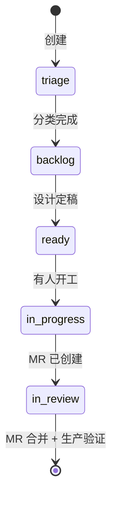

# Status Workflow — 5 状态流转规则

## 状态图

`flag/blocked` 与 status 正交，可叠加在任一 open 状态，不进入上面的状态机。

## 每状态的进入 / 退出条件

### `status::triage`（初始）

**进入：** 新建 issue，信息、类型、优先级或归属尚未确认。

**退出到 backlog：** type、priority、范围和 owner 已完成初步判断。

### `status::backlog`

**进入：** triage 已完成，issue 已接受但设计或开工条件未完成。

**退出到 ready：** 设计文档写清楚、验收 checklist 可勾选、依赖关系盘清楚。

### `status::ready`

**进入：** 设计完成，不需要进一步决策就能开工。

**退出到 in-progress：** assignee 明确 + 开始动手。

**遇到阻塞：** 保留 `status::ready`，添加 `flag/blocked`。

### `status::in-progress`

**进入：** 有人正在写代码/做事。

**退出到 in-review：** MR 已创建并贴到 issue（comment 里）。

**遇到阻塞：** 保留 `status::in-progress`，添加 `flag/blocked`。

### `status::in-review`

**进入：** MR 已开，等 reviewer / CI / 灰度。

**退出到 close：** MR 合并且部署到目标环境验证通过。不是 MR 合并就 close — 要等**线上**确认。

### `flag/blocked`

**添加：** 任何 open 状态都可添加，条件是**依赖方不属于本 issue 的 assignee 能控制范围**。添加时不移除原 `status::*`。

**移除：** 依赖解除后只移除 `flag/blocked`；原 status 保留。若工作事实也变化，再单独流转 status。

## 阻塞的常见原因

| 原因 | 例子 |
|------|------|
| 等其他 issue | "阻塞于 #15（埋点未注册）" |
| 等决策 | "等产品 PM 确认 A/B 组样本量" |
| 等数据 | "等 dbt 产出 dwm_xxx 表" |
| 等运维 | "等 SRE 部署 ServiceMonitor" |
| 等外部 API | "等合作方提供 webhook 接口" |

阻塞原因必须写在 **issue 描述的 `## 依赖` 段** 和 **最新一条进展 comment** 里，方便后来人一眼看清。

## close vs backlog

| 情况 | 正确操作 |
|------|----------|
| 功能做完上线 | close（写验收 comment） |
| 不做了（需求砍掉） | close + 写原因 comment + label 保留（为审计） |
| 下周做 | 留在 backlog，不要 close 再重开 |
| 依赖长期没解 | 保留 status + `flag/blocked`，每两周 review；如果永远做不了 → close 并记录 |

## 反模式

### status 停在 ready 不动

ready 的定义是 "能开工"。如果 2 周都没进 in-progress，说明要么优先级不够（降为 `priority::p3` 并回 backlog），要么实际有阻塞（加 `flag/blocked` + 说明原因）。**ready 不是垃圾桶**。

### in-progress 挂一个月

说明要么范围太大（拆子 issue），要么其实阻塞了（加 `flag/blocked`），要么 assignee 搁置了（重新分配或回 backlog）。

### in-review 永不 close

MR 合并不等于 done — 生产验证、数据回流、用户反馈都要到位。close 条件一定要在 DoD checklist 里明确。

### 漏 status::* label

每个 issue 都必须有 status 标签（开场默认 triage）。没有 status 的 issue 在 board 上看不到，等于丢了。

### 用关闭 issue 代替 blocked

"因为卡住所以先 close" 是反模式 — 失去跟踪。正确做法是保留真实 status，添加 `flag/blocked` 并描述依赖。
