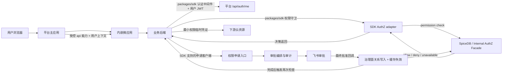

# 通用架构与决策规则

## 目录

- 目标边界
- 推荐链路
- 拓扑决策
- 凭证分类
- 资源模型
- 错误语义
- 旧 SDK 与 Facade 的边界

## 目标边界

把系统拆成四个独立问题：

- 认证（AuthN）：请求代表谁。
- 授权（AuthZ）：该主体能否对某个资源执行某动作。
- 权限治理：谁能申请、批准、写入、撤销和审计权限。
- 微应用装载：主应用如何加载子应用并传递受控能力。

任意一层成功都不能替代其他层。例如，飞书登录成功不代表拥有发布权限，侧边栏出现不代表后端允许发布，审批记录通过也不代表 SpiceDB 关系已经落地。

## 推荐链路



主应用只把完成业务请求所需的能力交给子应用。业务后端必须通过对应 `packages/sdk` 完成用户认证和权限鉴权。SDK 的底层授权模式按目标版本 README 与平台契约选择；业务代码不自行连接 SpiceDB，也不自行拼装 Facade 客户端。

## 拓扑决策

### 平台内嵌前端，共用平台后端

适合小型功能、同一发布节奏、同一故障域和平台团队可维护的场景。

- 前端：使用主应用注入的 API 客户端和用户信息。
- 后端：在平台 Controller/handler 上使用现有认证过滤器和权限守卫。
- 权限治理：仍经平台权限申请和审计闭环。
- 风险：平台发布耦合、业务代码侵入平台、权限资源容易与路由硬编码绑定。

### 平台内嵌前端，独立业务后端

作为通用默认选项。

- 前端：仍由主应用提供登录态和能力适配器。
- 后端：使用同一个技术栈对应的 `packages/sdk` 注册认证中间件和权限守卫。
- 优点：业务发布独立，认证与授权调用由 SDK 统一；只有 Facade 模式才避免把 SpiceDB 凭证和 Schema 扩散到业务后端，当前 direct SDK 仍需要 workload 持有 SpiceDB 预共享 token。
- 代价：增加平台认证和授权两个运行时依赖，必须有超时、熔断、指标和 fail-closed 语义。

### 独立可信 Web 应用

适合无法被 qiankun 装载或有自身会话系统的产品。

- 浏览器只参与 redirect 和 state 验证。
- 应用 BFF 用一次性 code 与服务端 secret 换取身份，并建立自己的 HttpOnly 会话。
- 不把飞书 access/refresh token 或 client secret 返回浏览器。
- 只有在目标环境确认授权码桥已合并、部署且回调 URI 已注册后才能启用。

### MCP、CLI 或后台任务

- 用户发起的 MCP 操作使用专用用户令牌和 MCP SDK 约束。
- 无用户上下文的批处理使用服务 JWT，并显式记录 actor/source/reason。
- 不借用某个管理员的长期浏览器 JWT 运行自动化。

## 凭证分类

| 凭证 | 主体 | 存放位置 | 典型用途 | 禁止事项 |
| --- | --- | --- | --- | --- |
| 用户 JWT | 人 | 主应用或安全会话 | `/api/auth/me`、业务 API | 作为服务身份、写日志、复制到子应用存储 |
| SpiceDB 预共享 token | SDK 所在 workload | Vault/Kubernetes Secret 注入 | direct SDK 调用 SpiceDB gRPC | 发给开发者、放浏览器/仓库/日志、与服务 JWT 密钥复用 |
| 服务 JWT 签名密钥 | 注册调用服务 | Vault/Kubernetes Secret 注入 | 签发 Facade 短时 JWT | 传给 SpiceDB、跨服务/环境共享、明文传递 |
| 短时服务 JWT | 调用服务 | 服务端内存 | `/internal/authz/**` | 放浏览器、超长 TTL、冒用其他 caller code |
| 一次性授权码 | 登录事务 | Redis 等短时存储 | 独立 Web 登录 code exchange | 重放、非原子消费、prefix redirect allowlist |
| 云临时凭证 | 受限下游角色 | 仅当前操作 | S3/STS 等上传 | 返回长期密钥、权限超出资源路径、记录密钥 |

`SPICEDB_TOKEN`、`SpiceDBConfig.token` 和 `auth.spicedb.token` 指向 SpiceDB gRPC preshared key。`APP_SERVICE_JWT_SECRET` 是 Facade 调用方的 JWT 签名密钥，不给 SpiceDB 使用。所选 SDK 模式必须与凭证类型一一对应；缺少目标环境的 Secret 来源、workload 注入配置或轮换责任时，接入状态为 `阻塞`。

服务 JWT 至少包含：

```json
{
  "iss": "registered-service-code",
  "sub": "registered-service-code",
  "aud": "micro-app-platform",
  "iat": 1710000000,
  "exp": 1710000300,
  "jti": "unique-per-token",
  "scope": "authz:check authz:request"
}
```

实际 audience、最大 TTL 和 scope 必须从实时平台配置读取。平台参考实现的默认最大 TTL 是 15 分钟，但消费方应尽量更短。

## 资源模型

先建立权限地图：

| UI 能力 | API | 副作用 | 推荐检查位置 | 权限来源 |
| --- | --- | --- | --- | --- |
| 应用入口 | 加载配置 | 只读 | 主应用 UX + 后端 API | `base/app` access 或现网等价资源 |
| 页面查看 | list/detail | 数据读取 | 每个查询 API | metadata 定义的 read/view |
| 修改动作 | create/update/delete | 数据变更 | 命令 API | metadata 定义的 action |
| 高风险动作 | 发布、授权、凭证签发 | 外部副作用 | 最靠近副作用的后端 | 独立 permission key |

不要从 URL 字符串直接发明权限。现代 Facade 的参考契约使用：

- `base/app:<application>#access` 表示显式应用入口；
- `base/permission_resource:<application>/<permission-resource>#<permission>` 表示功能权限；
- `base/view:<app>/<route>` 仍可能存在于旧主应用路由模型。

最终以实时 metadata、OpenAPI 和 Schema 为准。动态资源 ID 必须验证租户/应用归属，不能只做字符清洗。

## 错误语义

| 条件 | HTTP/结果 | 客户端动作 |
| --- | --- | --- |
| 用户 token 缺失、无效、过期 | 401 | 重新认证；不发起权限申请 |
| 服务 JWT 无效或 scope 不足 | 401 | 修复服务配置；不降级为用户请求 |
| 已认证但无资源权限 | 403 或 allowed=false/DENY | 展示申请入口或无权状态 |
| AuthZ 依赖不可用 | 503 或 `AUTHZ_UNAVAILABLE` | 有界重试、告警；禁止 fail open |
| 请求契约非法 | 400 | 修复 resource/subject/trace/idempotency |
| 幂等键与不同命令冲突 | 409 | 生成新命令键或调查重复提交 |

批量检查时单项非法或依赖故障也要保留单项 reason；lookup 故障不能伪装为空列表。

## SDK 授权模式与 Facade 的边界

现有 Java、FastAPI 和 Next.js SDK 具备：

- 从 `Authorization: Bearer` 提取用户 token；
- 调平台用户信息端点验证 token 并注入用户上下文；
- 权限 decorator/wrapper、缓存和统一错误；
- 直接 SpiceDB check/relationship 能力；
- 部分语言提供审批客户端或 MCP wrapper。

审批批准只是治理命令的输入。只有治理面完成关系写入与缓存失效，业务后端再次通过 SDK 发起 permission check，并从 `K → B` 读回 allow 后，才能报告授权生效。

微应用后端的模式选择统一遵循 [sdk-integration.md](sdk-integration.md) 的“强制边界”和“README 与实现漂移”。本架构只表达数据流，不另行定义 direct/Facade 决策规则。
