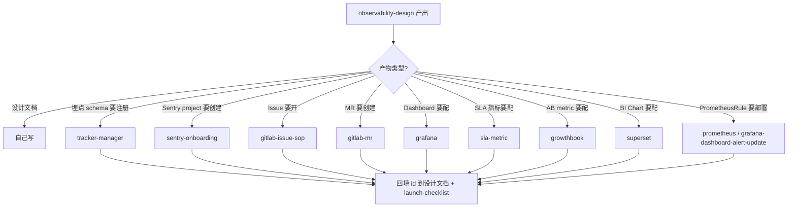

# 委派地图（delegation map）

observability-design 自己做方法论和审计，具体工具链的操作委派给对应 skill。下表列出每次调用的 input / output / 触发条件。

## 总览

| 步骤 | 调用的 skill | 类型 | input | output |
|------|-------------|------|-------|-------|
| 注册埋点 schema | `tracker-manager` | 交互式工作流 | 事件名 + schema JSON | schema version + iglu uri |
| 创 Sentry project | `sentry-onboarding` | 交互式工作流 | project name + team + environments | project slug + DSN（入 Vault） |
| 创 issue 群（追踪 gap） | `gitlab-issue-sop` | SOP（无交互） | gap 列表 + 标签体系 + 优先级 | issue iids + board 映射 |
| 创 MR | `gitlab-mr` | SOP（无交互） | branch + commits + 关联 issue | MR url + pipeline status |
| 配 Grafana dashboard | `grafana` | 交互式工作流 | dashboard JSON 或 panel 定义 | dashboard url + uid |
| 配 SLA 指标 | `sla-metric` | 交互式工作流 | SQL + 阈值 + scene 维度 | dapp metric id |
| 配 GrowthBook metric | `growthbook` | 交互式工作流 | metric YAML（config-as-code） + feature flag 定义 | metric ids + feature flag ids |
| 配 Superset chart / dashboard | `superset` | 交互式工作流 | dataset + chart 定义 + YAML 导出 | chart/dashboard ids + YAML 备份文件 |
| 配 Prometheus alert / dashboard | `prometheus` + `grafana-dashboard-alert-update` | 交互式工作流 | PrometheusRule YAML + dashboard JSON | merged PrometheusRule + dashboard uid |

## 每个委派的详细说明

### tracker-manager

**何时调用：** `:design` 工作流第 5 步产出设计文档后，需要把链路①的埋点 schema 落到公司埋点平台。

**触发条件：**
- 新事件名不存在于 Tracker Manager
- 已有事件但字段结构要升级（vendor/event/version 需要 bump）

**input：**
- 事件名（`scene_entry`、`recipe_evaluation` 等）
- schema JSON（Snowplow / Iglu schema 格式）
- 应用归属（vicohome / roku-app 等）
- 版本号决策（major vs minor）

**output：**
- Tracker Manager 工单 id
- 审核通过后的 schema version（如 `1-0-46`）
- Iglu URI（`iglu:com.vicohome/<event>/jsonschema/<version>`）

**后续动作：**
- 把 Iglu URI 写入 App SDK 代码
- 在数仓 auto-parser 配置里声明新 schema
- 更新设计文档的链路①章节

### sentry-onboarding

**何时调用：** 系统里有后端/前端服务需要错误监控但 Sentry project 未创建。

**触发条件：**
- 审计发现链路② 数据源未接
- 新服务上线前期准备

**input：**
- project name（如 `customer-care-backend`）
- team slug
- environments 列表（staging / prod）
- 告警路由（PagerDuty integration key 或 Slack webhook）

**output：**
- project slug
- DSN 配置（需写入 Vault / ExternalSecret，**不要写入代码仓库**）
- project 的 Sentry URL

**后续动作：**
- 运维写 ExternalSecret 把 DSN 注入 Pod env
- 后端 `main.go` 初始化 SentryReporter
- 在 launch checklist 加验收项

### gitlab-issue-sop

**何时调用：**
- `:design` 工作流第 6 步：为设计文档的每个实施项开 issue
- `:audit` 工作流第 4 步：为每个 gap 开 issue

**触发条件：** 永远是"要批量创建/更新 issue 时"，不是方法论本身。

**input：**
- gap 列表 / 实施项列表（至少含：标题、说明、优先级、关联文档链接）
- labels：引用 [GitLab Label 治理规范](../../../docs/standards/gitlab-label-governance.md)，通常使用 `type::maintenance` + `priority::pN` + `status::*` + `area/observability`，不自行扩展一套模型
- 项目 id（GitLab project id）
- 父 issue（可选，用于 linked items）

**output：**
- 所有 issue 的 iid + URL 列表
- board 映射关系

**后续动作：**
- 把 issue iid 回填到设计文档 / launch-checklist
- MR 创建时关联这些 iid（`Closes #NN`）

详见 [gitlab-issue-sop SKILL.md](../../gitlab-issue-sop/SKILL.md)。

### gitlab-mr

**何时调用：** `:design` 工作流第 7 步代码变更；`:audit` 如果审计结论包含代码修改也会走 MR。

**触发条件：**
- 分支上有待合并的 commits
- 关联 issue 已就位
- CI 基本通过或准备推进合并

**input：**
- branch name
- 关联 issue iid（`Closes #NN`）
- 跨仓库 MR 协调（如 app repo + dbt repo）

**output：**
- MR URL
- pipeline 状态
- 合并后部署状态（通过 ArgoCD sync 反查）

### grafana（+ grafana-dashboard-alert-update）

**何时调用：** 需要创建或更新 Grafana dashboard / alert rule 时。

**触发条件：**
- `grafana/dashboards/*.json` 有新增或修改
- 需要把 dashboard 导入到 Grafana 实例
- 需要配置数据源变量（`$datasource` / `$namespace`）

**input：**
- dashboard JSON 文件路径
- Grafana 目标实例（staging / prod）
- folder / tags

**output：**
- dashboard uid + URL
- 导入状态 log

**后续动作：**
- 把 URL 写回设计文档
- 加入 launch-checklist 的勾选项

### sla-metric

**何时调用：** 业务效果指标 / 系统安全护栏需要定期告警（dapp 平台）。

**触发条件：**
- 有稳定的 SQL 可以计算指标
- 有明确的阈值（warning / critical）
- 数仓宽表已建好（不能依赖还没 ready 的表）

**input：**
- SQL 逻辑
- 阈值方向（过低 / 过高 / 偏离基线）
- 调度频率（小时 / 天）
- scene / variation 等维度拆分

**output：**
- dapp metric id
- 告警接收人 / 频道

### growthbook

**何时调用：** 配置 feature flag 或 AB 实验 metric。

**触发条件：**
- config-as-code：`growthbook/metrics.yml` 变更，GitLab CI 触发 bulk-import
- 新 feature flag 上线前

**input：**
- metric YAML（标准 GrowthBook config-as-code 格式）
- feature flag 定义（valueType / defaultValue / variants）
- project（如 `smart-popup`）

**output：**
- metric ids（标 Official）
- feature flag ids

**后续动作：**
- `getSmartPopupConfig` 或等价 API 会拉 feature flag 做分流
- 把 metric 关联到对应 experiment

### superset

**何时调用：** 需要 BI 报表、漏斗图、留存图时。

**触发条件：**
- 数仓宽表已生成
- PM / 运营需要日常查看业务数据

**input：**
- dataset 定义（指向数仓表）
- chart 定义（type + dimensions + metrics）
- dashboard 布局
- YAML 导出路径（入仓库做审计备份）

**output：**
- chart / dashboard ids
- YAML 备份文件路径（`superset/<feature>-dashboard.yaml`）

### prometheus + grafana-dashboard-alert-update

**何时调用：** 修改 PrometheusRule YAML、调试告警规则、检查 Alertmanager 路由。

**触发条件：**
- 新增告警规则
- 调整阈值 / for 时间 / 标签
- 验证告警端到端链路（触发 → Alertmanager → PagerDuty）

**input：**
- PrometheusRule YAML（`k8s/<service>/base/prometheusrule.yaml`）
- 告警 label（`team: smart-popup` 用于 routing）

**output：**
- 合并后的规则列表
- staging 触发验证结果

## 委派决策流程

## 不委派的事

observability-design 自己完成：
- 方法论引导（苏格拉底追问、四层指标 / 三链路 / 安全护栏的推导）
- 设计文档的撰写与结构化
- Gap 分析与分类
- 架构文档归档（`docs/architecture/<system>/observability.md`）
- launch-checklist / ops-runbook 的更新

**为什么不委派：** 方法论本身不适合 SOP 化——每次都要基于实际业务做推导。SOP 化的是"确定要做 X 之后怎么做 X"，而不是"是否要做 X"。
