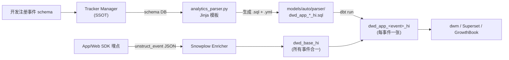

# 事件解析流水线（Auto-Parser）

业务指标链路①的"第一公里"：从 Snowplow 原始事件到可 SQL 查询的 dwd 表，靠的是 schema 驱动的自动 parser，不是给每个事件手写一份 SQL。

## 为什么需要 auto-parser

每个业务事件（scene_entry / recipe_evaluation / popup_interaction …）的字段都塞在 Snowplow 的 `unstruct_event` JSON 列里。如果 **给每个事件手写一份 dwd SQL**：

- N 个事件 → N 份重复 SQL（字段抽取、类型转换、context 拼接全部重复）
- schema 一升级就要改 N 处
- 新增事件要等数据工程师排期
- 命名、类型、null 处理难统一，下游 SQL 随机踩雷

**解法**：schema 注册到中央平台 → 自动化脚本根据 schema 生成 dwd dbt model → CI/Dagster 渲染执行。开发只负责"注册 schema"和"写消费方 SQL"，中间全自动。

## 整体流程



四个角色：

| 角色 | 职责 | 工具 |
|------|------|------|
| **Schema** | 事件字段契约 | Tracker Manager DB |
| **采集** | SDK 埋点 → 上报 | Snowplow Tracker |
| **Parser** | schema → dbt model | `analytics_parser.py` |
| **编排** | dbt run + S3 archive | Dagster + dbt |

## 步骤 1：Schema 注册（Tracker Manager）

事件定义是 SSOT，落在 Tracker Manager 平台（或等价的 schema 管理系统）上。每次新增/改事件必须先注册再上报，否则进 `dwd_bad_events`。

**注册内容**：

- `event_vendor`（如 `com.smart_popup`）
- `event_name`（如 `scene_entry`）
- 字段列表：name、类型（trino_type）、是否必填、描述
- 关联的 context schema（如 `com.base/base-schema`、`com.smart_device/base-schema`）

**委派**：具体操作委派 `tracker-manager` skill（API 查询、创建工单、审核发布）。本 reference 只讲解析侧如何消费这份 schema。

## 步骤 2：Snowplow 采集 → `dwd_base_hi`

Snowplow 把所有事件（不分 event_name）enrich 后写到一张大表 `dwd_base_hi`。关键列：

| 列 | 含义 | 典型来源 |
|---|------|---------|
| `event_id` | 事件唯一 ID（去重 key） | SDK 生成 UUID |
| `event_vendor` | 事件归属 vendor（`com.smart_popup`） | schema 注册 |
| `event_name` | 事件名（`scene_entry`） | schema 注册 |
| `dvce_created_tstamp` | 设备端时间戳 | SDK |
| `unstruct_event` | **自定义事件 payload JSON** | SDK 填 |
| `contexts` | **全局 context JSON 数组** | SDK 填（每条含 schema + data） |

这张表已经包含所有事件，但无法直接按业务字段 SQL 查询——`unstruct_event` 是原始 JSON。

参考实现：`dbt_athena/models/dw/analytics/dwd_base_hi.sql`，负责从 `enriched` 源表 cast、去重、抽 `user_id` / `country_no` / `serial_number` 等跨所有事件的公共字段。

## 步骤 3：Auto-Parser 生成 dbt model

`analytics_parser.py`（位于数据仓库 `utils/` 目录）是个 Jinja 模板渲染器。流程：

1. 从 schema 平台拉 event / context 元数据 DataFrame
2. 按 `app_group`（如 `smart_popup`）分组所有事件
3. 每个 app_group 渲染 **一张聚合表** `dwd_app_<group>_hi`（所有该 vendor 事件合一，按 event_name 区分行）
4. 每个 event 还可单独渲染 `dwd_app_<event>_hi`（按事件拆分的窄表，便于消费）
5. 产物打成 `auto_models.tar.gz` 上传 S3，CI/Dagster 下载解压到 dbt 项目 `models/dw/analytics/auto/` 目录，由 dbt run 物化

**命名规范**（SSOT）：

- 全量合一表：`dwd_app_<group>_hi`（如 `dwd_app_smart_popup_hi`）
- 单事件宽表：`dwd_app_<event_name>_hi`（如 `dwd_app_scene_entry_hi`）
- 分区变体：`dwd_app_<name>_partitioned_by_<sn|uid>_hi`（按 serial_number 或 user_id 重分区）
- 后缀 `_hi` = 小时增量（hourly incremental）

## 步骤 4：生成的 SQL 模式

parser 的 Jinja 模板（`templates/analytics_event_model_default.sql`）输出如下结构：

```sql
{{ config(
    materialized='incremental',
    table_type='iceberg',
    incremental_strategy='merge',
    unique_key=['event_id'],
    partitioned_by=['day(dvce_created_tstamp)'],
    on_schema_change='sync_all_columns',
    tags=[var("schedule_hourly")]
) }}

WITH split_rowdata AS (
    SELECT
        {{ base_column_names | join(",") }},
        -- 每个 context schema 一次 JSON path match
        json_query(contexts, 'lax $.data[*]?(@.schema starts with "iglu:com.base/base-schema/jsonschema")') AS d_com_base_base_schema,
        json_query(contexts, 'lax $.data[*]?(@.schema starts with "iglu:com.smart_device/base-schema/jsonschema")') AS d_com_smart_device_base_schema,
        -- unstruct_event 一次 JSON path 提取
        json_query(unstruct_event, 'lax $.data') AS unstruct_event_data
    FROM {{ ref("dwd_base_hi") }}
    WHERE {{ dh_filter(lag=2, dh_expr='dvce_created_tstamp') }}
      AND event_vendor = 'com.smart_popup'
      AND event_name IN ('scene_entry')
)
SELECT
    -- 事件专属字段（来自 unstruct_event.data）
    TRY_CAST(json_extract(unstruct_event_data, '$.data.scene_id')   AS VARCHAR) AS scene_id,
    TRY_CAST(json_extract(unstruct_event_data, '$.data.recipe_id')  AS VARCHAR) AS recipe_id,
    TRY_CAST(json_extract(unstruct_event_data, '$.data.rules_version') AS VARCHAR) AS rules_version,
    -- context 字段（每个 context schema 一个 d_* 列，展开为带 schema 后缀的独立列）
    TRY_CAST(json_extract(d_com_base_base_schema, '$.data.user_id') AS BIGINT) AS user_id_com_base_base_schema,
    TRY_CAST(json_extract(d_com_base_base_schema, '$.data.country_no') AS VARCHAR) AS country_no_com_base_base_schema,
    TRY_CAST(json_extract(d_com_smart_device_base_schema, '$.data.sn') AS VARCHAR) AS sn_com_smart_device_base_schema,
    -- base 表公共列（event_id, dvce_created_tstamp, …）
    {{ base_column_names | join(",") }}
FROM split_rowdata
```

核心手法：

- `json_query(..., 'lax $.data[*]?(@.schema starts with "iglu:...")')` — 从 contexts 数组里按 schema 前缀抽出匹配的那条
- `json_extract(..., '$.data.<field>')` — 再从抽出的对象里拿具体字段
- `TRY_CAST(... AS <trino_type>)` — 类型失败 → NULL（不会炸作业）
- `json_query` 保留 JSON 类型（用于嵌套对象），`json_extract` 走 scalar 路径

## 步骤 5：Context vs Unstruct event 字段命名

理解这个边界 = 理解下游 SQL 的字段来自哪里。

| 字段来源 | JSON 位置 | 列名规范 | 例子 |
|---------|-----------|---------|------|
| **Context**（全局 schema，跨事件） | `contexts.data[*]?(schema starts with "iglu:...")` | `<field>_<schema_key>` | `user_id_com_base_base_schema` |
| **Unstruct event**（事件专属字段） | `unstruct_event.data.data.<field>` | 原始字段名（可能加 `_event` 后缀避免冲突） | `scene_id` / `condition_met` |

- **Context 必须加 schema 后缀**：同一个字段名（如 `user_id`）可能出现在 `com.base/base-schema` 和 `com.smart_device/base-schema` 两个 context 里，加后缀避免歧义。下游 dwm 在 SELECT 时用 alias 重命名（`user_id_com_base_base_schema AS user_id`）。
- **Unstruct event 字段不加后缀**：同一张 `dwd_app_<event>_hi` 只解析一个 event schema，无歧义。

**schema_key 生成规则**：`iglu:com.base/base-schema/jsonschema` → 去掉 `iglu:` 和 `/jsonschema`，把 `.` `/` `-` 替换成 `_` → `com_base_base_schema`。

## 步骤 6：下游如何使用 `dwd_app_<event>_hi`

dwm 层（见 [dwm-wide-table-pattern.md](dwm-wide-table-pattern.md)）直接 ref：

```sql
SELECT
    event_id,
    dvce_created_tstamp,
    user_id_com_base_base_schema AS user_id,
    sn_com_smart_device_base_schema AS serial_number,
    scene_id,
    recipe_id
FROM {{ ref('dwd_app_scene_entry_hi') }}
WHERE {{ dh_filter(lag=1, dh_expr="dvce_created_tstamp") }}
```

dwm 不碰 `dwd_base_hi`、不解析 JSON、不关心 schema — parser 已经把脏活干完了。

## 常见踩坑

1. **Schema 升级不向下兼容** — parser 用 `on_schema_change='sync_all_columns'`，新增列自动加；**重命名字段等于删旧加新**，旧历史数据丢失 → 改字段名之前评估是否需要 dual-write。
2. **类型不一致**：同一 context 下某字段在不同事件里类型不同（例如 `version` 有时 VARCHAR 有时 BIGINT），parser 会 upcast 到公共父类型；下游最好用 `TRY_CAST` 兜底。
3. **NULL 处理**：`json_extract` 找不到 key → NULL；`TRY_CAST` 失败 → NULL。区分不了"字段不存在"和"值为 null"。必要时把 "是否存在" 做成独立 boolean 列在 SDK 上传时明确表达。
4. **分区谓词被忘**：查询没带 `dvce_created_tstamp >=` 会全表扫描（iceberg 也会炸）。所有消费 SQL 必须带时间分区过滤。
5. **事件未注册就上报** → 进 `dwd_bad_events_hi`，parser 不会生成对应表，下游 SELECT 直接报 relation does not exist。先注册再发版。
6. **Context schema 没带上** → 对应 `d_<schema>` 列为 null，依赖该 context 的 user_id / serial_number 也为 null → 下游 JOIN 失败。SDK 必须在初始化时注册所有需要的全局 context。

## 真实示例：SmartPopup 三事件

Event schemas 在 Tracker Manager 注册后，parser 各自产出一张表：

| Event | 生成表 | Unstruct 字段 | Context 字段（示例） |
|-------|-------|-------------|--------------------|
| `scene_entry` | `dwd_app_scene_entry_hi` | `scene_id`, `recipe_id`, `rules_version`, `engine_version` | `user_id_com_base_base_schema`, `country_no_com_base_base_schema`, `sn_com_smart_device_base_schema` |
| `recipe_evaluation` | `dwd_app_recipe_evaluation_hi` | `scene_id`, `recipe_id`, `hit_id`, `condition_met`, `fatigue_passed`, `fatigue_blocked_by`, `shown` | 同上 |
| `popup_interaction` | `dwd_app_popup_interaction_hi` | `hit_id`, `action` | 同上 |

三张表都有 `user_id` / `serial_number`（来自 base-schema context），以及 `hit_id`（一次弹窗 resolve 的 correlation id，从 recipe_evaluation 穿到 popup_interaction）。下游 dwm 按 `scene_id + recipe_id + 时间窗` JOIN scene_entry → recipe_evaluation，按 `hit_id` JOIN recipe_evaluation → popup_interaction。

完整消费侧 SQL 见 [dwm-wide-table-pattern.md](dwm-wide-table-pattern.md) 的 SmartPopup 示例。

## 检查清单（新增事件时）

- [ ] schema 已在 Tracker Manager 注册并发布（委派 `tracker-manager` skill）
- [ ] `event_vendor` / `event_name` 和 SDK 调用一致（不一致会进 bad_events）
- [ ] 必须的全局 context（base-schema、smart_device schema）SDK 已注册
- [ ] CI/Dagster 的 parser 已重跑，`dwd_app_<event>_hi` 已生成并物化
- [ ] DataHub 能搜到新表、schema 展示正常
- [ ] 冒烟 SQL：`SELECT COUNT(*) FROM dwd_app_<event>_hi WHERE dt=current_date - interval '1' day`
- [ ] `dwd_bad_events_hi` 里**没有**该 event_name 相关错误

## 附：DB 配置维度同步路径（SeaTunnel + Dagster）

链路① 业务指标除了 Snowplow 埋点路径外，还有**第二条上游路径**：应用 MySQL 里的配置维度表（Admin 里 Scene/Rule/Fact/Recipe 这类配置）也要进数仓，和事件 JOIN 后产出 dwm 宽表。标准模式：

```
Admin MySQL (Scene / Rule / Fact / Recipe / ...)
   │ SeaTunnel connector (JDBC source → Iceberg/Athena sink)
   │ Dagster 调度 (hourly 或按配置变更频率)
   ▼
dwd_config_<system>_* (dbt schema)
   │ dbt dwm 层 JOIN event_id / recipe_id / scene_id
   ▼
dwm_<system>_funnel
```

**工具分工**：
- **SeaTunnel** 负责数据搬运（JDBC 读 + Iceberg/Hive 写 + schema 映射）
- **Dagster** 负责编排（调度频率、依赖管理、失败重试、观测）
- **dbt** 负责下游建模（join 逻辑、宽表物化、schema test）

**时间对齐（重要踩坑点）**：
- 事件 timestamp = 用户操作时刻（不可变）
- 配置 timestamp = 配置最后修改时刻
- JOIN 时要避免"今天的 config 套到昨天的事件"——正确做法：
  - 维度表带 `effective_from / effective_to` 列（SCD Type 2）
  - 或每次 SeaTunnel 同步快照 snapshot 历史（带 `snapshot_date` 分区）
  - dwm JOIN 条件：`event.dvce_created_tstamp BETWEEN config.effective_from AND config.effective_to`

**增量 vs 全量**：
- 小表（< 10k 行）→ SeaTunnel 全量 dump，简单可靠
- 大表（> 100k 行）→ SeaTunnel CDC 或增量同步（依赖 MySQL binlog 或 updated_at 字段）
- 中等表 → 按 `updated_at > last_sync_time` 拉增量

**错误模式**：
- ❌ 在数仓里直连 MySQL（Athena federated query）→ 生产查询打到 OLTP DB，危险
- ❌ 每次事件查询都 call 一次 Admin API 拿 config → 数仓批查变串行 RPC，慢且依赖应用层
- ✅ SeaTunnel 周期 sync 到数仓独立副本，数仓查询完全自闭环

**参考实现**：customer-care 仓 smart_popup 场景（见 `docs/architecture/smart_popup/observability/link-1-business-metrics.md §数据流入路径`）。

---

## 参考

- Snowplow 官方 Schema/Iglu 文档：<https://docs.snowplow.io/docs/understanding-tracking-design/>
- `tracker-manager` skill — schema 注册 SSOT
- dbt `on_schema_change='sync_all_columns'` — 列增减自动同步
- Athena JSON 函数：`json_query` / `json_extract` / `json_extract_scalar`
- **SeaTunnel** 官方文档：<https://seatunnel.apache.org/docs/> — JDBC source / Iceberg sink
- **Dagster** 调度 SeaTunnel job 模式：见 `dagster` skill + `dagster-python-asset-register` skill
