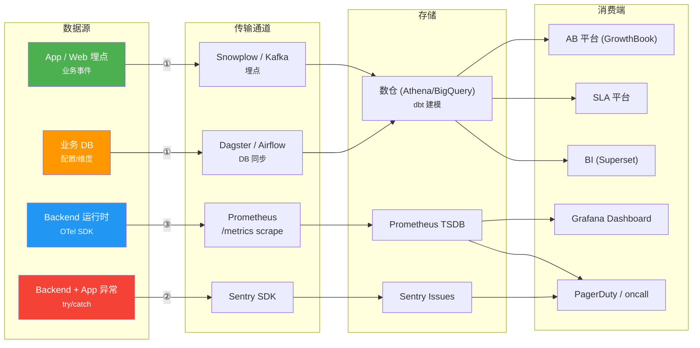

# 三链路架构参考实现

观测方案一定要拆成三条独立链路。链路合并 = 数据通道混用 = 消费端 / 时效 / 告警逻辑打架。

## 三链路总览



## 每链路四要素

| 链路 | 数据源 | 传输通道 | 存储 | 消费端 |
|------|-------|---------|------|-------|
| ① 业务指标 | 业务埋点 + DB 配置维度 | Snowplow / Kafka + ETL | 数仓（dbt） | AB / SLA / BI |
| ② 错误 | try/catch 异常事件 | Sentry SDK | Sentry Issues | Sentry UI → PagerDuty |
| ③ 系统指标 | Backend runtime metrics | Prometheus scrape | Prometheus TSDB | Grafana + Alertmanager |

## 链路 ①：业务指标链路

### 四要素详解

**数据源：**
- App / Web SDK 的业务埋点事件（用户行为、转化、交互）
- Backend 的业务日志（如支付状态变化）
- 业务 DB 的配置表 / 维度表（scene / recipe / user / device）
- 外部系统的维度（GrowthBook 实验分组、GeoIP）

**传输通道：**
- **埋点主通道**：Snowplow / Amplitude / Kafka + 自建 collector。要求 schema 注册机制（Tracker Manager / Iglu / Segment）
- **DB 同步**：Dagster / Airflow 定期拉取业务 DB 到数仓（hourly / daily）
- **禁止**：把错误事件塞进埋点通道、把系统 metric 塞进埋点通道

**存储：**
- 数仓（Athena / BigQuery / Snowflake），dbt 建模分层：`dwd` 明细层 → `dwm` 宽表层 → `dws` 汇总层
- 宽表作为 SSOT，下游只查一张表
- 粒度：一行一次核心事件（如 scene_entry），JOIN 其他维度进来

**消费端：**
- AB 平台（GrowthBook / Eppo / Optimizely）：跑 AB 实验分析
- SLA 平台（内部 dapp）：配业务效果 SLA 告警
- BI（Superset / Metabase / Tableau）：日常报表和深度分析

### 选型模式

| 选型点 | 选项 | 何时用 |
|--------|------|-------|
| 埋点通道 | Snowplow | 自建、schema 严格、跨端统一 |
| 埋点通道 | Segment | 多目的地扇出、不自建 collector |
| 埋点通道 | Amplitude | SaaS、产品分析优先 |
| DB 同步 | Dagster | Python 生态、数据资产建模 |
| DB 同步 | Airflow | 任务调度为中心 |
| DB 同步 | Debezium CDC | 需要秒级同步 |
| 数仓建模 | dbt | SQL 为中心、版本化、Iceberg/Athena 兼容 |
| AB 消费 | GrowthBook config-as-code | metric 定义放 git，防 UI drift |
| SLA 消费 | 内部 dapp | 公司标准化告警路由 |

### 配置 drift 防范

**config-as-code 原则：** 关键配置（GrowthBook metric、Superset dashboard、dbt model）放 git，CI 同步到平台，UI 里禁止手改。

例：GrowthBook metric 通过 `growthbook/metrics.yml` + GitLab CI 调 `/api/v1/bulk-import/facts` 批量导入。同步后 metric 标记为 "Official"，UI 不可编辑。

## 链路 ②：错误链路

### 四要素详解

**数据源：** Backend 和前端的异常事件，包括：
- 未捕获异常（unhandled）
- 主动上报的业务错误（GrowthBook 超时、DB 查询失败、外部 API 失败）
- Promise rejection / panic / 协程崩溃

**传输通道：** Sentry SDK / Bugsnag / Rollbar。SDK 自动捕获 + 手动 `capture_exception`。

**存储：** Sentry Issues（按指纹聚合）。

**消费端：** Sentry UI → Alert → PagerDuty → oncall。

### 必上报的 4 类业务错误

抽象上，每个后端服务必报：

| 错误类型 | 触发 | 为什么不能少 |
|---------|------|------------|
| 配置/规则加载失败 | DB / S3 / config 服务读不到 | 链路① 此时静默，这是唯一信号 |
| 外部依赖调用失败 | GrowthBook / CMS / Stripe 超时或 5xx | 与链路③ 互为佐证 |
| 下游资源不可用 | CDN / 对象存储 / 推送网关 fail | 用户感知 silent，这是唯一信号 |
| 业务逻辑约束违反 | 配置里 recipe_id 不存在、状态机非法跳转 | metric 无法捕获纯逻辑问题 |

### 错误处理原则

- **silent skip + Sentry 上报**：异常路径不抛到上游、返回空/默认值 + 上报 Sentry
- **指纹稳定**：同一 bug 的多次发生要聚合成一个 issue（Sentry 自动处理，但自定义 fingerprint 更可控）
- **告警去噪**：Sentry "First seen" / "Spike" 告警优于"每次都告警"

### 反模式

| 反模式 | 后果 |
|-------|------|
| 抛异常到 HTTP 500 让前端处理 | 业务降级变成错误风暴 |
| 只打 log 不上 Sentry | 日志里捞异常效率极低 |
| 所有 log.Error 都上 Sentry | Sentry 配额打爆、信号淹没 |

## 链路 ③：系统指标链路

### 四要素详解

**数据源：** Backend 的 OpenTelemetry SDK instrumentation，包括：
- HTTP 层：request count / duration histogram
- 业务层：关键操作 duration / error count / 返回结果 histogram（如 `recipes_returned`）
- 版本/健康 Gauge：当前配置版本、加载时间戳、活跃连接数

**传输通道：** Prometheus exporter `/metrics` + Kubernetes ServiceMonitor（15s scrape interval）。

**存储：** Prometheus TSDB（本地 15d + Thanos/Mimir 长期）。

**消费端：**
- Grafana Dashboard：按服务 / 业务域分页
- PrometheusRule → Alertmanager → PagerDuty：告警路由

### OTel metric 命名规约

- 前缀统一服务名：`smart_popup_*`、`payment_*`
- 动词过去式 for counter：`requests_total`、`errors_total`
- 名词 for gauge / histogram：`request_duration_seconds`、`active_connections`
- Labels 遵循 Prometheus 约束：低基数（≤ 20 种值），高基数放日志/数仓

### 关键 metric 类型

| 类型 | 何时用 | 示例 |
|------|-------|------|
| Counter | 累积计数 | `http_requests_total` |
| Histogram | 分布（百分位、平均） | `http_request_duration_seconds` |
| Gauge | 瞬时值 | `active_connections`、`rules_version` |
| Observable Gauge | 按 scrape 时间回调计算 | `rules_version`（应用读自己内存） |

### K8s 资源

```yaml
# k8s/base/servicemonitor.yaml — Prometheus scrape
# k8s/base/prometheusrule.yaml — 告警规则
# grafana/dashboards/<service>.json — Dashboard JSON
```

**部署注意：** Grafana dashboard 独立于 K8s 部署（通过 provisioning 或 CI sync）。

### 本地 dev 验证（可选但强烈推荐）

生产的 dashboard / PromQL / 告警表达式失效方式大多在**部署前**就可以暴露：metric 名被改掉、PromQL 语法错、dashboard 变量筛不到数据、alert 规则引用废弃 label。让 `make dev` 起一套 per-worktree 的 Prom + Grafana 栈，用 TDD 风格的 `verify.sh` 跑断言，这些 drift 就不会漏到 staging。

参考实现：[customer-care MR !151](https://gitlab.addx.ai/services/customer-care/-/merge_requests/151) 和 [customer-care MR !150](https://gitlab.addx.ai/services/customer-care/-/merge_requests/150)。

**最小栈**：

```yaml
# docker-compose.local-dev.yml
services:
  prometheus:
    image: prom/prometheus:v2.53.0
    # per-worktree 避免并发冲突；subnet 不要硬编码
    container_name: <app>-prometheus-${WORKTREE_ID}
    command:
      - --config.file=/etc/prometheus/prometheus.yml
      - --web.enable-lifecycle      # 支持 POST /-/reload
    volumes:
      - ${REPO_ROOT}/.logs/prometheus.yml:/etc/prometheus/prometheus.yml:ro
      - ${REPO_ROOT}/.logs/alerts.yml:/etc/prometheus/alerts.yml:ro
    extra_hosts:
      - "host.docker.internal:host-gateway"   # linux 必须
    ports:
      - "${PROMETHEUS_PORT}:9090"

  grafana:
    image: grafana/grafana:10.4.2
    container_name: <app>-grafana-${WORKTREE_ID}
    volumes:
      # provisioning 自动注入 datasource + dashboard
      - ${REPO_ROOT}/scripts/observability/grafana/provisioning:/etc/grafana/provisioning:ro
      - ${REPO_ROOT}/grafana/dashboards:/var/lib/grafana/dashboards:ro
    ports:
      - "${GRAFANA_PORT}:3000"
```

**关键配置点**：

| 关键点 | 做法 | 为什么 |
|-------|------|-------|
| backend 运行位置 | host 侧 air 热重载，不塞进 compose | hot reload 保留；用 `host.docker.internal:${BACKEND_PORT}` 从 prom 回连 |
| scrape target 动态端口 | `prometheus.yml.tpl` 模板 + `envsubst` 渲染到 `.logs/prometheus.yml` | backend 端口是动态分配的；模板化拦住"固定 8080"假设 |
| 多 worktree 并发 | 容器名带 `${WORKTREE_ID}`，docker network 不 pin subnet | 两个 worktree 同时 `make dev` 不会撞 |
| namespace label 兼容 | scrape labels 里硬编码 `namespace: <app>-local` | 生产 dashboard 有 `{namespace=~"$namespace"}` 过滤；本地不加这个 label 就渲染为空 |
| K8s PrometheusRule 本地加载 | python 从 CRD 抽 `.spec.groups` 写成 plain rules 文件 | SSOT 仍是 CRD；本地 Prom 启动时就 catch PromQL 语法错 |
| Grafana dashboard | provisioning yaml 挂载，uid 固定 | 保证 `/d/<uid>/<slug>` 链接复用，CI 验证也能直接访问 |
| 版本 info-gauge | 构建时 `-ldflags -X main.buildVersion=dev-local` | 否则 observable gauge callback 看到空字符串直接短路，本地永远不 emit |

**TDD 契约 (`e2e/observability-local/verify.sh`)**：

```
1.  Prometheus /-/healthy 200
2.  scrape target UP (query up{job="<app>"} = 1)
3.  HTTP middleware metrics 注册（hard-fail）
4.  业务 metrics 软提示（OTel 不 emit 0 值样本，需要触发活动）
5.  namespace label 存在（防 dashboard 渲染空）
6.  PrometheusRule 加载成功，group 里告警条数 ≥ 预期
7.  Grafana /api/health 200
8.  datasource provisioned（type=prometheus）
9.  Grafana 通过 datasource proxy 能对 dashboard PromQL 返回有数据
10. Shipped dashboard uid 出现在 /api/search
```

**陷阱清单**：

- OTel Go SDK 只在第一次 observation 之后才 emit 序列，idle backend 的 Counter/Histogram 不会出现在 `/metrics` — 不是注册缺失。drift 检查要区分"必须注册"（HTTP 中间件）和"活动才 emit"（业务指标）。
- `Int64ObservableGauge` 的 callback 返回空字符串时 SDK 不 emit 样本 — 版本 gauge 本地需要确保源头非空（构建注入或 fallback）。
- Grafana provisioning 的 dashboard `query=<name>` 搜索匹配 title/tags，不匹配 uid；CI 校验要用 `/api/search?type=dash-db` 然后 grep uid。
- 老 worktree 起的容器名（`smart-popup-mysql-dev`）与新命名（`customer-care-mysql-dev`）并存时会互相"认亲"，一定先 `make dev-down` 再切。

## 链路交叉佐证

三条链路独立运行但互相校验：

| 故障场景 | 链路① | 链路② | 链路③ |
|---------|-------|-------|-------|
| GrowthBook 不可用 | 静默（无 recipes） | `growthbook_query_failed` ✅ | `growthbook_query_errors_total` ↑ ✅ |
| CMS 不可用 | 静默 | `cms_fetch_failed` ✅ | — |
| DB 规则加载失败 | 静默 | `rules_load_failed` ✅ | — |
| App 网络问题 | 有缓存则正常、无缓存静默 | — | — |
| 后端 panic | 部分请求失败 | Sentry `panic` ✅ | `http_requests_total{status="5xx"}` ↑ |

### 交叉规则

- **链路① 静默 + 链路② 有 alert = 正常降级**（服务按预期 silent skip）
- **链路① 静默 + 链路② 无 alert = 异常盲区**（通道本身挂了、埋点上报失败、SDK 没初始化）
- **链路② 有 event + 链路③ 无 spike = 可疑**（单点错误、不是系统性问题；或 metric 忘记埋）
- **链路③ 有 spike + 链路② 无 event = 可疑**（metric 记了错误但没上报到 Sentry）

**设计时必做：把每个关键故障场景在三链路的表现列成表，确保至少有 2 条链路会触发信号。**

## 实例：SmartPopup 三链路映射

来自 [customer-care observability.md](../../customer-care/docs/architecture/smart_popup/observability.md)。完整 mermaid 架构图见原文 §"链路总览"。

### 链路 ① 业务指标

- **数据源：** App SmartPopup SDK 3 个埋点（scene_entry / recipe_evaluation / popup_interaction）+ MySQL smart_popup_* 表 + 已有 `dwd_ab_user_experiments_f`
- **通道：** Snowplow（埋点）+ Dagster ETL（DB → 数仓）
- **存储：** dbt Athena/Iceberg，核心宽表 `dwm_smart_popup_funnel_hi`（一行一次 scene_entry，包含漏斗 + AB 分组 + 设备留存）
- **消费端：** GrowthBook（config-as-code，5 metric）+ SLA dapp（4 指标含 P99 安全护栏）+ Superset（4 chart）

### 链路 ② 错误

- **数据源：** Backend 4 个主动上报错误（`rules_load_failed` / `growthbook_query_failed` / `cms_fetch_failed` / `recipe_id_not_in_scene`）+ App SDK 异常
- **通道：** Sentry SDK（`internal/smart_popup/adapter/sentry_reporter.go`）
- **存储：** Sentry Issues
- **消费端：** Sentry → PagerDuty

### 链路 ③ 系统指标

- **数据源：** OTel SDK 在 `internal/telemetry/`，7 个 metric（HTTP 2 + GrowthBook 2 + Resolver 1 + Version Gauge 2）
- **通道：** Prometheus exporter `/metrics` + ServiceMonitor 15s scrape
- **存储：** Prometheus TSDB
- **消费端：** Grafana `grafana/dashboards/smart-popup-overview.json`（4 行布局）+ PrometheusRule 4 条告警 → Alertmanager → PagerDuty
