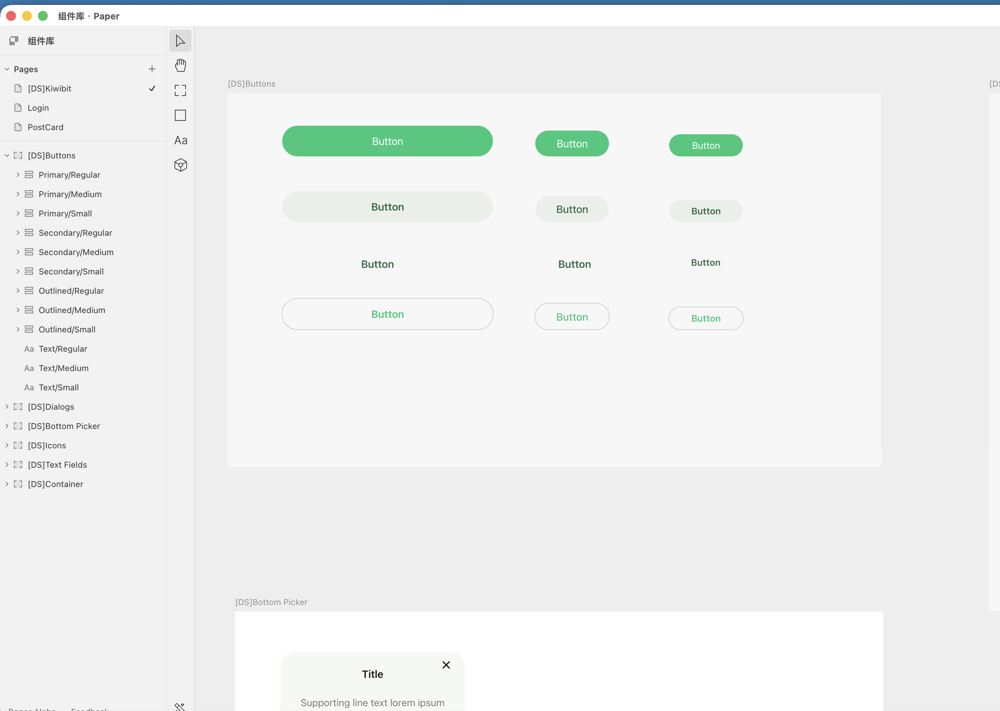

# paper-ui-design Skill

基于 User Story 与设计系统 Token，通过 Paper MCP 在画布上增量构建 UI 设计稿。

---

## 环境依赖

使用本 Skill 前必须完成以下三项配置，缺一不可。

### 1. 安装 Paper 客户端

前往 [paper.design](https://paper.design) 下载并安装客户端（macOS / Windows），使用团队账号登录。

### 2. 配置 Paper MCP

在 `~/.claude/mcp.json` 或项目级 `.mcp.json` 中添加：

```json
{
  "mcpServers": {
    "paper": {
      "command": "npx",
      "args": ["-y", "@paper-design/mcp"]
    }
  }
}
```

配置后重启 Claude Code，工具列表中出现 `mcp__paper__*` 系列工具即表示成功。

### 3. 准备组件库文件

在 Paper 中准备一个包含组件库的文件，供 AI 扫描。命名不限，但内部 Artboard 和 Layer 须遵循命名规范（见下文）。

以下为标准组件库文件的结构示例：



图中可以看到：
- 左侧 Pages 面板：`[DS]Kiwibit` 为组件库专用 Page，`Login` / `PostCard` 为各功能设计稿 Page
- 左侧 Layer 面板：Artboard 以 `[DS]` 前缀命名（如 `[DS]Buttons`），Layer 以 `Type/Size` 格式命名（如 `Primary/Regular`、`Outlined/Small`）
- 右侧画布：各 Artboard 横向排列，AI 扫描时逐一截图识别

---

## 组件库命名规范

AI 依赖命名来识别组件，**不规范的命名会导致扫描结果不准确或无法复用**。

### Artboard 层（组件类型）

格式：`[DS]<ComponentName>`

| 示例 | 说明 |
|------|------|
| `[DS]Buttons` | 按钮集合 |
| `[DS]Dialogs` | 弹窗集合 |
| `[DS]Text Fields` | 输入框集合 |
| `[DS]Icons` | 图标集合 |
| `[DS]Container` | 卡片/容器集合 |
| `[DS]Bottom Picker` | 底部选择器集合 |

> `[DS]` 前缀是 AI 识别"可复用组件"的唯一标志，缺少此前缀的 Artboard 会被忽略。

### Layer 层（变体命名）

格式：`<Type>/<State>` 或 `<Type>/<Size>/<State>`（斜杠分隔）

| 示例 | 说明 |
|------|------|
| `Primary/Regular` | 主色 · 默认态 |
| `Primary/Disabled` | 主色 · 禁用态 |
| `Outline/Small/Regular` | 描边 · 小尺寸 · 默认态 |
| `Icon/Filled` | 填充图标变体 |

---

## 设计系统 Token

Token 文件位于本 Skill 目录下：`~/.claude/skills/paper-ui-design/ds_token.md`

**可直接编辑此文件**来修改色板、字体、间距等参数，修改后立即生效，无需改动项目代码。

当前 Token 概览：

| 类别 | 关键值 |
|------|--------|
| 主色 | `#0CC97A` |
| 背景色 | `#F5F8F5` |
| 正文色 | `#181D19` |
| 辅助色 | `#797B79` |
| 边框色 | `#E5EAE2` |
| 字号 | H1 24px / H2 20px / Body 16px / Caption 12px |
| 间距步长 | 4px（xs=4 / s=8 / m=16 / l=24 / xl=32） |
| 圆角 | radius-s=4px / radius-m=12px / radius-full=999px |

---

## 使用规范

### UI 文案语言

**所有 UI 界面文字默认使用英文**（按钮、label、placeholder、标题），无论用户以中文还是其他语言描述需求。如需其他语言请明确说明。

### 设计 Page 规范

- 每个功能模块在组件库文件内新建独立 Page，命名格式：`<FeatureName>`（如 `PostCard`、`Login`）
- 禁止在组件库 Page 内直接新增设计稿，保持组件库纯净

### 增量构建原则

每次 `write_html` 只写一个视觉分组，每 2–3 步截图检查一次。禁止一次写入整个页面。

---

## 已知 MCP 调用注意事项

Paper MCP 工具为 deferred tools，**首次调用前须通过 ToolSearch 加载**，否则参数签名不匹配会报错。

| 工具 | 常见错误 | 正确用法 |
|------|----------|----------|
| `create_artboard` | 直接传数字 width/height | `styles: { width: "375px", height: "812px" }` 字符串格式 |
| `write_html` | 参数名用 `nodeId` | 正确参数名为 `targetNodeId` |
| `update_styles` | 平铺传 nodeId + styles | `updates: [{ nodeIds: [...], styles: {...} }]` 数组格式 |
| artboard 布局 | 子元素全部堆叠在左上角 | 创建后须 `update_styles` 设置 `display:flex, flexDirection:column` |

---

## 文件结构

```
~/.claude/skills/paper-ui-design/
├── README.md       ← 本文件：环境配置、规范说明
├── SKILL.md        ← AI 执行逻辑（Workflow、Rules、Examples）
├── ds_token.md     ← 设计系统 Token（用户可编辑）
└── sample.png      ← Paper 组件库文件结构示例截图
```
