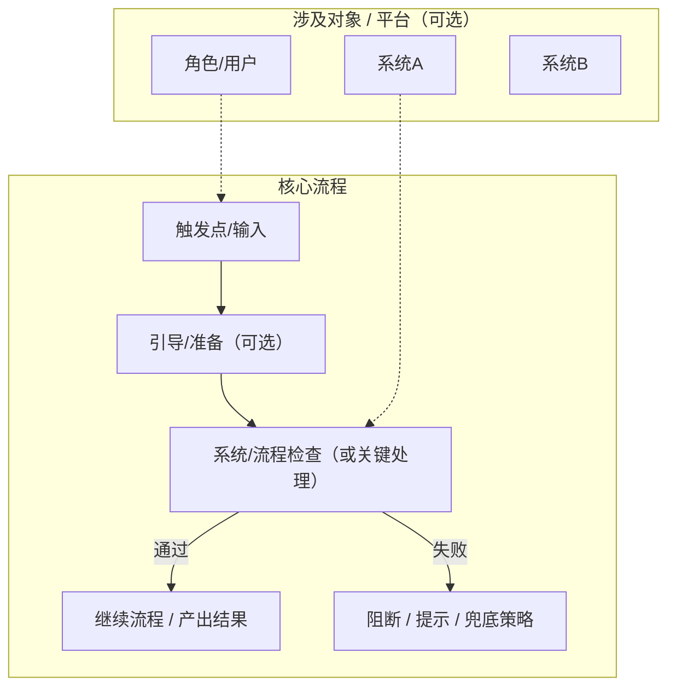

# 【模板】<主题名称> - 用户故事

> 📌 参考文档（可选）: <链接或相对路径1> ｜<链接或相对路径2>

## 1. 背景（Why）

- <痛点/问题 1：现状导致什么成本或风险>
- <痛点/问题 2：谁在什么场景下被影响>

## 2. 目标（What）

- <目标 1：要达成什么结果（可验证）>
- <目标 2：要提升什么指标/体验（可量化更好）>

## 3. 角色（Who）

| 角色 | 职责 |
|------|------|
| **<角色A>** | <做什么/关心什么> |
| **<角色B>** | <做什么/关心什么> |
| **<系统/平台>（可选）** | <自动化做什么> |

## 4. 用户故事（User Stories）

> 写法建议：每条 US 一句话 + 3-6 条验收标准；尽量满足 INVEST（尤其是 Small/Testable）。

### 4.1 US-<模块>-01: <用户故事标题> [P0/P1/P2]

**作为** <角色>，**我希望** <能力/需求>，**以便于** <价值/目的>。

**验收标准（AC）:**
- [ ] <Given/When/Then 或可勾选条件 1>
- [ ] <条件 2>
- [ ] <条件 3>

<!-- 可选：补充说明（Notes）
- 约束：<权限/网络/平台限制>
- 依赖：<依赖的系统/先决条件>
- 风险：<误伤/漏报/兼容性问题>
-->

### 4.2 US-<模块>-02: <用户故事标题> [P0/P1/P2]

**作为** <角色>，**我希望** <能力/需求>，**以便于** <价值/目的>。

**验收标准（AC）:**
- [ ] <条件 1>
- [ ] <条件 2>

<!-- 如有更多 US，继续追加 4.3/4.4... -->

## 5. 进展（可选）

| US | 状态 | 备注 |
|---|---|---|
| US-<模块>-01 | 待实现 / 进行中 / 已实现 | <可选> |
| US-<模块>-02 | 待实现 / 进行中 / 已实现 | <可选> |

## 6. 更新记录（可选）

| 日期 | 说明 |
|------|------|
| <YYYY-MM-DD> | 初始版本 |
