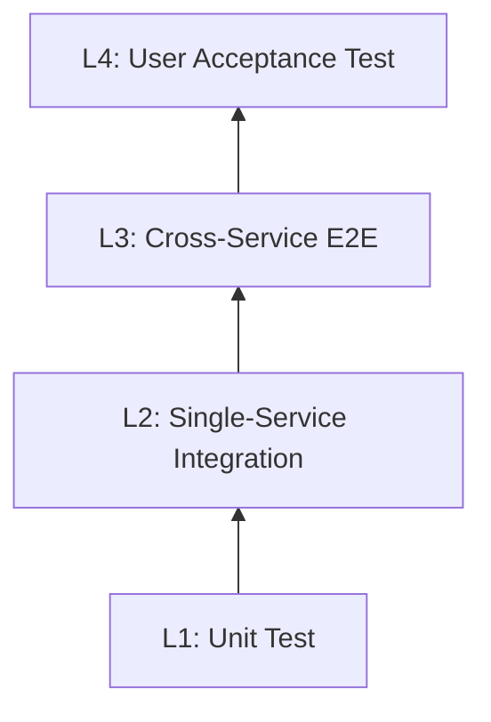

# 通用分层测试策略 (Universal Layered Testing Strategy)

## Issue Agent 单节点入口（条件适用）

若调用方明确委派 `FINAL_TEST_PLAN` 或 `DEV_TEST_REPORT` 节点，先读取
[研发质量节点契约](references/issue-agent-quality-contract.md)，仅执行该节点；
复用下文测试设计标准，但不从 Step 1 重启全套方案流程。不符合此条件时保持默认流程。
研发产出方案/执行证据，独立 QA Session 审查，人工 Gate 由可信控制端校验；不新增角色型 Skill。

## Description

本 Skill 根据项目类型（后端+APP / 后端+WEB / 后端+APP+嵌入式）生成完整的分层测试策略，包括测试分层架构、场景适配矩阵、代码模板和 CI/CD 配置。**项目输出文档默认全部使用 HTML**；本 skill 自身的 `SKILL.md` / `references/*.md` 只是 skill 包载体，不代表生成给项目的文档格式。

核心理念: **"Quality is built in, not tested in."**

### 三大原则

1. **测试左移 (Shift Left)**: 开发者在编码阶段编写 L1/L2 测试，Bug 越早发现修复成本越低
2. **测试下沉 (Push Down)**: 能在 L1 测的不留给 L2，能在 L2 测的不留给 L3
3. **右侧 Bug 追溯 (Trace Back)**: 在更右侧（L3/L4）发现的 Bug，必须追问"为什么更左侧的测试没有发现它"，并在**对应的更左侧层级补充用例**——左移不只是开发时的习惯，更是每次 Bug 修复后的强制复盘

### 理想用例金字塔比例

- **L1 (Unit)**: ~70% — 毫秒级反馈（含接口契约 / Schema Contract）
- **L2 (Integration)**: ~20% — 分钟级反馈（单服务 + 真实中间件）
- **L3 (E2E)**: ~10% — 小时级反馈（跨服务全链路，含第三方 API）
  - **L3-k8s**: L3 子层，需要 K8s/minikube 环境
- **L4 (UAT)**: <1% — Staging 验收

## Rules

1. **分层必须完整**: 每个项目必须定义 L1-L4 各层级的测试范围和工具
2. **覆盖率门禁**: L1 覆盖率 ≥ 80%，核心逻辑库 ≥ 90%
3. **Mock 隔离**: L1 测试必须 Mock 所有外部依赖（DB/网络/HAL/文件系统）
4. **用例编号规范**: 所有用例按 `L{层级}-<MODULE>-NNN` 格式编号
5. **TDD 调试**: Bug 修复必须先编写复现测试用例，禁止手动浏览器调试；修复后必须追溯更左侧层级是否能覆盖该 Bug（见 Step 7.4）
6. **CI 质量门禁**: L1 + L2-1 每次提交必须 100% 通过
7. **需求追溯**: 必须建立 User Story → Test Case 追溯矩阵
8. **L3/L4 黑盒测试**: L3 和 L4 必须通过公开边界驱动，**禁止在中间层拦截、mock 或绕过任何内部组件**。有 UI 的业务 vertical 用 Playwright/Appium/真机 UI；无 UI 的 technical vertical 用 public API / package integration harness / HTTP route 作为黑盒入口。唯一例外是不可控的外部第三方服务可用 stub 替代
9. **测试场景数据管理**: 每个测试场景必须通过 `make mock-scenario` 等命令一键加载，确保输入可控、可重复
10. **防假绿测试 (Vacuous Tests)**: 测试 merge 前必须通过"故意破坏 production 代码"验证真的会 fail；断言前置条件，防止 fixture/config 漂移让被测分支永远不进（见 Step 7.6）
11. **本地 L3 可 TDD**: L3 不能只依赖 staging；跨端/端云能力必须定义本地可重复 harness，固定 owner、seed、migration、auth bypass 和外部 stub 边界
12. **业务 vertical 与技术 vertical 分工**: 业务 vertical 断言用户事实和业务结果；技术 vertical 断言通用机制、状态机、契约和可靠性。禁止一个 vertical 的测试窥探另一个 vertical 的内部实现
13. **Shell 装配单独验证**: App/Web shell 的 DI、路由、连接对象、scheduler、lifecycle trigger 必须有独立装配测试；package test 绿不等于真实宿主装配正确
14. **HTML-only 测试文档**: 新建或重写测试策略文档时，SSOT 必须是 `docs/testing/strategy.html`、`docs/testing/scenarios/*.html` 和 `docs/architecture/verticals/<vertical>/testing/*.html`；旧 Markdown 只允许作为迁移期导航或外部平台兼容镜像，不复制正文
15. **同模板不同类型**: strategy、Epic scenario、技术 scenario、vertical-local testing 页面共用同一个 HTML shell（导航、大纲、summary cards、table wrapper、traceability grid、quality gates）；不同文档类型只替换内容模块，不换页面骨架
16. **MR TDD Level**: 单个 MR 的 TDD 过程证据统一按 [`references/tdd-level-assessment.md`](references/tdd-level-assessment.md) 输出 `T0-T4 / N/A / UNVERIFIED`；该等级只用于观测，不作为合并门禁
17. **证据契约 (Evidence Contract)**: 每层必须声明证据物、格式、存放与受众（见 Step 4.7）。CI 可跑层（L1/L2/L3）的证据是 pipeline 本身——job URL + report artifact + MR 描述证据块（生成的摘要），**不为每次运行向仓库提交报告文件**；不进 CI 的层（L4）必须由运行生成带溯源头的人读 HTML 报告，按项目约定提交（如 `docs/testing/evidence/<date>-<slug>/`）。**手抄终端输出不是证据**。commit 级 TDD 证明靠红绿 commit + 重放工具（tddproof、故意破坏验证、mutation），报告只汇总不转述；证据挂 MR/运行，不逐 commit 提交
18. **证据呈现面与平台写边界**: 证据本体只有两个 SSOT——仓内 evidence 文件（L4 等离线层）、pipeline artifact（CI 层）；MR 描述证据块是生成摘要的投影；issue/MR comment 只承载通知、时间戳与人工签核（操作人身份由平台背书，这是 L4-Manual 签核的价值所在），**不存证据本体**（可编辑、无保留期、与 SSOT 漂移后出现两份真相）。bot comment 单条 upsert，不逐次追加。对 issue tracker 的写操作（bot 身份）属平台写，**须按产品线单独授权**；credential-free / 离线产品线不挂任何平台写 bot

---

## Step 1: 识别项目类型

询问或自动检测项目属于哪种场景，确定技术栈：

| 场景                | 典型技术栈                        | 特殊关注                                    |
| :------------------ | :-------------------------------- | :------------------------------------------ |
| **后端+APP**        | Go/Java + Flutter/RN              | App UI 测试、API 契约、推送                 |
| **后端+WEB**        | Go/Java + React/Vue               | 浏览器兼容性、SEO、SSR                      |
| **后端+APP+嵌入式** | Go/Java + Flutter + C/C++ (Bazel) | HAL 抽象、Wasm 仿真、Digital Twin、固件 OTA |

---

## Step 2: 生成分层测试架构

### 2.1 通用四层架构 (L1-L4)



### 2.2 L1 — 单元测试 (Unit Test)

**目标**: 验证最小代码单元（函数/类/状态机）的逻辑正确性。**含接口契约和 Schema Contract**（无 IO 依赖的验证）。

| 项目类型          | 测试对象                       | 工具                    | 关注点                       |
| :---------------- | :----------------------------- | :---------------------- | :--------------------------- |
| **后端**          | Service/Repository/Domain 逻辑 + API Schema | Go Test / JUnit / pytest | 业务规则、边界条件、接口契约 |
| **APP (Flutter)** | Widget/BLoC/Provider 逻辑      | flutter_test            | 状态管理、数据转换           |
| **APP (RN)**      | Component/Hook 逻辑            | Jest                    | 状态管理、数据转换           |
| **WEB**           | Components/Hooks/Store         | Vitest / Jest           | 渲染逻辑、状态管理           |
| **嵌入式**        | Cluster 逻辑、FSM、算法        | GTest + Mock HAL        | 状态转换、HAL 联动、内存安全 |

**L1 编写规范**:

- Mock 所有外部依赖（DB/网络/HAL/文件系统）
- 覆盖：正常路径 / 边界条件 / 异常处理 / 状态转换
- 目标覆盖率 ≥ 80%（核心逻辑库 ≥ 90%）
- 毫秒级执行，作为开发实时反馈
- L1 不需要在测试方案文档中逐条列出（与代码共存，pytest 自动发现）

### 2.3 L2 — 单应用，无外部依赖 (Single-App, No External Dependencies)

**目标**: 验证单个应用边界内的模块协作。**L2 的核心约束：外部依赖全部 mock，不引入任何真实外部服务。** infra 真实度可细分：

L2 内部可按 **infra 真实度**细分：

| 子层 | infra | 外部服务依赖 | 代表场景 |
|------|-------|------------|---------|
| **L2-1** | 无真实 infra（进程内，MockMvc 等）| 全部 mock | API 契约、Schema 不回退 |
| **L2-2** | 真实 infra（DB/Redis/MQ，Docker）| 外部服务全部 mock（WireMock 等）| SQL/事务/ORM 正确性 |

> 细分粒度按项目复杂度决定，简单项目 L2-1/L2-2 可合并。

| 项目类型   | 测试对象                 | 工具                            |
| :--------- | :----------------------- | :------------------------------ |
| **后端**   | Service ↔ DB/Redis/Kafka | Docker Compose / Testcontainers |
| **APP**    | App ↔ Mock Server        | Integration Test + Mock Server  |
| **WEB**    | Frontend ↔ Mock API      | MSW / Vitest                    |
| **嵌入式** | Device + HAL (Wasm)      | Vitest Browser (Digital Twin)   |

### 2.4 L3 — 真实依赖集成 (Real Dependency Integration)

**目标**: 验证真实外部依赖参与时的完整链路。**L3 的核心约束：引入真实外部服务（infra 全真实，外部依赖尽可能真实）。** 这是 L2 与 L3 的本质区别。

L3 内部可按**服务边界**细分：

| 子层 | 说明 | 典型场景 |
|------|------|---------|
| **L3-1** | 单后端服务 + 真实外部依赖（CMS/第三方 API），但无前端 | 上游 schema 变更、第三方 API 格式漂移 |
| **L3-2** | 全链路（含前端 / App），全真实服务 | User Story AC 端到端验证 |

> L3-1 的价值：把"上游格式变更"这类 bug 从 L3-2 提前到 L3-1 发现，而非等到 E2E 才暴露。

| 项目类型            | 测试对象                      | 工具                                    |
| :------------------ | :---------------------------- | :-------------------------------------- |
| **后端+APP**        | App → API → DB → 推送         | Appium / Flutter Integration Test       |
| **后端+WEB**        | Browser → API → DB → SSE      | Playwright / Cypress                    |
| **后端+APP+嵌入式** | App → Cloud → Hub(Wasm) → HAL | Simulator + Vitest Browser + Playwright |

**黑盒原则**：L3 测试从系统公开边界出发，驱动真实链路贯通，**禁止在任何中间层进行拦截或 mock 内部组件**。有 UI 的业务 vertical 从用户界面进入；无 UI 的 technical vertical 从 public API、package integration harness、CLI、SDK 或 HTTP route 进入。唯一例外是不可控的真实第三方服务（如支付网关）可用 stub 服务替代，但不得 mock 内部组件。

**本地 L3 TDD profile**：L3 必须优先能在开发机和 CI 中本地运行；只有 API Gateway、真实 Auth、真机、真实弱网、Staging 数据这类生产边界留给 L4。典型本地 L3 可使用固定 test owner / auth bypass / 本地真实 DB migration / 真实 HTTP route / 外部三方 stub，但不能替换被测 vertical 的内部 service、repository、state machine。

**业务 vertical 与 technical vertical 的断言边界**：

| vertical 类型 | L3 入口 | 主要断言 | 不应该断言 |
|---|---|---|---|
| 业务 vertical | UI / app shell / public use case / device simulator | 用户可见事实、业务实体、跨端结果、聚合口径 | reusable technical vertical 的内部队列、lease、cursor 实现细节 |
| technical vertical | public API / package harness / HTTP route / SDK | 状态机、契约、幂等、顺序、恢复、数据一致性 | 业务 vertical 的 UI 文案、页面导航、业务字段合并 policy |

**Shell 装配层**：当能力以 package / SDK / business component 形式被宿主 App/Web 集成时，必须增加 `test-shell-<capability>` 或等价 target，验证真实 DI/wiring：业务 repository 是否接入同一 runner/service/scheduler/connection，宿主注入 auth/owner/network/lifecycle 的边界是否正确。

**L3-k8s 子层**（可选）：当测试场景依赖 K8s 环境（如 Pod 调度、Spot Recovery）时，标注为 L3-k8s。日常开发用 L3（无 K8s），Nightly/Pre-release 用 L3-k8s。

### 2.5 L4 — 用户验收测试 (UAT)

**L4 不是全手工**：自动化为主，只有需要真实第三方客户端交互的场景才保留手工。

| 类型 | 设计原则 | 执行方式 | 场景示例 |
|------|---------|---------|--------|
| **L4-Auto** | 达标准可量化：有输入、有预期输出 | `make test-l4-uat`（自动化，Staging 环境） | API Roundtrip、Memory 持久化、审批流程 |
| **L4-Manual** | 需真实第三方客户端视觉验证 | QA 手工在真实环境操作 | 飞书 Card UI 渲染、消息送达视觉 |

- **责任人**: QA 团队 / PM
- **环境**: 真实 Staging（真实 DB/Letta/外部服务，不是 Mock）
- **关注**: 用户体验、极端网络环境、第三方服务真实交互
- **LLM 路径**: 断言结构和副作用，不断言 LLM 输出具体文本
- **L4 运行必须留证据**: L4-Auto 的每次运行由工具链生成人读 HTML 证据报告（规范见 Step 4.7）并提交进仓或在 MR 引用；L4-Manual 按清单签核，执行人在 MR 留签核 comment（时间戳 + 身份），截图等证据本体进 evidence 目录、不进 comment

### 2.6 跨层级测试套件：Smoke / Regression / UAT

**这三套件不是新的测试层**，而是对现有 L1–L4 用例打标签（marker）形成的**运行套件**。

| 套件 | 含义 | 用例来源 | 运行命令 | 时机 |
|------|------|-----------|----------|------|
| **Smoke** | 最关键路径快速验证（系统还活着） | 少量 L3 关键用例打上 `@smoke` | `make smoke` | 部署后立即跑 |
| **Regression** | 全量回归，验证历史功能未被破坏 | 全部 L1+L2+L3 用例 | `make regression` | PR 合并前 / CI 质量门禁 |
| **UAT-Auto** | 业务验收自动化（Staging 真实环境） | L4 用例中可量化的部分 | `make test-l4-uat` | 发布前 / Release Tag |

**关键原则**：
- Smoke 用例 = 在已有 L3 的关键路径用例上**加 `@pytest.mark.smoke`**，不新建测试文件
- 一个用例可以同时拥有多个 marker，例如 `@pytest.mark.smoke` + `@pytest.mark.l3`
- **决定哪些用例进入 smoke 的标准**：用户最常走的关键路径、唯一不可替代的系统入口
- Smoke 用例必须**快**（< 5 min 内全部通过），否则进入常规 test-l3

```python
# 示例：一个用例同时属于 l3 和 smoke
@pytest.mark.l3
@pytest.mark.smoke
async def test_completions_roundtrip(...):
    """L3-COMP-001: 最关键的 E2E 用例。"""
    ...

# 示例：L4 Auto 用例—Staging 环境，不断言具体文本
@pytest.mark.l4
async def test_agent_memory_persists(letta_client):
    """L4-MS-001: Agent 跨对话记住用户偏好。"""
    archival = await letta_client.archival_memory_search(agent_id, keyword)
    assert len(archival.items) > 0   # 有内容即可
```


---

## Step 3: 场景适配矩阵

根据项目类型，确定各层级的 **必选 / 推荐 / 可选**：

### 场景 A: 后端 + APP

| 层级                | 状态    | 重点                          |
| :------------------ | :------ | :---------------------------- |
| L1 (Unit)           | ✅ 必选 | 后端业务逻辑 + App 状态管理   |
| L2-1 (Interface)    | ✅ 必选 | API 契约 (OpenAPI/Protobuf)   |
| L2-2 (Integration)  | ✅ 必选 | 后端服务 + DB/MQ 集成         |
| L2-3 (E2E)          | ✅ 必选 | App → API 全链路              |
| L2-4 (Playground)   | ⭐ 推荐 | Swagger UI + Mock 环境        |
| L3-1 (Contract)     | ⭐ 推荐 | 前后端 API 契约               |
| L3-2 (Cross-System) | 🔵 可选 | 多子系统联动                  |
| L4 (UAT)            | ✅ 必选 | 真机测试 + App Store 审核流程 |

**特殊关注点**:

- 推送通知的端到端验证 (APNs/FCM)
- 多设备登录/Token 刷新竞态
- App 冷启动/热启动性能
- 离线模式 & 数据同步

### 场景 B: 后端 + WEB

| 层级                | 状态    | 重点                              |
| :------------------ | :------ | :-------------------------------- |
| L1 (Unit)           | ✅ 必选 | 后端业务逻辑 + 前端组件/Store     |
| L2-1 (Interface)    | ✅ 必选 | API 契约 + 组件 Props 接口        |
| L2-2 (Integration)  | ✅ 必选 | 后端服务集成 + 前端 API 层        |
| L2-3 (E2E)          | ✅ 必选 | Browser → API 全链路 (Playwright) |
| L2-4 (Playground)   | ⭐ 推荐 | Storybook + Staging 环境          |
| L3-1 (Contract)     | ⭐ 推荐 | 前后端 API 变更兼容性             |
| L3-2 (Cross-System) | 🔵 可选 | 多子系统联动                      |
| L4 (UAT)            | ⭐ 推荐 | 真实浏览器测试                    |

**特殊关注点**:

- 浏览器兼容性 (Chrome/Firefox/Safari)
- 响应式布局 (Mobile/Tablet/Desktop)
- SSR/SSG 水合一致性
- Accessibility (a11y) 无障碍
- SEO 验证

### 场景 C: 后端 + APP + 嵌入式

| 层级                | 状态    | 重点                                       |
| :------------------ | :------ | :----------------------------------------- |
| L1 (Unit)           | ✅ 必选 | 后端 + App + Cluster/FSM/算法              |
| L2-1 (Interface)    | ✅ 必选 | API 契约 + C ABI + AxData 协议             |
| L2-2 (Integration)  | ✅ 必选 | 后端集成 + Device Wasm 集成 (Digital Twin) |
| L2-3 (E2E)          | ✅ 必选 | App → Cloud → Hub(Wasm) → HAL 全链路       |
| L2-4 (Playground)   | ✅ 必选 | Web Simulator (仿真器)                     |
| L3-1 (Contract)     | ✅ 必选 | 端/云/边协议契约                           |
| L3-2 (Cross-System) | ⭐ 推荐 | 多子系统联动 (安防↔AI↔推送)                |
| L4 (UAT)            | ✅ 必选 | 真实硬件 + 真实 App + 真实云端             |

**特殊关注点**:

- **HAL 抽象**: 所有硬件操作通过 HAL 接口，Bazel `select` 构建时切换
- **Wasm 仿真保真度**: Digital Twin 与真实硬件行为一致性
- **内存安全**: ASan/TSan/Valgrind 验证 (资源受限平台)
- **固件 OTA**: 版本升级/降级/中断恢复验证
- **断网容灾**: 设备离线时的本地自治能力
- **D2D 通信**: 设备间直连交互验证

### 场景 D: Technical Vertical / Reusable Package + Backend

适用于没有自有 UI、但被多个业务 vertical 集成的能力，例如 sync、telemetry、local database、media transfer、feature flag SDK、push runtime。

| 层级 | 状态 | 重点 |
| :--- | :--- | :--- |
| L1 (Unit + Contract) | ✅ 必选 | 状态机、依赖排序、schema/golden、payload contract、兼容性 |
| L2 App/SDK Integration | ✅ 必选 | package 内部真实 DB / queue / scheduler / fake endpoint 协作 |
| L2 Backend Integration | ✅ 必选 | 单服务真实 DB/Redis/migration/HTTP handler/事务 |
| Shell Wiring | ✅ 必选 | 宿主 App/Web DI、连接对象、owner/auth 上下文、lifecycle trigger |
| L3 Local Cross-End | ✅ 必选 | public API / package harness → 本地 backend HTTP → 真实 DB roundtrip；不经过 Gateway/Auth |
| L4 UAT | ⭐ 推荐 | 由拥有 UI 的业务 vertical 验收真实用户流程、Gateway/Auth、真机、弱网 |

**特殊关注点**:

- L3 黑盒入口不是 UI，而是 public API / integration harness / HTTP route。
- L3 必须能本地 TDD；Gateway、真实 auth、真机弱网进入 L4。
- 业务 vertical 只断言业务事实；technical vertical 维护内部机制测试。

---

## Step 4: 生成 HTML 测试方案文档

### 4.1 输出目录结构

所有测试策略输出都是 HTML。不要新建 Markdown 测试方案作为 SSOT。

```text
docs/testing/
├── strategy.html                  # 测试方案总览（SSOT，建议 ≤600 行）
└── scenarios/                     # 场景矩阵（按 Epic + 技术模块拆分）
    ├── ep1-<epic-name>.html       # 产品 / QA 视角：US → AC 场景追溯
    ├── ep2-<epic-name>.html
    ├── tech-<module>.html         # 开发视角：服务 / 组件追溯
    └── tech-nfr.html              # NFR 降级容错
```

如果项目采用 architecture verticals，还要在 owning vertical 下补 vertical-specific HTML 测试文档：

```text
docs/architecture/verticals/<vertical>/
└── testing/
    ├── strategy.html              # 该 vertical 的 TDD 边界、test doubles、local L3 harness
    └── scenarios/                 # AC / Given-When-Then 场景红绿推进文档
        └── <scenario>.html
```

职责边界：

- `docs/testing/strategy.html`：全局 L1/L2/L3/L4、编号、CI、黑盒原则、scenario fixture 总规范。
- `docs/testing/scenarios/*.html`：跨 vertical / 按 Epic 或技术主题的全局追溯矩阵。
- `docs/architecture/verticals/<vertical>/testing/strategy.html`：该 vertical 的 Inside / External / Out-of-Scope 边界、test doubles、TDD ladder、shell wiring、local L3 harness。
- `docs/architecture/verticals/<vertical>/testing/scenarios/*.html`：该 vertical 的 AC 级 Scenario，不复制全局分层定义。

### 4.2 HTML 页面契约

测试策略页面复用 `/architect` 的 HTML-first 方法（见 `../architect/references/html-architecture-doc-writing.md`），但内容模块换成测试策略。每个页面必须：

| 维度 | 要求 |
|---|---|
| 同模板 | strategy、Epic scenario、technical scenario、vertical-local testing 共用同一个 HTML shell。 |
| 自包含 | 不依赖外部 CDN；可链接仓内 `site.css`，但关键表格、badge、summary card 样式应在页面内可读。 |
| 导航 | 有返回测试总览、当前页大纲、相关 scenario / vertical / ADR 链接。 |
| 表格 | 所有矩阵用 `<div class="table-wrap"><table>...</table></div>`，不要输出 Markdown 表格。 |
| 可视化 | 测试金字塔、门禁流、场景覆盖可以用 SVG / KPI card / coverage matrix；复杂链路不要只写散文。 |
| 可访问 | `svg` 有 `role="img"` 和 `aria-label`；长表格有 `<caption>`。 |
| 可验证 | 页面列出本地命令：`make test-l1-*`、`make test-l2-*`、`make test-l3-*`、`make test-l4-*` 或项目等价命令。 |

### 4.3 共用 HTML Shell

所有测试文档类型使用同一个基础骨架，只替换 `<main>` 内的内容模块：

```html
<!doctype html>
<html lang="zh-CN">
<head>
  <meta charset="utf-8">
  <meta name="viewport" content="width=device-width, initial-scale=1">
  <title>测试策略 · 项目名</title>
  <link rel="stylesheet" href="../site.css">
  <style>
    :root { --test-unit:#2563eb; --test-int:#059669; --test-e2e:#d97706; --test-uat:#7c3aed; --risk:#dc2626; }
    body { margin:0; font-family:system-ui,-apple-system,BlinkMacSystemFont,"Segoe UI",sans-serif; line-height:1.6; color:#111827; background:#f8fafc; }
    main { max-width:1180px; margin:0 auto; padding:32px 20px 56px; }
    .doc-nav,.doc-outline,.summary-grid,.quality-gates { margin:18px 0; }
    .summary-grid { display:grid; grid-template-columns:repeat(auto-fit,minmax(180px,1fr)); gap:12px; }
    .summary-card { border:1px solid #d1d5db; border-radius:8px; background:#fff; padding:14px; }
    .badge { display:inline-flex; border-radius:999px; padding:2px 8px; font-size:12px; font-weight:700; background:#eef2ff; }
    .table-wrap { overflow-x:auto; border:1px solid #d1d5db; border-radius:8px; background:#fff; }
    table { width:100%; border-collapse:collapse; min-width:760px; }
    th,td { padding:10px 12px; border-bottom:1px solid #e5e7eb; text-align:left; vertical-align:top; }
    th { background:#f3f4f6; }
    code { background:#eef2ff; padding:1px 4px; border-radius:4px; }
  </style>
</head>
<body>
  <main>
    <nav class="doc-nav" aria-label="文档导航">
      <a href="./strategy.html">测试策略</a>
      <a href="./scenarios/ep1-example.html">场景矩阵</a>
    </nav>
    <details class="doc-outline" open>
      <summary>本页大纲</summary>
      <nav aria-label="本页章节">...</nav>
    </details>
    <!-- 每种测试文档只替换这里的内容模块 -->
  </main>
</body>
</html>
```

### 4.4 `strategy.html` 内容模块

`strategy.html` 必须包含：

1. 项目类型、测试目标、非目标。
2. L1/L2/L3/L4 层级总览：10 列标准表，列为 `层级 / 用例数 / 测试目标 / 真实依赖 / mock 依赖 / 真实 infra / mock infra / 执行时机 / 耗时 / 代码位置`。
3. 分层逻辑：每层解决什么上一层解决不了的问题。
4. L2 与 L3 分界：L2 = 单应用、无外部依赖；L3 = 真实依赖集成。
5. 黑盒原则：L3/L4 从公开边界进入，不拦截中间层，不 mock 内部组件。
6. 需求追溯矩阵：User Story → L1/L2/L3/L4。
7. Scenario fixture schema：owner、device/client marker、local/server initial state、failure injection、expected final state。
8. 异常场景矩阵：失败时状态正确 + 恢复后最终一致。
9. CI/CD 质量门禁：每层 target、触发时机、必过标准。
10. TDD 节律：Bug Fix Rule、新功能 test-first、豁免场景、左移追溯。
11. 证据与审查：层级 × 证据物 × 格式 × 存放 × 保留期 × 受众的表，以及 MR 证据块模板（见 Step 4.7）。

示例模块：

```html
<section id="layer-overview">
  <h2>1. 测试层级总览</h2>
  <div class="table-wrap">
    <table>
      <caption>10 列标准表：真实依赖 vs mock 依赖是分层核心决策依据</caption>
      <thead>
        <tr>
          <th>层级</th><th>用例数</th><th>测试目标</th><th>真实依赖</th><th>mock 依赖</th>
          <th>真实 infra</th><th>mock infra</th><th>执行时机</th><th>耗时</th><th>代码位置</th>
        </tr>
      </thead>
      <tbody>
        <tr>
          <td><span class="badge">L1-backend</span></td>
          <td>N</td><td>核心业务逻辑正确性</td><td>-</td><td>DB / HTTP / 缓存</td>
          <td>-</td><td>-</td><td>每次提交</td><td>&lt; 30s</td><td><code>src/test/</code></td>
        </tr>
      </tbody>
    </table>
  </div>
</section>
```

### 4.5 Scenario HTML 模板

Epic 文件和技术文件共用 AC 级追溯表格。Epic 文件给产品/QA 看，技术文件给开发者看；两种文件共享同一套用例编号，双向追溯。

```html
<section id="us-tp-01">
  <h2>US-TP-01 设备卡片角标</h2>
  <div class="table-wrap">
    <table>
      <caption>AC 级追溯矩阵</caption>
      <thead>
        <tr><th>AC 场景</th><th>Smoke</th><th>L1</th><th>L2-1</th><th>L2-2</th><th>L3-1</th><th>L3-2</th><th>L4</th></tr>
      </thead>
      <tbody>
        <tr>
          <td>未订阅显示锁定角标</td><td>yes</td><td>TestClass</td><td>CONTRACT-001</td>
          <td>EVAL-001</td><td>FG01-001</td><td>TP01-001</td><td>yes</td>
        </tr>
      </tbody>
    </table>
  </div>
</section>
```

列固定 8 列：`AC 场景 / Smoke / L1 / L2-1 / L2-2 / L3-1 / L3-2 / L4`。每格填具体用例编号，无覆盖填 `-`；`Smoke` 用 `yes/no` 或项目已有 badge，不用只靠颜色表达。

### 4.6 Vertical-local Scenario HTML 模板

`<vertical>/` 目录本身是 Vertical Slice；AC 级红绿单位叫 Scenario。Scenario HTML 最小结构：

```html
<section id="ac-oracle">
  <h2>AC Oracle</h2>
  <p><strong>Given</strong> ...</p>
  <p><strong>When</strong> ...</p>
  <p><strong>Then</strong> ...</p>
</section>

<section id="boundary-model">
  <h2>Boundary Model</h2>
  <div class="table-wrap">
    <table>
      <thead><tr><th>Type</th><th>Boundary</th><th>Real / Double</th><th>Owner</th><th>Notes</th></tr></thead>
      <tbody>
        <tr><td>Inside</td><td>...</td><td>Real</td><td>&lt;vertical&gt;</td><td>Must not mock</td></tr>
        <tr><td>External</td><td>...</td><td>WireMock / simulator / fake adapter</td><td>...</td><td>Scenario fixture</td></tr>
        <tr><td>Out of Scope</td><td>...</td><td>L4 only / not covered</td><td>...</td><td>...</td></tr>
      </tbody>
    </table>
  </div>
</section>
```

Vertical-local scenario 还必须包含 `TDD Ladder`、`Scenario Fixture`、`Smoke / Regression`、`Traceability` 四个 section。Boundary Model 必须区分：

- **Inside**：本 scenario 必须真实打通的内部链路，不允许 mock 掉。
- **External**：scenario 外部依赖，必须声明 contract、test double、fixture 和 failure mode。
- **Out of Scope**：本 scenario 明确不验证的能力，防止范围膨胀。

外部依赖的协议、fake / simulator / WireMock stub 是 External Boundary 资产，Scenario 只选择并组合这些边界资产和 fixture，不私有化一套临时 mock。

> 完整实战范例见 `references/engagement-example.md`（skill 内部参考文件；生成项目文档时输出 `.html`）。

### 4.7 证据契约与 Playwright 式运行报告

`strategy.html` 的「证据与审查」章节必须给出下表的层级证据声明；运行报告按下述规范由工具链生成，不由人手抄。

#### 呈现面（一次生成，多处投影）

| 呈现面 | 内容 | 谁生成 | 定位 |
|---|---|---|---|
| 仓内 evidence 文件 | L4 等离线层证据本体（SSOT） | 测试工具链 | git 历史、diff 可审 |
| pipeline artifact | L1–L3 报告本体（SSOT） | CI | 绑定 SHA、不可变 |
| MR 描述证据块 | 摘要：pipeline 链接、每层通过数、需求覆盖 x/y、tddproof 判定、L4 证据路径 | 模板 + 生成 | reviewer 第一入口 |
| issue/MR comment | 通知、时间戳、人工签核 | CI bot（须授权）/ 操作人 | 事件而非存储（Rule 18） |

> **URL 是投影，不是存储**：评审期的「点击即看」用 artifact URL——每次 push 的 pipeline 一份（`expose_as` 可把目录暴露成 MR 上的链接），绑定的就是被评审的 SHA；GitLab 在沙箱 artifact 域渲染 HTML 但会过期。合并后的**归档**浏览才用 Pages（发布规范见 `gitlab-pages-html`：private + 读者授 Guest、仅公司网可达、CE 单部署无 per-MR 预览）。两者都不改变上面的 SSOT。

#### 运行报告规范（Playwright 式）

- **自包含单 HTML**：内联 CSS、无外部 CDN、无 `<script>`（折叠交互用 `<details>` 实现）；确定性排序，同输入同输出，时间戳由参数显式注入而非墙钟
- **块结构**：summary cards（总数/pass/fail/skip/耗时）→ 溯源头 → 按 suite/包分组的可折叠用例树 → 失败断言原文与日志/回执附件 → TDD 节律块（范围内 red/green commit 列表 + 重放工具判定）
- **L4 附加块**：操作人、recipient 及范围声明（如「测试应用可用范围只有 PO」）、逐用例回执（如飞书 `message_id`）、负向对照结果、「本次不证明什么」
- **脱敏红线**：secret / token / nsec / 验证码 / 消息全文不进报告；回执引 `message_id` 这类服务端凭据而非消息内容
- 同一渲染器复用于各层：L3 直接吃 `go test -json`，L4 吃证据 fixture + 运行结果
- 已委派研发质量节点（如 `DEV_TEST_REPORT`）时，机器记录 schema 以节点契约为准，HTML 报告是其人读投影，不另立第二份真相

#### 需求覆盖：生成，不手填

- 覆盖度 = US AC 子句锚点 ∪ 测试代码声明的用例编号（`// ID:` / `// AC:`）∩ 本次运行报告 → 三张清单：**本次覆盖 / 有用例但本次未跑 / 无用例（缺口）**
- 手填追溯矩阵必须被生成版替换（手填必然腐烂）；需求源只认一个 SSOT（仓内文档或 issue 二选一，禁止双向挖，两个源分叉后覆盖度本身就成了待审计对象）
- 覆盖带时效：`source_dirty=true` 或旧 SHA 上的运行不算覆盖；负向用例必须有正向对照

---

## Step 5: 编写测试代码

### 5.1 用例编号规范

- L1: `L1-<MODULE>-NNN` (如 `L1-AUTH-001`)
- L2: `L2-<MODULE>-NNN` (如 `L2-CRED-001`)
- L3: `L3-<FLOW>-NNN` (如 `L3-COMP-001`)
- L3-k8s: `L3k8s-<FLOW>-NNN`
- L4: `L4-<FLOW>-NNN`

### 5.2 通用测试模板

各技术栈代码模板见 **`references/code-templates.md`**（Go / Java / Flutter / React / C++ / Playwright / Flutter Web+Playwright / Wasm Digital Twin）。

### 5.3 关键测试模式

#### Promise Resolver Pattern (异步验证)

```typescript
// ✅ 正确: 事件驱动
await waitFor(() => shadowUpdates.get("panel_status") === "armed_away");

// ❌ 错误: 永远不要用 setTimeout
await new Promise((resolve) => setTimeout(resolve, 3000));
```

> 嵌入式专用模式（State-Wait、Forced Cycle）见 `references/code-templates.md`。

#### Test Scenario Data Management (场景数据管理)

根据项目是否需要跨栈（后端 / 引擎 / App / 数据管道）验证同一业务规则，在下面两个 Tier 中选择：

##### Tier 1：单栈场景数据（`make mock-scenario`）

通过 `make mock-scenario` 切换预设测试数据状态，确保测试输入可控、可重复：

```bash
make mock-scenario SCENARIO=new-user        # 无历史记录
make mock-scenario SCENARIO=returning-user   # 有历史交互记录
make mock-scenario SCENARIO=converted-user   # 已完成转化
```

每个 Scenario = 一组 DB seed data + Mock stub 配置。Playwright 测试通过 URL 参数（`?scenario=new-user`）或环境变量指定场景，与 CI 无缝集成。

##### Tier 2：多栈共享 Golden Dataset（`e2e/golden-data/*.json`）

适用于多技术栈项目（后端 + 引擎 + App + 数据管道），一份 JSON fixture 供多个栈的测试共读，用来验证**跨栈的业务规则行为一致性**。

- **目录约定**：`e2e/golden-data/*.json`
- **每个 JSON 的内容**：输入事件 + RulesConfig + expected outcomes（必须含所有阈值 / fatigue 变体）
- **消费端各自读取**：
  - JS engine：`personalization_engine/test/golden_dryrun.test.js`
  - Python dagster：`dbt/tests/customer_care/test_dryrun_golden.py`
  - Flutter SDK / Go backend：各有自己的 golden test runner
- **核心价值**：同一业务规则的跨栈行为一致性测试 —— 以 customer-care 为例，13 个 JS test + 17 个 Python test 读同一份 fixture，JS / Python 任一栈行为漂移立刻暴露
- **参考**：customer-care 的 `e2e/golden-data/golden_bind_fail.json`（4 事件 / 3 用户 / threshold_2/4 + fatigue 变体），详见 `/home/jchen/customer-care/CLAUDE.md` 中 "Golden Dataset 测试" 章节

##### 两个 Tier 的选择决策

| 场景 | 选 Tier |
|------|---------|
| 单栈项目，或无跨语言复用需求 | **Tier 1**（`make mock-scenario`） |
| 多技术栈、同一业务规则需跨语言 / 跨栈验证一致性 | **Tier 2**（共享 Golden Dataset） |

> 两个 Tier 不互斥：Tier 2 解决"规则一致性"，Tier 1 解决"单栈流程可重复"，复杂项目通常两者并用。

##### Stateful Cross-End Scenario（可靠队列 / 同步 / 多端状态）

当被测对象包含 outbox、cursor、download merge、media upload、device session、offline retry、event replay 等状态机时，场景数据必须超出“DB seed + mock stub”：

- 固定 `owner/user_id`、`device_marker`、client UUID、batch/idempotency key、时间 seed 和随机 seed。
- 同时声明本地 DB、服务端 DB、内部队列、cursor/cache、外部 stub 的初始状态。
- 声明故障注入点，例如 transport failure、backend restart、schema error、version conflict、download pagination interrupt。
- 断言最终 invariant，而不只断言某个 API 返回值；例如无重复实体、cursor 不提前推进、pending 可恢复、metrics/key 不丢。

复杂项目应提供 `make seed-<capability>-scenario SCENARIO=<fixture_id>` 或等价 target，且 seed 命令可重复执行、可按 owner namespace 清理。

#### Seeded Monkey / Chaos

Monkey / chaos 测试不能是不可复现的随机点击。所有随机用例必须：

- 固定并输出 seed、操作序列、owner/device、故障注入点。
- 只断言稳定 invariant：依赖顺序、幂等、最终一致、状态不丢、隔离不串。
- 失败日志必须能直接复现同一序列。
- 精确场景用例仍是主覆盖；monkey/chaos 只扩大组合面。

#### WireMock Fault Injection (容错注入)

通过 WireMock 注入故障场景验证服务降级行为：

```json
// 注入 5s 延迟 → 预期：服务降级返回 HTTP 200 空列表
{ "request": { "method": "POST", "urlPattern": "/api/eval" },
  "response": { "fixedDelayMilliseconds": 5000, "status": 200 } }

// 返回 500 → 预期：视为无权益，locked=true
{ "request": { "method": "GET", "urlPattern": "/v1/features/.*" },
  "response": { "status": 500 } }
```

---

## Step 6: CI/CD 自动化配置

### Make Target 命名原则

**格式**：`test-l{层级}-{描述}[-{粒度}]`，共三个维度——**层级**（数字表示执行顺序）、**描述**（测试范围）、**粒度**（可选，关键路径子集 vs 完整回归）。前两者缺一不可，粒度按需扩展。

| 维度 | 说明 | 示例 |
|------|------|------|
| 层级 | 让人一眼知道这是哪个测试层，以及执行顺序 | `test-l2-backend` |
| 描述 | 单纯数字不可读，需说明测试对象 | `test-l3-e2e`（而非 `test-l3`）|
| 粒度（可选）| `smoke` = 关键路径子集，< 5min；`full` = 完整回归；不写默认 full | `test-l3-admin-smoke` vs `test-l3-admin` |
| 反模式 | 纯数字（`test-l2-2`）或纯描述（`test-integration`）| ❌ |

```
✅ test-l1-backend          # L1 后端单测
✅ test-l1-app              # L1 App 单测
✅ test-l2-backend          # L2-2 后端集成（真实 infra，mock 外部服务）
✅ test-l3-backend-e2e      # L3-1 后端完整集成（真实 CMS/外部服务）
✅ test-l3-e2e              # L3-2 全链路 E2E
✅ test-l3-admin-smoke      # L3 admin 模块的关键路径子集（< 5min，customer-care 实践）
✅ test-l3-admin            # L3 admin 模块完整回归（等价于 test-l3-admin-full）
✅ test-shell-play-sync     # Shell 装配测试：宿主 DI / connection / scheduler wiring
✅ test-l3-sync             # 无 UI technical vertical 的本地 public API / HTTP roundtrip
✅ seed-sync-scenario       # 场景数据装载，不是测试层级，但供 L2/L3 复现

❌ test-l2-2                # 纯数字，看不出测什么
❌ test-integration         # 看不出是哪个层级，执行顺序不明
```

> **粒度的落地约定**：`smoke` 子集通过 pytest `@pytest.mark.smoke` 等 marker 挑选，而不是新建测试文件——与 [2.6 跨层级测试套件](#26-跨层级测试套件smoke--regression--uat) 的 marker 机制一致。

### 通用 CI 流水线结构

```yaml
# .gitlab-ci.yml 通用结构
stages:
  - build
  - test-l1 # L1 + L2-1 (每次提交)
  - test-l2 # L2-2 集成 (Nightly / Merge)
  - test-e2e # L2-3 E2E (发布前)
  - quality # SonarQube / 覆盖率

test-l1:
  stage: test-l1
  rules:
    - if: $CI_PIPELINE_SOURCE == "merge_request_event"
    - if: $CI_COMMIT_BRANCH
  script:
    # 后端
    - go test ./... -short -count=1 -coverprofile=coverage.out
    # 或 bazel test //...
    # APP
    - flutter test
    # WEB
    - npm run test:unit
    # 嵌入式
    - bazel test //clusters/...:all //devices/...:all

test-l2:
  stage: test-l2
  rules:
    - if: $CI_PIPELINE_SOURCE == "schedule" # Nightly
    - if: $CI_PIPELINE_SOURCE == "merge_request_event"
  script:
    - docker compose -f docker-compose.test.yml up -d
    - go test ./... -count=1 -run Integration
    # 嵌入式: Wasm 集成
    - cd simulator && npm run test:browser

test-e2e:
  stage: test-e2e
  rules:
    - if: $CI_COMMIT_TAG # Release
  script:
    - npx playwright test
    # 嵌入式: Simulator E2E
    - cd simulator && npm run test:e2e
```

### 质量门禁 (Quality Gates)

下表描述项目测试体系的执行层级，不代表每个 release MR 都要所有端重新出报告。MR 的
增量审查按 [L3 分阶段门禁](../code-review/references/l3-release-gate.md) 选择最小充分测试集合：
release 身份本身不触发全端或全量 L3；低风险局部行为可用 L1/L2/组件测试与必要 smoke，
关键链路验证受影响用例，未失效的成功报告可复用。明确的项目全量发布策略仍须执行。

| 门禁         | 检查点             | 标准                    |
| :----------- | :----------------- | :---------------------- |
| **CI Gate**  | L1                 | 100% 通过，覆盖率 ≥ 80% |
| **Nightly**  | L2 + L3            | 100% 通过               |
| **Release**  | L1 + L2 + L3 + L4  | 100% 通过               |
| **内存安全** | ASan/TSan (嵌入式) | 0 报错                  |
| **代码质量** | SonarQube          | Quality Gate 通过       |
| **证据 artifact** | 每层 CI job    | 报告（JSON + HTML）与日志作为 pipeline artifact 上传；MR 描述证据块引用 job URL（Rule 17） |

---

## Step 7: TDD 调试流程 + 新功能 Test-First

> 本流程继承 `superpowers:test-driven-development` 的 Iron Law（**NO PRODUCTION CODE WITHOUT A FAILING TEST FIRST**）和 `superpowers:systematic-debugging` 的 Phase 1（**NO FIXES WITHOUT ROOT CAUSE INVESTIGATION FIRST**）。违反任一 law 即违反本流程。

> ❌ **禁止手动浏览器调试**，必须用测试用例复现和验证

> **TDD 分两个场景**：（A）Bug 修复（本节 §1-§4）；（B）新功能 test-first（见 §5 + [`references/tdd-practice.md`](references/tdd-practice.md)）。**L3/L4 TDD 比 L1 TDD ROI 大 3-10 倍**（集成调试节约 10-30h/feature）。

> 单个 MR 的 TDD Level 是与 L1-L4 正交的过程证据等级，唯一标准见 [`references/tdd-level-assessment.md`](references/tdd-level-assessment.md)。`code-review` 只负责评估并展示，不得用等级改变 Review 结论、分数或合并建议。

### 1. 复现 (Red)

根据 Bug 层级选择测试工具：

| Bug 类型     | 测试层级 | 工具                          |
| :----------- | :------- | :---------------------------- |
| 后端业务逻辑 | L1       | Go Test / JUnit / GTest       |
| API 接口     | L2-1     | 接口测试 + Mock               |
| 前端组件     | L1       | Vitest / Jest / flutter_test  |
| 前后端集成   | L2-2     | Docker Compose + Integration  |
| 全链路       | L2-3     | Playwright / Simulator        |
| 嵌入式逻辑   | L1       | GTest + Mock HAL              |
| Wasm/Browser | L2-2     | Vitest Browser (Digital Twin) |

编写复现测试 → 运行确认 **失败**

### 2. 修复 (Green)

分析测试日志 → 修复代码 → 运行确认 **通过**

### 3. 验证 (Refactor)

运行全套测试确认无回归，保留测试用例作为回归防护。

### 4. 左移追溯 (Trace Back)

**每次修复 Bug 后必须执行**，尤其是在 L3/L4 发现的 Bug：

1. **定位发现层级**：这个 Bug 是在哪一层被发现的？
2. **追溯遗漏原因**：为什么更左侧的测试没有发现它？

| 遗漏原因 | 对策 |
|---------|------|
| 该逻辑根本没有 L1 用例覆盖 | 在 L1 补充对应边界条件或状态机用例 |
| L2 mock 了外部服务，掩盖了上游格式问题 | 在 L3-1 补充上游格式变更的验证用例 |
| L2 用了 WireMock stub，真实 DB 行为与 mock 不一致 | 在 L2-2（真实 infra）补充对应用例 |
| 该 Bug 确实只能在全链路 L3 才能复现 | 接受在 L3 覆盖，但在 L1 补充背景逻辑断言 |

3. **补充用例**：在能覆盖该 Bug 的**最左侧层级**补充测试用例
4. **更新追溯矩阵**：将新增用例登记到需求追溯矩阵

> **左移追溯的测试用例必须在 CI 质量门禁里成为必跑用例**（不能只是 "added for regression" 就完事）——必须进入对应层级的 CI job（如 `test-l1-backend` / `test-l3-backend-e2e`），在每次 PR 或 Nightly 中自动执行，否则左移等于没做。

> 例：L3-2-app 发现"CMS 字段 null 导致 Widget 崩溃"→ 追溯：L3-1-backend 应已验证 CMS 字段完整性 → 在 L3-1 补充 CMS content completeness 用例，确保此类 bug 在 L3-2 之前被捕获。

### 5. 新功能 Test-First — AC 驱动的 L3-first（关键）

**L3-first TDD 每 feature 节约 10-30h 集成调试时间**。不写 L3-first 的代价（真实案例）：App 端 Semantics locator 写完了才发现 API 字段名不匹配；Hub 实现完了才发现后端 og 接口漏字段；Admin UI 对接时才发现后端 endpoint 不存在。每种 bug 至少 2-4 小时排查 + 跨人协调。

#### 5.1 四步流程

```bash
# 1. 读 US AC，写 L3 黑盒 test skeleton（UI vertical 用 Playwright/Appium；technical vertical 用 public API / harness）
git commit -m "test(xxx): red US-EX-04 report removes from feed"  # CI allow_failure

# 2. 后端实现 contract_test + logic → 让 L2-1 contract 绿
# 3. 实现 UI 或技术链路 → 让 L3 黑盒用例绿
# 4. 绿 commit
git commit -m "feat(xxx): green US-EX-04 report removes from feed"
```

#### 5.2 红绿重构 commit 范式

| 前缀 | 含义 | CI 行为 |
|:---|:---|:---|
| `test(xxx): red <AC>` | 失败测试独立 commit | allow_failure 或本地 |
| `feat(xxx): green <AC>` / `fix(xxx): green <AC>` | 让 test 绿的实现 | 必须绿 |
| `refactor(xxx): ...` | 不改行为只改结构 | 必须绿 |

**好处**：git log 直接看出红绿节律；code-review 可 grep 量化 TDD 实践度；CI 可对 `red` 放宽、对 `green/refactor` 严格。

> 触及 L4 面的变更：其 green commit 对应的 L4 证据（evidence 报告路径或 URL）必须出现在 MR 证据块。只有红绿 commit 而无 L4 证据的 MR 不满足证据契约（Rule 17）。

#### 5.3 各层 TDD 决策速查

| 场景 | L1 | L2-1 | L2-2 | L3 | L4 |
|:---|:-:|:-:|:-:|:-:|:-:|
| 新 US AC | — | ✅ expected schema | — | ✅ Playwright skeleton | ⭐ checklist |
| crash/state bug fix | ✅ repro | — | — | — | — |
| 集成层 bug 跨服务 | — | ✅ contract red | — | ✅ E2E red | — |
| 新后端 API | ✅ logic | ✅ expected | — | — | — |
| Schema migration | — | — | ✅ "读回来" | — | — |
| 新算法 | ✅ table-driven | — | — | — | — |
| CI/build/infra 改 | — | — | — | — | — |
| 无 UI technical vertical 新能力 | ✅ 状态机/契约 | ✅ 单端/单服务集成 | ✅ 真实 infra | ✅ public API/harness roundtrip | ⭐ 由业务 vertical UAT |
| Shell DI / wiring 改 | — | ✅ 装配测试 | — | ⭐ 若跨端才跑 | — |

> 详细 decision table、反模式（placebo test / 80% 覆盖率 ≠ TDD）、示范 MR 模板、Monthly checklist 见 [`references/tdd-practice.md`](references/tdd-practice.md)。

#### 5.4 strategy.html 必写 `TDD 节律` 章节

每个项目的 `docs/testing/strategy.html` 必须含此章节，覆盖：
- Bug Fix Rule（引自 CLAUDE.md）
- 新功能 TDD 决策表
- 豁免场景（CI/build/infra）
- 左移追溯

模板见 [`references/tdd-practice.md §3`](references/tdd-practice.md)。

#### 5.5 L3-first 的两种入口

| 能力类型 | Red 阶段写什么 | Green 阶段证明什么 |
|---|---|---|
| 有 UI 的业务能力 | UI E2E skeleton、用户可见 selector、期望 API / DB 副作用 | 用户路径真实可走，业务事实和可见状态一致 |
| 无 UI 的 technical vertical | public API / package harness / HTTP roundtrip skeleton、前置 seed、期望状态机副作用 | 公开边界真实可用，内部队列/状态机/契约通过副作用证明，而不是直接调用私有方法 |

### 6. 防假绿测试 (Vacuous Tests)

**定义**：测试名字写对、断言写对，CI 跑绿 —— 但被测分支实际从未执行，产品还是挂。比 "write-only test" 更隐蔽：write-only 至少真跑了写入；vacuous test 连期望验证的分支都没进去。

TDD 的 Red 环节要求"确认测试失败"，但一旦进了 Green 后再修 fixture / 改 config，很容易让 Red 环节失去意义 —— 看起来还是绿的，实际是从绿 → 假绿。

#### 6.1 三类常见成因（真实案例）

| 形态 | 典型 fingerprint | 真实案例 |
|:-----|:----------------|:---------|
| **A. Fixture/Config 漏字段** | `TestMain` 初始化 config 时漏某个阈值字段，生产默认零值让判断分支永远不触发 | Explore `hide` 阈值测试 —— `HideReportThreshold` 没配，feedLogic 的阈值分支根本没跑，测试是"seed 本身就没插 feed"的假绿 |
| **B. Seed 规模未达触发阈值** | 被测分支有 fast-path / minimum-size gate，seed 数据规模低于 gate 就走不到 | `TestFeedLogic_SeenSetDedup_Redis` —— pool 只 seed 2 条，`BloomFilterMinPosts=5` fast-path 直接 return，dedup 代码从未执行 |
| **C. 只验写入不验读出（write-only）** | `INSERT` 后只 `SELECT COUNT(*)` 断"写了一行"，不断用户可见的后续读取效果 | `reportLogic_test` —— 只断 `explore_reports` 有 1 行，没断 feed 不再返回该 post；真实 bug 是 reportLogic 漏 insert `explore_hides`，测试完全没捕到 |

#### 6.2 识别手段

1. **故意破坏验证（fail-loud）**：在 production code 里把被测分支改为永远不 trigger（把 `if threshold > 0 && count > threshold` 改成 `if false`），如果测试**还 pass** → 它没真跑到那个分支。这是 TDD Red 阶段的延伸 —— 不只"写完 test 确认 fail"，还要定期"改坏 code 确认 fail"。
2. **覆盖路径检查**：`go test -coverprofile` 导出覆盖，查被测分支的源码行号是否在 covered lines 里。CI 可配对比 before/after：被测分支行号不在新增 covered lines 说明测试没覆盖它。
3. **Mutation testing**（Java/JS 生态有成熟工具 Pitest / Stryker；Go 无主流工具）：框架自动 mutate 被测代码，跑测试，测试全绿 = 该部分测试无效。
4. **前置断言 sanity check**：测试开始时先断言预设的前提（如 `require.Greater(t, len(pool), BloomFilterMinPosts)`），一旦 fixture 漂移立即 fail。

#### 6.3 预防清单（写测试时自检）

- [ ] **TestMain 必须完整初始化被测 config 字段**（不漏）；关键字段与 production default 对齐，或显式覆写
- [ ] **seed data 规模、数值、状态要达到被测分支的触发条件**；前置条件写成 require 断言，不对就 fail
- [ ] **Compound AC "X 并 Y"**：测 write（数据写对）+ 测 read（用户看到的效果也对），二者都断言
- [ ] **新测试写完后，故意破坏 production 代码**（注释关键行 / return 假值），确认测试 **真的 fail** —— 再还原。没做过 fail-loud 验证的测试不能 merge
- [ ] **Review 时问**："这个测试的断言，如果被测分支一行都没执行，还会 fail 吗？"

#### 6.4 发现 vacuous test 后的修复链

不是"加一条新 test 就完事"：

1. **修旧 test**：让它真的进入被测分支（补全 fixture / config / seed）
2. **加兜底**：补一条断言前置条件的 sanity check，防止 fixture 再次漂移
3. **audit 邻居测试**：同一 `_test.go` 的其他 case 是否有同类 copy-paste 陷阱（往往批量存在）
4. **更新 SSOT fixture**：如果根因是 fixture 文件（tier-config.test.json 等）与 production 漂移，修 fixture 并加 CI lint 比对字段完整性

#### 6.5 跨端 / 状态系统防假绿

对 App + Backend、嵌入式 + App + Cloud、或 technical vertical 的 L3 核心用例，必须额外满足：

- Given 前置断言：seed 行数、owner/device marker、pending queue/outbox count、server 起始状态明确。
- When 只通过公开边界驱动：UI、public API、package harness、SDK、HTTP route；DB 读取只能作为断言，不作为驱动手段。
- Then 至少断言两类副作用，例如 App DB、backend DB、event/log、queue/cursor、download 后第二端、用户可见状态。Roundtrip 场景必须覆盖“写入端 + 服务端 + 读取端”。
- 故意破坏验证点要选真实风险分支，例如跳过 queue/outbox 写入、提前推进 cursor、丢弃 metrics、跳过 media attach、绕过 dependency closure。

### 7. 策略实现审计（不记录进度）

`testing-strategy` 可以定义实现审计表格式，但不维护当前进度。具体“已完成 / 未完成 / 本轮通过哪些命令”归 `dev-workflow` 维护的 `PROGRESS.md`。

```html
<section id="testing-strategy-audit">
  <h2>Testing Strategy 实现审计</h2>
  <div class="table-wrap">
    <table>
      <thead><tr><th>策略项</th><th>当前 target / 证据</th><th>缺口</th><th>下一步</th></tr></thead>
      <tbody>
        <tr><td>L1 Unit + Contract</td><td><code>make test-l1-...</code></td><td>...</td><td>...</td></tr>
        <tr><td>L2 App / Backend Integration</td><td><code>make test-l2-...</code></td><td>...</td><td>...</td></tr>
        <tr><td>Shell Wiring</td><td><code>make test-shell-...</code></td><td>...</td><td>...</td></tr>
        <tr><td>L3 Local Cross-End</td><td><code>make test-l3-...</code></td><td>...</td><td>...</td></tr>
        <tr><td>L4 UAT</td><td><code>make test-l4-...</code></td><td>...</td><td>...</td></tr>
        <tr><td>Fixtures / Exception Matrix / Monkey</td><td><code>make seed-...</code> / <code>make test-...-monkey</code></td><td>...</td><td>...</td></tr>
      </tbody>
    </table>
  </div>
</section>
```

---

## Examples

### ❌ Bad — 测试策略缺失分层

```yaml
stages: [build, test]
test:
  script: [go test ./..., flutter test, npm run test]
# 问题: 无分层、无门禁、L1 失败无法快速定位
```

### ✅ Good — 分层流水线（完整模板见 `references/code-templates.md`）

```yaml
stages: [build, test-l1, test-l2, test-e2e, quality]
# 每层独立 stage，独立触发规则，独立门禁
```

### ❌ Bad — 调试方式不规范

```typescript
// 手动 setTimeout 等待，不可靠且脆弱
await new Promise((resolve) => setTimeout(resolve, 3000));
console.log("手动检查浏览器看看是否正常"); // 禁止手动浏览器调试
```

### ✅ Good Example — 事件驱动的异步验证

```typescript
// 使用 Promise Resolver Pattern，精确等待状态变更
await waitFor(() => shadowUpdates.get("panel_status") === "armed_away");
expect(shadowUpdates.get("panel_status")).toBe("armed_away");
```

### ❌ Bad — 假绿测试（vacuous test）

```go
// 测 "举报 N 次内容从 feed 移除"，但 config 漏配 threshold，feedLogic 分支从未触发
func TestReportHidesFromFeed(t *testing.T) {
    db := setupTestDB(t) // setup_test.go 漏配 HideReportThreshold
    seedReport(db, postID=1, userID=1)
    posts := listFeed(db)
    require.NotContains(t, posts, 1) // 跑绿，但 threshold=0 时这个分支压根没跑
}
```

### ✅ Good — 前置断言 + fail-loud 验证

```go
func TestReportHidesFromFeed(t *testing.T) {
    db := setupTestDB(t)
    cfg := getTestConfig()
    require.Greater(t, cfg.HideReportThreshold, 0,
        "HideReportThreshold must be > 0 for this test to exercise the hide branch")
    for i := 1; i <= cfg.HideReportThreshold; i++ {
        seedReport(db, postID=1, userID=i)
    }
    posts := listFeed(db)
    require.NotContains(t, posts, 1)
    // 写完后在 feedLogic 里注释掉 hide 过滤，确认这个测试会 fail 再还原
}
```

---

## 检查清单

- [ ] 项目类型已识别
- [ ] 测试分层架构已确定
- [ ] HTML 测试方案文档已生成 (`docs/testing/strategy.html`)
- [ ] 各层级测试用例编号与方案一致
- [ ] L1 覆盖核心逻辑 + 边界条件
- [ ] L2-1 覆盖 API 契约 / ABI 接口
- [ ] L2-2 覆盖关键集成路径
- [ ] L2-3 覆盖核心 User Story 端到端路径
- [ ] 需求追溯矩阵已建立 (User Story → Test Case)
- [ ] 无 UI technical vertical 的 L3 入口已定义为 public API / harness / HTTP route，而不是强行 UI
- [ ] Shell DI / wiring 有独立装配测试 target
- [ ] Stateful / cross-end fixture 已声明 owner、device、local/server initial state、failure injection、expected final state
- [ ] 异常场景同时断言失败状态和恢复行为
- [ ] Monkey / chaos 测试固定 seed，并输出可复现操作序列
- [ ] CI/CD 流水线已配置质量门禁
- [ ] Bug 修复均有复现测试用例
- [ ] 在 L3/L4 发现的 Bug 已执行左移追溯，并在更左侧层级补充用例
- [ ] 新增测试已通过"故意破坏 production 代码"验证真的会 fail（非假绿，见 Step 7.6）
- [ ] 前置条件已写成 require 断言（防止 fixture/config 漂移让被测分支永远不进）
- [ ] MR Review 已按 `tdd-level-assessment.md` 输出 TDD Level；等级仅作观测，不参与门禁
- [ ] 每层证据物已声明：CI 层走 pipeline artifact + MR 证据块；L4 运行生成人读 HTML 报告并按约定提交（Rule 17、Step 4.7）
- [ ] 运行报告自包含、确定性、带溯源头与脱敏；L4 报告含回执、负向对照与「本次不证明什么」
- [ ] 需求覆盖从 US 锚点 + 代码用例声明 + 运行报告生成三清单；手填矩阵已退役（Step 4.7）
- [ ] 平台写（bot comment 等）按产品线授权；credential-free 线无平台写 bot（Rule 18）

## 参考资源

- **[Engagement 项目实战范例](references/engagement-example.md)** — 完整的后端+APP HTML 测试方案参考实现（文档结构、10 列表格、AC 级追溯矩阵、Mock 架构、Flutter Semantics 标注规范、WireMock 容错注入）
- **[MR TDD Level 评估标准](references/tdd-level-assessment.md)** — `T0-T4 / N/A / UNVERIFIED` 定义、证据优先级和非门禁输出契约
- [质量保证与分层测试策略](https://a4x-paas.feishu.cn/wiki/WfyLwKvO2iQR1ckY8odcibO6nSg)
- [子系统通用分层测试策略与实践指南](https://a4x-paas.feishu.cn/wiki/RytIwwNm8iwdeTk1JThc3bognVe)
- [TDD 驱动开发技能](../tdd/SKILL.md)
