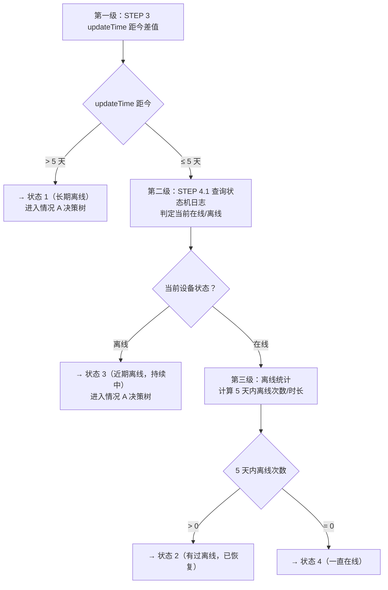

# device-offline-analyzer

## Description

本 Skill 用于排查用户反馈的"设备离线"问题，通过标准化 SOP 快速定位离线根因，并为用户提供有效解决方案。适用场景：用户反馈设备离线、统计设备离线时长与频率、从设备/网络/服务器多维度进行根因排查。

### 认证

**REQUIRED SUB-SKILL:** `troubleshooting` — 获取 token，后续请求使用 `Authorization: Bearer $TROUBLESHOOTING_TOKEN`

### API 信息

| 环境      | 基础 URL                               |
| --------- | -------------------------------------- |
| `prod-us` | `https://troubleshooting-us.addx.live` |
| `prod-eu` | `https://troubleshooting-eu.addx.live` |

| 方法 | 路径                              | 说明              |
| ---- | --------------------------------- | ----------------- |
| POST | `/api/v1/log-search/query/es`     | ES 日志搜索        |
| POST | `/api/v1/log-search/query/db`     | DB 业务数据查询    |
| POST | `/api/v1/log-search/query-index`  | 直接索引查询       |
| POST | `/api/v1/chart/data`              | superset 埋点看板  |

Swagger 文档：`https://troubleshooting-{us,eu}.addx.live/api/docs`

## Rules

### Rule 1 — 操作红线

- 禁止修改或删除生产环境设备数据
- 所有操作仅限只读查询

### Rule 2 — 输入识别

从用户输入推断 `id_type` 与 `encrypted`：

| 输入格式           | 示例                                   | id_type     | encrypted |
| ------------------ | -------------------------------------- | ----------- | --------- |
| 脱敏 ID            | `trouble_shooting_id:3fdd9f7dc1c948b0` | `device_sn` | `true`    |
| 14/15 位 User SN    | `KC3NQXFBED2247`、`AIC1JPE1S1A1003`、`HUB1234ABCD5678` | `user_sn`   | `false`   |
| 32 位十六进制 UID  | `28d61f9dc94ce3212e23ad67a9428e95`     | `device_sn` | `false`   |

所有查询统一使用 `deidentify: true`。

> 本指南只查 Prod。14 位 `GL` User SN 当前仅 Staging 后端已支持；生产后端发布 GL 校验前，不要将 GL 值发给上述 Prod 接口。

### Rule 3 — 时间格式

- **API 请求体**中的时间字段使用 UTC 格式（如 `2026-03-19T00:00:00.000Z`）
- **所有输出**（过程、数据解析、报告）使用北京时间（UTC+8），格式 `YYYY-MM-DD HH:MM:SS`
- 对 API 返回时间字段的处理：
  - **需要转换**：Unix 时间戳或带 `Z` 的 ISO 8601 → 转为北京时间（UTC+8）后显示
  - **直接输出**：已格式化 datetime 字符串且无时区标识（如 `2026-03-04 04:45:03`）→ 视为北京时间，**禁止再加 8 小时**
- 禁止在用户输出中出现 UTC 时间戳或带 `Z` 的 ISO 8601

### Rule 4 — JSON 解析

- 所有 curl 响应保存到本地文件：`curl ... > <filename>.json`，**禁止使用 jq**（Windows 不可用）
- 保存后使用 **Read 工具**读取文件提取字段
- 文件命名：`step<N>_<描述>.json`；分页按页命名：`step5_por_p1.json`、`step5_por_p2.json`

### Rule 5 — 数据驱动，禁止臆测

- 必须完整执行每一个 STEP，**不得跳步**
- **严格遵守请求模板格式**，严禁随意构造无效请求
- **所有结论必须基于 API 返回数据**，严禁编造数据或推测原因；API 返回错误或空结果时如实告知，不得补充猜测
- **查询时间范围严格限定在 STEP 1.1 确定的固定窗口内**，禁止因查询结果为空或数据不足而自行扩大；如需调整范围须告知用户并征得明确同意
- 引用 FAQ 链接时只使用本文档中明确列出的 URL；每个 STEP 的输出须标注数据来源

### Rule 6 — 跨平台兼容性

支持平台：macOS、Linux、Windows（Git Bash / PowerShell）

- **文件操作**：仅使用相对路径 `./filename.json`；保存响应用 `curl ... | tee filename.json > /dev/null`
- **JSON 处理**：禁止 jq，改用 grep；验证文件完整性，避免 `head -c N` 截断
- **脚本执行**：避免 `python3 << 'EOF'` 内嵌方式，改用独立脚本文件；明确设置 `export PYTHONIOENCODING=utf-8`
- **环境变量**：bash/zsh 用 `export VAR="value"` 和 `$VAR`；PowerShell 用 `$env:VAR="value"` 和 `$env:VAR`

### Rule 7 — curl 请求通用格式

所有 API 请求通用请求头（`<region>` 由 STEP 1.1 环境决定：`prod-us` → `us`，`prod-eu` → `eu`）：

```bash
curl -s -X POST \
  -H "Authorization: Bearer $TROUBLESHOOTING_TOKEN" \
  -H "Content-Type: application/json" \
  -H "X-Requested-With: XMLHttpRequest" \
  "https://troubleshooting-<region>.addx.live/<endpoint>" \
  -d '<body>' > <output>.json
```

**ES 查询请求体基础结构**（`/api/v1/log-search/query/es`）：各 STEP 仅列出差异字段（`fuzzy_search`、`page_size`、`output`），其余参数均复用：

```json
{
  "id_type": "<Rule 2>",
  "id_value": "<用户输入>",
  "fuzzy_search": "<见各 STEP>",
  "start_date": "<STEP 1.1 起始，ISO 8601>",
  "end_date": "<STEP 1.1 结束，ISO 8601>",
  "es_data": { "backend": ["log"] },
  "db_queries": ["all", "all"],
  "deidentify": true,
  "encrypted": "<Rule 2>",
  "data_source": "iot-service",
  "sort_order": "desc",
  "page": 1,
  "page_size": 200
}
```

### Rule 8 — 分页处理

使用 Read 工具读取第 1 页文件，检查 `result.data.pagination.has_next_page`：若为 `true`，递增 `page` 继续查询，文件命名为 `<name>_p2.json`，以此类推直至 `has_next_page = false`。仅在当前数据未覆盖所需时间范围时继续拉取后续页。

## STEP 1: 获取设备基本信息

**1.1 收集输入信息并识别参数**

开始排查前，必须收集：

- **设备标识**：Prod 当前支持的 User SN（14 位 `KC` 开头，15 位 `HUB` / `AIC` 开头）、设备 UID（32 位十六进制）、或脱敏 ID（`trouble_shooting_id:` 前缀）
- **环境/节点**：`prod-us` / `prod-eu`。用户未指定时，先查 `prod-us`，若 `isBind` 为未绑定再查 `prod-eu`；首次判定为已绑定的一侧即为全流程环境。两侧均未绑定时走错误处理。
- **起始时间**：用户指定时间；未指定则默认 `当前时间 - 5天`
- **结束时间**：当前时间

> **时间窗口约束**：以上确定的起始/结束时间为全流程固定查询窗口，后续所有 STEP 的 API 查询必须严格在此范围内执行，禁止自行调整。

根据 Rule 2 识别设备标识格式，确定 `id_type` 和 `encrypted`。

**1.2 调用 API 查询设备基本信息**

调用 `/api/v1/log-search/query/db`（Rule 7 通用请求头），请求体（`start_date`/`end_date` 此接口使用 `YYYY-MM-DD` 格式）：

```json
{
  "id_type": "<Rule 2>",
  "id_value": "<用户输入>",
  "start_date": "<YYYY-MM-DD>",
  "end_date": "<YYYY-MM-DD>",
  "db_queries": { "user_device_binding": ["all"], "user_info": ["all"] },
  "es_data": {},
  "deidentify": true,
  "encrypted": "<Rule 2>"
}
```

保存至 `step1_db.json`。使用 Read 工具读取，提取：

- 设备型号：`result.data.results.UserDeviceBindingQuery[0].factoryInfoDOS[0].derivedModelNo`
- 设备状态：`result.data.results.UserDeviceBindingQuery[0].deviceStatuses[0]`
- 脱敏 UID：`result.data.results.UserDeviceBindingQuery[0].serialNumber`（`trouble_shooting_id:xxxxxxxx` 格式）

各字段完整说明见 [references/user_device_binding_fields.md](references/user_device_binding_fields.md)。

**错误处理**（API 非 200、UserDeviceBindingQuery 为空、字段报错时）：
1. 查阅 Swagger 文档核对最新参数规范
2. 检查 `id_type`/`encrypted` 是否与输入格式匹配（Rule 2）
3. 确认环境是否正确
4. 将原始错误如实反馈给用户，终止后续 STEP 直到问题解决

## STEP 2: 查询设备类型

根据 STEP 1 得到的设备型号，调用 `get_device_type.py`（`--json` 输出 JSON）：

```bash
# SKILL_DIR 指向本 skill 的目录（= troubleshooting skill Base directory + "/device-offline-analyzer"）
SKILL_DIR="<troubleshooting skill Base directory>/device-offline-analyzer"
python "$SKILL_DIR/scripts/get_device_type.py" <设备型号> --json
```

提取关键字段 `category`（设备大类），决定后续分析策略：

| category    | 分析策略                        |
| ----------- | ------------------------------- |
| 常电WiFi    | 关注网络稳定性和服务器连接        |
| 4G低功耗    | 关注 4G 信号和低功耗唤醒机制     |
| 低功耗WiFi  | 关注 WiFi 连接和低功耗唤醒机制   |

## STEP 3: 查询设备状态

复用 STEP 1.2 响应（`step1_db.json`），从 `result.data.results.UserDeviceBindingQuery[0].deviceStatuses[0]` 提取：

- `status`：设备最近一次上报状态
- `reason`：状态流转原因
- `updateTime`：最近状态更新时间（UTC+8）

**3.2 离线状态判定**：同时满足以下 3 个条件为**在线**，否则为**离线**：

| 条件 | 字段         | 值                               |
| ---- | ------------ | -------------------------------- |
| 1    | `status`     | `已休眠并连上websocket`           |
| 2    | `reason`     | `dormantStatus` 或 `mqttreceive` |
| 3    | `updateTime` | 距当前时间 < 1 小时               |

**3.3 关机原因判定**：`status` 为 `已关机` 时，按 `reason` 判断：

| reason | 关机原因             |
| ------ | -------------------- |
| `1`    | 低电量关机            |
| `2`    | 按键关机              |
| `4`    | 解绑关机              |
| `5`    | 太阳能充电低电量关机   |

## STEP 4: 离线时长分析与分流

**4 种离线状态定义：**

| 状态   | 条件                                          | 说明               |
| ------ | --------------------------------------------- | ------------------ |
| 状态 1 | `updateTime` 距今 > 5 天                       | 长期离线            |
| 状态 2 | 距今 ≤ 5 天，当前在线，近期有离线记录            | 有过离线，已恢复    |
| 状态 3 | 距今 ≤ 5 天，当前仍离线                         | 近期离线，持续中    |
| 状态 4 | 距今 ≤ 5 天，当前在线，近期无离线记录            | 一直在线            |

**三级判定流程：**



---

### 情况 A：离线设备通用排查决策树

> 适用于所有当前离线设备（状态 1、状态 3）。结合 STEP 1～3 基础信息，从上到下逐步输出排查建议：

**步骤 1 — 指示灯检查**：引导用户在设备镜头前走动/挥手，观察是否亮起蓝灯：

- **亮蓝灯** → App 首页下拉刷新：
  - **恢复在线** → 网络波动，建议重启路由器、设备靠近路由器继续观察，按设备类型提供 FAQ：低功耗/常电设备 [FAQ: 设备离线](https://support.vicoo.tech/hc/en-us/articles/360058598833-What-can-I-do-if-the-device-is-offline)；4G 设备 [FAQ: 4G 离线排查](https://support.vicoo.tech/hc/en-us/articles/36152408474649-Troubleshooting-4G-Camera-Offline-Issues)
  - **未恢复** → 继续步骤 2
- **未亮蓝灯** → 询问近期是否多次出现：多次出现 → 可能硬件问题，引导录制操作视频，联系人工确认；首次/偶发 → 继续步骤 2

**步骤 2 — 设备能否正常重启？**

- **能重启** → 能否联网？
  - **恢复在线** → 按设备类型给出方案：低功耗设备靠近路由器观察 + [FAQ: 设备离线](https://support.vicoo.tech/hc/en-us/articles/360058598833-What-can-I-do-if-the-device-is-offline)；4G 设备 [FAQ: 4G 离线排查](https://support.vicoo.tech/hc/en-us/articles/36152408474649-Troubleshooting-4G-Camera-Offline-Issues)
  - **未恢复** → 建议重新绑定设备
- **无法重启** → 建议插电后复位（低功耗设备戳 P 孔 / 常电设备长按 reset）：复位后能重启 → 回到「能正常重启」流程；复位后仍无法重启 → 可能硬件问题，引导录制操作视频，联系人工确认

### 情况 B：最近状态更新 ≤ 5 天 → 状态 2 / 3 / 4

**4.1 查询状态机日志**

调用 `/api/v1/log-search/query-index`（Rule 7 通用请求头），请求体：

```json
{
  "index_name": "addx-<region>-prod-statemachine-*",
  "query": "\"<设备UID>\" AND \"state_connection_lost\" AND \"iot_cloud.device_state_change\"",
  "start_time": "<STEP 1.1 起始，ISO 8601>",
  "end_time": "<STEP 1.1 结束，ISO 8601>",
  "page": 1,
  "page_size": 1000,
  "sort_order": "desc"
}
```

保存至 `step4_statemachine.json`。

> `<设备UID>` 取值：`id_type = user_sn` 时使用 `step1_db.json` 中 `UserDeviceBindingQuery[0].serialNumber` 的脱敏 ID；`id_type = device_sn` 时直接使用用户输入。

调用脚本解析（输出北京时间 Markdown 表格，含 fromState/toState/event，按时间倒序）：

```bash
node "$SKILL_DIR/scripts/parse_statemachine.js" < step4_statemachine.json
```

**统计离线指标：**

- **离线次数**：`toState = state_connection_lost` 的行数；若最早一条记录的 `fromState = state_connection_lost`（窗口前已离线），额外 +1
- **每次离线时长**：从 `toState = state_connection_lost` 到紧接其后 `fromState = state_connection_lost` 的时差；窗口前已离线时从 `start_time` 起算
- **总离线时长**：所有离线时段累计

**当前状态判定**（从最新一条记录）：`fromState = state_connection_lost` → **在线**；`toState = state_connection_lost` → **离线**

> **双源交叉验证**：STEP 4.1 状态机结论与 STEP 3 结论一致时高置信度确认；不一致时**以 STEP 3 为准**，记录差异供进一步排查。

**4.2 状态分类**

**4.2.1 当前在线 → 状态 2 或 状态 4**

| 条件                   | 结论                          |
| ---------------------- | ----------------------------- |
| 5 天内离线次数 > 0      | **状态 2**（有过离线，已恢复）  |
| 5 天内离线次数 = 0      | **状态 4**（一直在线）          |

**异常离线判定（满足任一即为异常）：**

| 规则   | 条件                                                 | 说明                         |
| ------ | ---------------------------------------------------- | ---------------------------- |
| 规则 1 | 单次离线时长 ≥ 1h，且发生次数 > 2 次                   | 多次长时间离线                |
| 规则 2 | 离线次数 ≥ 10 次，且总离线时长 ≥ 1h                    | 频繁短时离线                  |
| 规则 3 | 总离线时长 ≥ 1h，且离线次数 < 10，且每次时长均不足 1h   | 单次不长、次数不多但累计偏长   |

**后续动作：**

- **状态 4**：设备状态正常，告知"查询范围内设备无离线记录，当前在线"。若用户仍反馈问题，建议确认设备是否正确，询问大致离线时间。
- **状态 2 未触发异常规则**：偶发且已自行恢复，建议观察，按设备类型提供 FAQ（同情况 A 步骤 1）。
- **状态 2 触发异常规则**：进入 STEP 5 深度排查。输出时须注明触发规则及数据（如「触发规则 1：单次离线 ≥ 1h 发生 4 次」）。

**4.2.2 当前离线 → 状态 3**

直接复用**情况 A 决策树**（从步骤 1 开始）。情况 A 全部执行仍无法恢复 → 进入 STEP 5。

## STEP 5: 根因排查

> 进入条件：状态 3 经情况 A 决策树仍无法恢复、状态 2 触发异常离线规则。

详细排查流程（设备/网络/服务器三个维度）见 [step5-root-cause.md](step5-root-cause.md)。

## Examples

### Bad

```
用户："设备离线了"
AI：直接查询日志，未收集设备 SN/UID 和环境信息
→ 错误：缺少必要输入，无法定位设备
```

```
用户："查一下 KC123456789012 的离线情况"
AI：使用错误的 id_type 参数（device_sn 而非 user_sn）
→ 错误：14 位 `KC` User SN 应使用 id_type="user_sn"
```

```
用户："查一下 KC3NQXFBED2247 在 prod-us 的离线情况"
AI：API 返回空结果后，回复"设备可能是因为固件版本过旧导致离线，建议升级固件"
→ 错误：未查到数据时编造原因，违反 Rule 5。应如实告知"查询未返回有效数据"并排查输入参数
```

### Good

```
用户："设备 KC3NQXFBED2247 在 prod-us 环境离线了"
AI：
STEP 1: 收集输入：SN=KC3NQXFBED2247（14位），环境=prod-us，时间=最近5天
        Rule 2 → id_type="user_sn", encrypted=false；调用 /api/v1/log-search/query/db
STEP 2: 调用 get_device_type.py 获取设备类型（如：低功耗WiFi）
STEP 3: 读取 step1_db.json，提取 status/reason/updateTime，判定当前离线状态
STEP 4: updateTime 距今 3 天 → 进入情况 B；查询状态机日志，判定状态 2/3/4
STEP 5: 触发异常规则 → 从设备/网络/服务器三个维度深度排查，输出根因和解决方案
```

## Checklist

- [ ] 已按 **troubleshooting** skill 完成认证（令牌有效）；环境 `prod-us`/`prod-eu` 与 URL `<region>` 一致；Rule 2 的 `id_type`/`encrypted`，`deidentify: true`；查询窗口 ≤ 30 天
- [ ] 请求体时间 **UTC**，用户输出 **北京时间**；响应 `> step*.json` + Read，**不用 jq**；STEP 1～5 **不跳步**，STEP 1 失败则停
- [ ] STEP 4：状态机 UID 取值正确；与 STEP 3 **双源校验**，不一致以 STEP 3 为准并说明；FAQ 只用本文档列出的链接
- [ ] STEP 5：后端日志已加载；POR/errorReports 含义经 **lark** + 飞书文档；ES 分页按需拉全
- [ ] 结论均有数据出处，空结果/错误不编造；STEP 5 满足 **5.4**（根因依据/建议/数据不足）

## Reference

- `UserDeviceBindingQuery` 字段说明: [references/user_device_binding_fields.md](references/user_device_binding_fields.md)
- 设备类型与 FAQ: [scripts/get_device_type.py](scripts/get_device_type.py)
- 状态机响应解析: [scripts/parse_statemachine.js](scripts/parse_statemachine.js)
- 根因排查详情: [step5-root-cause.md](step5-root-cause.md)
- Troubleshooting Skill: `<troubleshooting skill Base directory>/SKILL.md`
