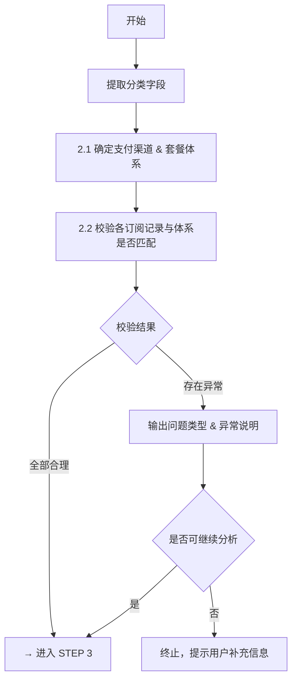
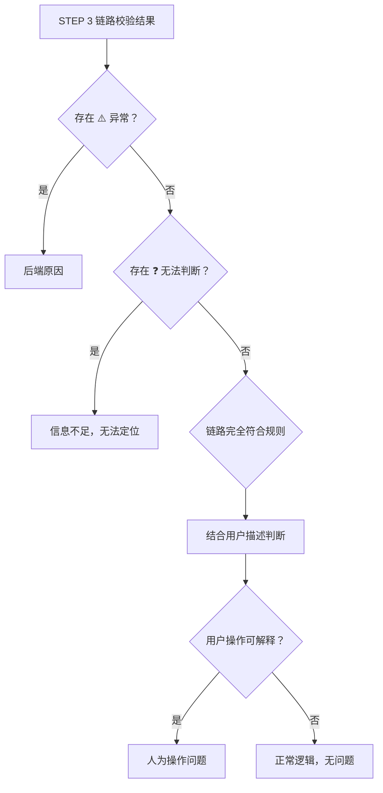

# 订阅问题排查

## Rules

### Rule 1 — 操作红线

- 禁止修改或删除生产环境数据
- 所有操作仅限只读查询
- 查询时间范围不超过账号注册至今的全量时间（订阅分析需覆盖完整历史）

### Rule 2 — 输入识别

从用户输入推断 `id_type` 与 `encrypted`，详见 SKILL.md **Cross-reference** 章节「ID 格式自动识别」表。

所有查询统一使用 `deidentify: true`。

### Rule 3 — 时间格式

- **API 请求体**中的 `start_date`、`end_date` 使用 `YYYY-MM-DD` 格式（UTC）
- **其余所有时间**（执行过程输出、数据解析、最终结论）统一使用北京时间（UTC+8），格式为 `YYYY-MM-DD HH:MM:SS`
- 收到 API 返回的 UTC 时间戳后，必须转换为北京时间再显示

### Rule 4 — JSON 解析

- 所有 curl 请求的响应必须用 `> <filename>.json` 保存到本地文件
- 保存后使用 **Read 工具**读取文件，直接从 JSON 内容中提取所需字段
- 文件命名规范：`step<N>_<描述>.json`，例如 `step1_db.json`
- **禁止使用 `jq`**（Windows 不可用）

### Rule 5 — 数据驱动，禁止臆测

- 必须完整执行每一个 Step，**不得跳步**
- **所有结论必须基于 API 返回的实际数据**，严禁编造数据、推测原因或虚构排查结果
- 当 API 返回错误或空结果时，必须如实告知用户并说明可能原因，不得补充或猜测
- 每个 Step 的输出必须标注数据来源字段，便于用户验证
- 无法判断的环节，必须明确说明：**哪里信息不足、缺少什么规则、建议补充哪些信息**

### Rule 6 — 跨平台兼容性

支持平台：macOS、Linux、Windows（Git Bash / PowerShell）

- **文件操作**：仅使用相对路径 `./filename.json`；保存 API 响应用 `curl ... | tee filename.json > /dev/null`
- **JSON 处理**：禁止使用 `jq`，改用 Read 工具读取保存的 JSON 文件
- **环境变量**：bash/zsh 用 `export VAR="value"` 和 `$VAR`；PowerShell 用 `$env:VAR="value"` 和 `$env:VAR`

---

## 排查流程总览

```
Step 1: 收集输入 & 查询原始数据
    ↓
Step 2: 前置校验（套餐体系归属 & 当前套餐合理性）
    ├─ 合理 → Step 3
    └─ 不合理 → 输出问题类型，终止或补充信息后继续
        ↓
Step 3: 订阅链路分析
    ├─ 3.1 当前订阅状态判断
    └─ 3.2 完整链路梳理 & 逐步校验
        ↓
Step 4: 根因判定 & 结论输出
    ├─ 4.1 问题分类
    ├─ 4.2 根因分析
    └─ 4.3 结论输出
```

---

## STEP 1: 收集输入 & 查询原始数据

**1.1 收集输入信息**

开始排查前，必须收集以下信息，缺失则主动询问用户：

- **用户标识**：user_id / email / user_sn / ticket_id（格式识别见 SKILL.md Rule 2）
- **环境**：US / EU（未指定则并行查询双环境自动识别，见 SKILL.md「环境自动识别」）
- **用户反馈的具体问题**：例如"订阅已失效"、"扣款但功能未解锁"、"升级后又降回来了"等
- **查询时间范围**：默认从账号注册时间到当前日期，覆盖全量订阅历史

收集完成后，根据 Rule 2 识别标识格式，确定 `id_type` 和 `encrypted` 参数。

**1.2 调用 API 查询原始数据**

调用 `POST /api/v1/log-search/query/db`，同时拉取 `user_info` 和 `user_device_binding` 全量数据，保存为 `step1_db.json`。

请求模板：

```bash
curl -s -X POST \
  -H "Authorization: Bearer $TROUBLESHOOTING_TOKEN" \
  -H "Content-Type: application/json" \
  -H "X-Requested-With: XMLHttpRequest" \
  "https://troubleshooting-<region>.addx.live/api/v1/log-search/query/db" \
  -d '{
    "id_type": "<根据 Rule 2 推断>",
    "id_value": "<用户输入的标识>",
    "start_date": "<账号注册日期，格式 YYYY-MM-DD>",
    "end_date": "<当前日期，格式 YYYY-MM-DD>",
    "db_queries": {
      "user_device_binding": ["all"],
      "user_info": ["all"]
    },
    "deidentify": true,
    "encrypted": <根据 Rule 2 推断>
  }' > step1_db.json
```

> `<region>`：`prod-us` → `us`，`prod-eu` → `eu`。
> `start_date` 未知时先用 `2020-01-01`，查到 `registerTime` 后可按需收窄。

**输出提取**：使用 Read 工具读取 `step1_db.json`，提取以下数据（字段含义见 [user_info_query_fields.md](user_info_query_fields.md)）：

| 数据块 | JSON 路径 | 关键字段 |
|---|---|---|
| 用户基础信息 | `result.data.results.UserInfoQuery[0].user[0]` | `tenantId`, `registerTime`, `appType`, `cancellation` |
| 订阅流水 | `result.data.results.UserInfoQuery[0].vip[]` | 全部字段 |
| 绑定操作记录 | `result.data.results.UserInfoQuery[0].binding[]` | `bindCompleteTime`, `serialNumber`, `userSn` |
| 名下设备 | `result.data.results.UserInfoQuery[0].devices[]` | `serialNumber`, `bindTime` |
| 设备工厂信息 | `result.data.results.UserDeviceBindingQuery[].factoryInfoDOS[0]` | `customerId`, `originalModelNo`, `brand` |

**错误处理**：

1. API 返回非 200 / `UserInfoQuery` 为空 → 检查 `id_type`、`encrypted`、环境是否正确
2. 查阅 Swagger 文档核对最新参数规范
3. 将原始错误信息如实反馈用户，终止后续 STEP 直到问题解决

---

## STEP 2: 前置校验（套餐体系归属 & 合理性）

**执行流程：**



**2.1 提取分类关键字段**

从 `step1_db.json` 提取以下字段，作为套餐体系判断的输入：

| 字段 | 提取路径 | 用途 |
|---|---|---|
| `tenantId` | `UserInfoQuery[0].user[0].tenantId` | 区分 App 归属（vicoo / 其他 OEM） |
| `registerTime` | `UserInfoQuery[0].user[0].registerTime` | 判断免费套餐版本边界 |
| `subscriptionType` | `UserInfoQuery[0].vip[].subscriptionType` | 识别套餐类型 |
| `paymentType` | `UserInfoQuery[0].vip[].paymentType` | 确认支付渠道 |
| 最早绑定时间 | `UserInfoQuery[0].binding[]` 中 `bindCompleteTime` 最小值 | 向前对齐策略起点 |
| 最早绑定设备的 `customerId` | 对应最早绑定时间设备的 `UserDeviceBindingQuery[].factoryInfoDOS[0].customerId` | 判断 OEM 套餐体系 |

> 「最早绑定设备的 customerId」查找方式：在 `binding[]` 中找 `bindCompleteTime` 最小的记录，取其 `serialNumber`，再在 `UserDeviceBindingQuery` 中匹配该 `serialNumber`，读取 `factoryInfoDOS[0].customerId`。

**2.2 套餐体系归属判断 & 合理性校验**

根据 2.1 提取的字段，按以下逻辑判断（详细规则见 [subscription-plans.md](subscription-plans.md)）：

> **前置判断**：先确认 `tenantId`。若非 `vicoo`，免费套餐按旧版（注册即发放，所有设备共享），付费套餐仅适用旧版基础版/高级版规则，以下所有边界条件（注册时间、customerId、V2 体系等）均不适用，直接跳至支付渠道判断。

**免费套餐体系判断：**

| 条件组合 | 适用免费套餐体系 | 说明 |
|---|---|---|
| `registerTime` < 2024-11-01 | 旧版（用户维度） | 自动发放 2 年，所有设备共享，多次延期属正常 |
| 2024-11-01 ≤ `registerTime` < 2026-01-01 | 新版（设备维度） | 单台设备手动领取，2 年持续，0.5GB 滚动，3 天回看 |
| `registerTime` ≥ 2026-01-01 且最早绑定设备 `customerId` 为 CU1807（技鸣） 或 CU1833（海视友） | 新版 7 天试用 | 手动领取，60 天回看，完整 VIP 功能，向前对齐策略生效 |

> **向前对齐策略**：首次绑定设备时的套餐方案决定该账号后续所有设备的免费套餐方案。

**付费套餐体系判断：**

| `subscriptionType` 特征 | `paymentType` | 适用体系 |
|---|---|---|
| 包含 `v2` | Android 内购 / iOS 内购 / 三方支付 | Awareness V2（设备维度，2024-01 起） |
| 不含 `v2`，含基础版/高级版 | 内购或三方支付 | 旧版套餐或 Awareness V1 |
| `tenantId` 非 `vicoo` | 任意 | OEM 客户，套餐规则以各 OEM 合同为准，TS 可能无完整规则，需标注 ❓ |

**旧版套餐（2023年前）持续存在的合理性判断：**

当 `subscriptionType` 不含 `v2`（即疑似旧版套餐，包含基础版/高级版）时，需结合完整订阅链路判断是否合理：

1. 检查 `vip[]` 中最早一条基础版/高级版记录的 `createTime`，是否在 2023 年以前（含）
2. 检查该条记录到当前最新记录之间，是否存在 `orderCancel=1` 的取消记录

| 链路特征 | 判断结论 |
|---|---|
| 首条订阅 `createTime` ≤ 2023年，且链路中从未出现 `orderCancel=1` | ✅ 正常：用户自 2023 年起一路续订至今，旧版套餐持续生效符合预期 |
| 首条订阅 `createTime` ≤ 2023年，但链路中存在在2023年后 `orderCancel=1`，且取消后又出现旧版 `subscriptionType` | ⚠️ 异常：用户在 2023 年后主动取消续订，再次订阅时不应能订阅到旧版套餐，需排查后端发放逻辑 |
| 首条订阅 `createTime` > 2023年，但 `subscriptionType` 为旧版套餐 | ⚠️ 异常：2023 年后新订阅不应出现旧版套餐类型，需排查后端发放逻辑 |

**支付渠道判断：**

| `paymentType` 值 | 支付渠道 | 适用升降级规则 |
|---|---|---|
| 含 `Android内购` | Google Play | 见「套餐升降级规则 - Google 平台」 |
| 含 `iOS内购` 或 `Apple` | App Store | 见「套餐升降级规则 - 苹果平台」，不支持降级 |
| 含 `Airwallex` / `Stripe`/ `Applepay` | 三方支付 | 折算规则待补充，遇到切换时标注 ❓ |
| `null` 或 `系统发放` | 系统赠送 | 无支付行为，不适用升降级规则 |

**校验异常示例（输出格式）：**

> ⚠️ **异常**：用户 `registerTime` 为 2026-02-15，但持有旧版免费套餐（用户维度，`subscriptionType: 2年3天循环云存储`），与注册时间边界（2024-11 之前才适用）不符。
> 数据来源：`UserInfoQuery[0].user[0].registerTime` = 2026-02-15，`UserInfoQuery[0].vip[0].subscriptionType` = "2年3天循环云存储(1003)"。
> 可能原因：后端套餐发放逻辑异常，或该账号经历了数据迁移。建议联系后端确认。

> ⚠️ **异常**：iOS 用户（`paymentType: iOS内购`）的订阅记录中存在从高等级到低等级的切换，但 App Store 不支持降级。
> 数据来源：`vip[2].subscriptionType` = "v2-无限设备-12个月" → `vip[3].subscriptionType` = "v2-单设备-1个月"。
> 可能原因：系统侧套餐处理异常，需进一步排查。

---

## STEP 3: 订阅链路分析

> 仅在 STEP 2 校验结果为"合理"或"存在异常但可继续分析"时执行。

**3.1 当前订阅状态判断**

从 `vip[]` 中取 `createTime` 最新的一条记录，判断当前时间是否在该记录的有效期内：

```
当前时间 ≥ startTime 且 当前时间 ≤ endTime          →  有效订阅
当前时间 > endTime 且 当前时间 ≤ endTime + 7天      →  宽限期内（Grace Period，VIP 仍生效）
当前时间 > endTime + 7天                            →  宽限期已过（VIP 失效；Google/Apple 可能仍在 Retry Period 内重试）
vip[] 为空                                          →  从未订阅
```

> 注意：`active` 字段已弃用，不得用于判断有效性。以当前时间与 `startTime` / `endTime` 的比较结果为准。

**宽限期规则（仅适用于付费续订套餐，系统发放套餐不适用）：**

订阅到期续费失败后存在两个阶段，详细规则见 [subscription-plans.md 宽限期规则章节](subscription-plans.md)：

| 阶段 | 时间范围 | VIP 权益 |
|---|---|---|
| Grace Period（宽限期） | `endTime` 起 7 天内 | **保留** |
| Retry Period（订阅恢复期） | 宽限期结束后 | **已失效**（App Store 最长 60 天，Google Play 最长 30 天） |

各支付渠道宽限期内重试策略：

| 支付渠道 | 首次重试 | 最多重试次数 | 超期未成功 |
|---|---|---|---|
| Google Play | 24 小时后 | 4 次（最长 30 天内） | VIP 失效，`orderCancel=1`，`orderCancelTime` 有值 |
| App Store | 当天稍后 | 不定（60 天内多次） | VIP 失效，`orderCancel=1`，`orderCancelTime` 有值 |
| 三方支付（Airwallex / 三方 Apple Pay） | 24 小时后 | 7 天内最多 4 次（间隔 24~48 小时） | VIP 失效并自动取消，`orderCancel=1`，`orderCancelTime` 有值 |

宽限期状态的判断与校验：

- **宽限期内，用户尚未取消**（`orderCancel=0`）：平台仍可能重试成功恢复续订，VIP 保留 ✅
- **宽限期内，用户已取消**（`orderCancel=1`，`orderCancelTime` ≤ `endTime + 7天`）：不再重试，VIP 在 `endTime` 后到期 ✅
- **超过宽限期（> endTime + 7天），`orderCancel=0` 且无续订记录**：Google/Apple 内购符合预期（平台不自动取消，可能仍在 Retry Period 内）✅；三方支付超期未自动取消标注 ⚠️
- **超过宽限期，`orderCancel=1`，`orderCancelTime` 在 `endTime + 7天` 以内**：正常超期自动取消 ✅；三方支付特有
- **Billing Cycle**：宽限期内续费成功保留原 billing cycle；宽限期外续费成功按扣费当天重新计算

输出格式：

```
【当前订阅状态】
最新套餐：<subscriptionType>
有效期：<startTime（UTC+8）> ~ <endTime（UTC+8）>
当前状态：✅ 生效中 / ⏳ 宽限期内（endTime + 7天 = <日期>，VIP 保留，平台重试中）/ ⚠️ 宽限期已过 VIP 失效 / ❌ 已到期 / — 从未订阅
```

若存在免费套餐（`subscriptionType` 含"免费"或"循环云存储"且 `tradeNo` 为 null），一并输出其状态。

**3.2 完整订阅链路梳理 & 逐步校验**

将 `vip[]` 按 `createTime` 升序排列，输出完整时间轴表格：

| # | 套餐类型 | 开始时间 | 结束时间 | 创建时间 | freeTrial | 支付方式 | 已取消 | 已退款 | 生效设备 | 校验结果 |
|---|---|---|---|---|---|---|---|---|---|---|
| 1 | ... | ... | ... | ... | ... | ... | ... | ... | ... | ✅/⚠️/❓ |

对每条记录逐一校验，给出判断依据（必须引用具体字段和值）：

**校验项参照：**

- **首月免费**：`freeTrial=1` 时，该条记录不扣费，真正扣款在下一笔续订记录（约 30 天后）。数据来源：`vip[N].freeTrial`
- **Google Play 升级（低→高）**：切换后立即生效高等级套餐，旧套餐立即终止，生成 0 元订单（不折算旧套餐剩余费用），原 billing date 不变，届时按新套餐价格扣款。数据来源：前后两条记录的 `startTime` / `endTime` / `tradeNo`
- **Google Play 降级（高→低）**：高等级套餐应继续生效至周期结束，低等级套餐的 `startTime` 应等于高等级的 `endTime`。数据来源同上
- **App Store 升级**：低等级套餐立即终止，高等级立即生效，低等级剩余费用自动按比例退款（约 8 小时到账），不支持降级，出现降级记录则标注 ⚠️
- **取消续订**：`orderCancel=1` 表示已取消自动续费，套餐仍生效至 `endTime`，之后不再续订
- **宽限期到期后自动取消**：若本条记录因宽限期超期失败而终止，Google Play / App Store 内购平台不会自动取消，`orderCancel` 可为 0，属正常状态 ✅；三方支付超期后应自动取消，`orderCancel` 应为 1 且 `orderCancelTime` 应在 `endTime + 7天` 以内，否则标注 ⚠️
- **退款**：`orderRefund=1`，套餐应在 `orderRefundTime` 前后失效
- **Airwallex 切换**：无升降级区分，旧套餐剩余时间按价格比例折算累加至新套餐有效期，新套餐立即生效并立即扣全额，billing cycle 改变（= 新套餐周期 + 旧套餐折算天数）。校验时对比前后两条记录的 `endTime` 差值是否与折算结果匹配
- **Stripe 切换**：升级（低价→高价）立即生效并扣差价，续费周期改变；降级（高价→低价）立即生效，剩余金额进账户余额后续抵扣，扣 0 元；均以切换当天重新计算续费周期。Free Trial 剩余期不参与折算

**校验标注规则：**

- ✅ 符合规则，附简短说明
- ⚠️ 存在异常，附异常描述 + 数据来源 + 违反的规则
- ❓ 无法判断，附原因（缺少哪条规则 / 哪个字段信息不足）

---

## STEP 4: 根因判定 & 结论输出

**4.1 问题分类**



| 分类 | 判断标准 | 典型示例 |
|---|---|---|
| 后端原因 | 链路中存在与规则不符的数据异常 | 续订未按时发放、套餐时间计算错误、降级记录不符合平台规则 |
| 人为操作问题 | 链路完全符合规则，当前状态由用户操作导致 | 主动取消续订后询问为何没有订阅 |
| 正常逻辑 | 链路符合规则，用户描述现象属预期行为 | 首月免费到期后开始扣费，用户误以为异常 |
| 无法定位 | 存在 ❓ 项，规则缺失或数据不足 | 三方支付折算规则未补充、OEM 特殊套餐无记录 |

**4.2 根因分析**

- 存在 ⚠️ → 列出所有异常点，每条注明数据来源和违反规则
- 仅存在 ❓ → 说明当前无法定位，需要哪些额外信息或规则补充
- 全部 ✅ → 无后端问题，结合用户问题描述判断是否为人为操作或正常逻辑

**4.3 结论输出**

输出格式（固定，不得省略任何适用部分）：

```
【完整订阅链路摘要】
账号注册时间：<registerTime>（UTC+8）
首次绑定设备时间：<binding.bindCompleteTime 最小值>（UTC+8）
首绑设备 customerId：<customerId>
适用套餐体系：<旧版/新版免费套餐 + 付费套餐体系>

<按时间顺序列出每条订阅，一句话描述>

当前状态：✅ 生效中（<套餐名> 至 <endTime>）/ ❌ 无有效订阅

【根因判定】
用户问题：<用户描述的现象>
判断结论：<后端原因 / 人为操作问题 / 正常逻辑 / 无法定位>
具体原因：<基于实际数据字段的说明，不得猜测>

【解决方案】
<针对根因的建议，无法定位时写"建议联系人工排查">

【无法定位说明】（仅在存在 ❓ 时输出）
- 无法判断的点：<具体哪条记录、哪个判断>
- 原因：<缺少哪条规则 / 哪个字段信息不足>
- 建议补充：<需要什么额外信息或规则，例如"Airwallex 套餐切换折算规则"、"该 OEM 客户的套餐合同">
```

---

## 套餐规则参考

详见 [subscription-plans.md](subscription-plans.md)（功能分级、免费套餐、付费套餐、升降级规则、OEM/SDK 差异等）。分析前按需读取对应章节。

---

## 历史案例

详见 [cases/index.md](cases/index.md)，分析前先查找相似案例。

---

## 订阅失败排查

> **待补充**：通过 ES 数据查询特定字段，参照飞书文档错误码定义，确定具体失败原因。
